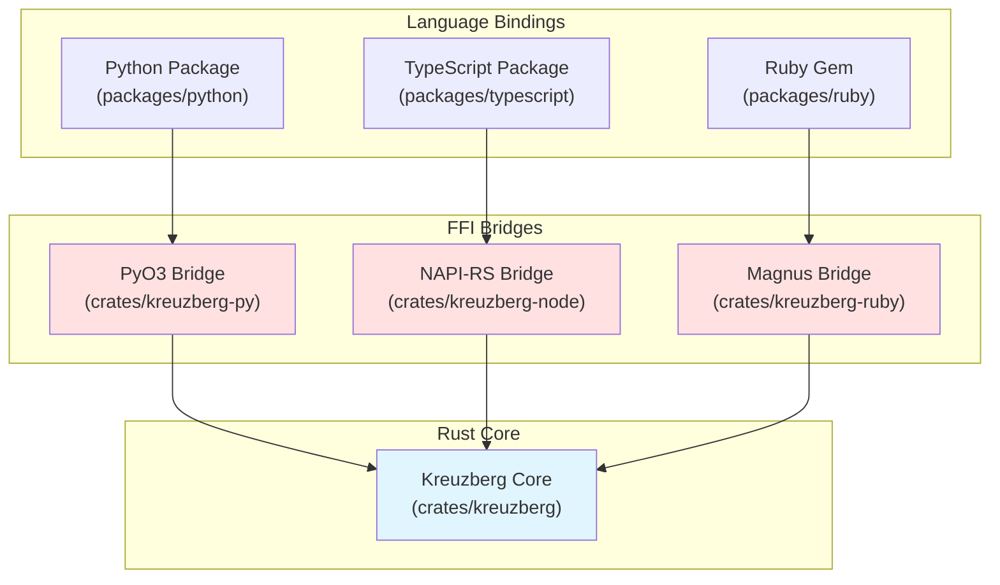
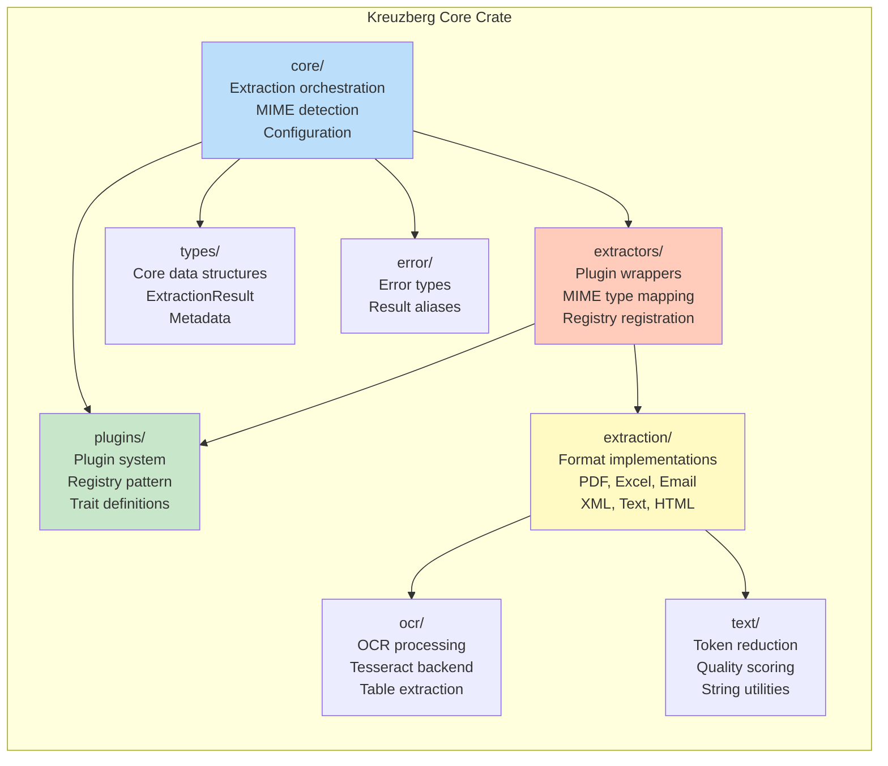

# Architecture

Kreuzberg is built with a Rust-first, multi-language architecture designed for maximum performance while maintaining accessibility across different programming ecosystems. The core extraction logic is implemented in Rust, with thin bindings for Python, TypeScript, and Ruby.

## Design Philosophy

The architecture follows three key principles:

1. **Rust Core**: All performance-critical operations (PDF parsing, OCR, text processing) are implemented in Rust for speed, safety, and memory efficiency
2. **Language-Agnostic Plugins**: The plugin system works across language boundaries, allowing Python OCR backends to integrate directly with the Rust core
3. **Zero-Copy Boundaries**: Data passes across FFI boundaries efficiently using zero-copy techniques where possible

## Multi-Language Architecture



## Rust Core Structure

The Rust core (`crates/kreuzberg`) is organized into distinct modules, each responsible for a specific aspect of document processing:



### Module Responsibilities

- **core/**: Main extraction entry points (`extract_file`, `extract_bytes`), MIME detection, configuration loading, pipeline orchestration
- **plugins/**: Plugin trait definitions (`DocumentExtractor`, `OcrBackend`, `PostProcessor`, `Validator`), registry implementation
- **extraction/**: Core extraction implementations for different formats (PDF via pdfium, Excel via calamine, etc.)
- **extractors/**: `DocumentExtractor` trait wrappers that register format handlers with the plugin system
- **ocr/**: OCR processing orchestration, Tesseract integration, HOCR parsing, table detection
- **text/**: Text processing utilities including token reduction, quality scoring, string manipulation
- **types/**: Shared type definitions (`ExtractionResult`, `Metadata`, `Chunk`, etc.)
- **error/**: Centralized error handling with `KreuzbergError` enum

## Why Rust?

Rust was chosen for the core implementation due to several compelling advantages:

### Performance

Rust provides significant performance improvements over pure Python implementations:

- **PDF parsing**: Native pdfium bindings eliminate Python overhead
- **Text processing**: SIMD-accelerated string operations for token reduction
- **Concurrent extraction**: True parallelism with Tokio's async runtime
- **Memory efficiency**: Zero-copy operations and streaming parsers for large files

### Safety

Rust's type system and ownership model prevent entire classes of bugs:

- **No null pointer exceptions**: Option types enforce explicit handling
- **No data races**: Compiler-enforced thread safety with Send/Sync
- **No buffer overflows**: Bounds checking at compile time
- **No use-after-free**: Ownership rules prevent memory errors

### Concurrency

Built-in async/await with Tokio enables efficient parallel processing:

- **Batch extraction**: Process multiple files concurrently
- **Non-blocking I/O**: Async file operations never block threads
- **Work-stealing**: Tokio scheduler maximizes CPU utilization
- **Backpressure**: Async streams handle large datasets gracefully

## Standalone Rust Library

The Rust core (`crates/kreuzberg`) is a fully functional standalone library that can be used directly in Rust projects without any language bindings:

```rust
use kreuzberg::{extract_file_sync, ExtractionConfig};

fn main() -> kreuzberg::Result<()> {
    let config = ExtractionConfig::default();
    let result = extract_file_sync("document.pdf", None, &config)?;
    println!("Extracted: {}", result.content);
    Ok(())
}
```

This makes Kreuzberg suitable for:

- Rust-native applications
- High-performance servers and APIs
- Command-line tools
- Embedded systems (where Python/Node.js are impractical)

## Related Documentation

- [Creating Plugins](../guides/plugins.md) - Guide to building custom plugins
- [API Reference](../reference/api-python.md) - Python API documentation
