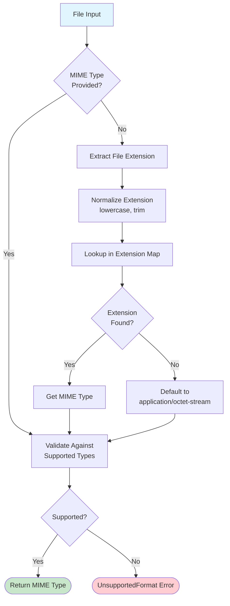

# MIME Type Detection

MIME (Multipurpose Internet Mail Extensions) type detection is the foundation of Kreuzberg's extraction pipeline. The MIME type determines which extractor processes a file, making accurate detection critical for successful extraction.

## How MIME Detection Works

Kreuzberg detects MIME types through a two-phase approach:



### Phase 1: Extension to MIME Mapping

When no explicit MIME type is provided, Kreuzberg extracts the file extension and looks it up in an internal mapping table:

```rust
// Extract extension
let extension = path.extension()
    .and_then(|e| e.to_str())
    .unwrap_or("")
    .to_lowercase();

// Lookup MIME type
let mime_type = EXT_TO_MIME.get(extension.as_str())
    .ok_or(UnsupportedFormat)?;
```

**Extension Normalization:**

- Converted to lowercase (`PDF` → `pdf`)
- Leading dots removed (`.txt` → `txt`)
- Only last extension used (`file.tar.gz` → `gz`)

### Phase 2: Validation

Whether the MIME type was detected or explicitly provided, it must be supported:

```rust
pub fn validate_mime_type(mime_type: &str) -> Result<()> {
    if SUPPORTED_TYPES.contains(mime_type) {
        Ok(())
    } else {
        Err(KreuzbergError::UnsupportedFormat {
            mime_type: mime_type.to_string(),
        })
    }
}
```

## Supported MIME Types

Kreuzberg supports multiple file formats across many categories:

### Documents

| Extension | MIME Type |
|-----------|-----------|
| `.pdf` | `application/pdf` |
| `.docx` | `application/vnd.openxmlformats-officedocument.wordprocessingml.document` |
| `.doc` | `application/msword` |
| `.odt` | `application/vnd.oasis.opendocument.text` |
| `.rtf` | `application/rtf` |

### Spreadsheets

| Extension | MIME Type |
|-----------|-----------|
| `.xlsx` | `application/vnd.openxmlformats-officedocument.spreadsheetml.sheet` |
| `.xls` | `application/vnd.ms-excel` |
| `.xlsm` | `application/vnd.ms-excel.sheet.macroEnabled.12` |
| `.xlsb` | `application/vnd.ms-excel.sheet.binary.macroEnabled.12` |
| `.ods` | `application/vnd.oasis.opendocument.spreadsheet` |
| `.csv` | `text/csv` |
| `.tsv` | `text/tab-separated-values` |

### Presentations

| Extension | MIME Type |
|-----------|-----------|
| `.pptx` | `application/vnd.openxmlformats-officedocument.presentationml.presentation` |
| `.ppt` | `application/vnd.ms-powerpoint` |
| `.odp` | `application/vnd.oasis.opendocument.presentation` |

### Images

| Extension | MIME Type |
|-----------|-----------|
| `.jpg`, `.jpeg` | `image/jpeg` |
| `.png` | `image/png` |
| `.gif` | `image/gif` |
| `.bmp` | `image/bmp` |
| `.tiff`, `.tif` | `image/tiff` |
| `.webp` | `image/webp` |
| `.svg` | `image/svg+xml` |

### Text and Markup

| Extension | MIME Type |
|-----------|-----------|
| `.txt` | `text/plain` |
| `.md`, `.markdown` | `text/markdown` |
| `.html`, `.htm` | `text/html` |
| `.xml` | `application/xml` |
| `.json` | `application/json` |
| `.yaml` | `application/x-yaml` |
| `.toml` | `application/toml` |

### Email

| Extension | MIME Type |
|-----------|-----------|
| `.eml` | `message/rfc822` |
| `.msg` | `application/vnd.ms-outlook` |

### Archives

| Extension | MIME Type |
|-----------|-----------|
| `.zip` | `application/zip` |
| `.tar` | `application/x-tar` |
| `.gz` | `application/gzip` |
| `.7z` | `application/x-7z-compressed` |

### Ebooks

| Extension | MIME Type |
|-----------|-----------|
| `.epub` | `application/epub+zip` |
| `.mobi` | `application/x-mobipocket-ebook` |

## Explicit MIME Type Override

Users can override auto-detection by providing explicit MIME type:

```python
# Force treating .txt file as markdown
result = extract_file("notes.txt", mime_type="text/markdown", config=config)
```

## Common MIME Type Constants

Kreuzberg exports commonly used MIME types as constants:

```rust
pub const PDF_MIME_TYPE: &str = "application/pdf";
pub const HTML_MIME_TYPE: &str = "text/html";
pub const MARKDOWN_MIME_TYPE: &str = "text/markdown";
pub const PLAIN_TEXT_MIME_TYPE: &str = "text/plain";
pub const EXCEL_MIME_TYPE: &str = "application/vnd.openxmlformats-officedocument.spreadsheetml.sheet";
pub const POWER_POINT_MIME_TYPE: &str = "application/vnd.openxmlformats-officedocument.presentationml.presentation";
pub const DOCX_MIME_TYPE: &str = "application/vnd.openxmlformats-officedocument.wordprocessingml.document";
pub const JSON_MIME_TYPE: &str = "application/json";
pub const XML_MIME_TYPE: &str = "application/xml";
```

**Usage:**

```python
from kreuzberg import extract_file, PDF_MIME_TYPE

result = extract_file("document.pdf", mime_type=PDF_MIME_TYPE, config=config)
```

## Detection API

Kreuzberg provides utility functions for MIME type operations:

```rust
// Detect MIME type from file path
pub fn detect_mime_type(path: impl AsRef<Path>) -> Result<String>

// Validate MIME type is supported
pub fn validate_mime_type(mime_type: &str) -> Result<()>

// Detect or validate (if provided)
pub fn detect_or_validate(
    path: impl AsRef<Path>,
    mime_type: Option<&str>
) -> Result<String>
```

**Python Example:**

```python
from kreuzberg import detect_mime_type, validate_mime_type

# Auto-detect from path
mime = detect_mime_type("document.pdf")
print(mime)  # "application/pdf"

# Validate MIME type
validate_mime_type("application/pdf")  # OK
validate_mime_type("invalid/type")     # Raises UnsupportedFormat
```

## Edge Cases

### Multiple Extensions

For files with multiple extensions (e.g., `archive.tar.gz`), only the last extension is used:

```python
detect_mime_type("file.tar.gz")  # Returns "application/gzip" (from .gz)
detect_mime_type("file.json.txt") # Returns "text/plain" (from .txt)
```

### No Extension

Files without extensions default to `application/octet-stream` (binary data):

```python
detect_mime_type("Makefile")  # Returns "application/octet-stream"
```

Users must provide explicit MIME type for extensionless files:

```python
result = extract_file("Makefile", mime_type="text/plain", config=config)
```

### Case Sensitivity

Extensions are case-insensitive:

```python
detect_mime_type("file.PDF")  # Returns "application/pdf"
detect_mime_type("file.Pdf")  # Returns "application/pdf"
detect_mime_type("file.pdf")  # Returns "application/pdf"
```

## Related Documentation

- [Architecture](architecture.md) - Overall system design
- [Extraction Pipeline](extraction-pipeline.md) - How MIME types affect extraction
- [Configuration Guide](../guides/configuration.md) - Configuring format handling
- [Creating Plugins](../guides/plugins.md) - Adding support for custom MIME types
