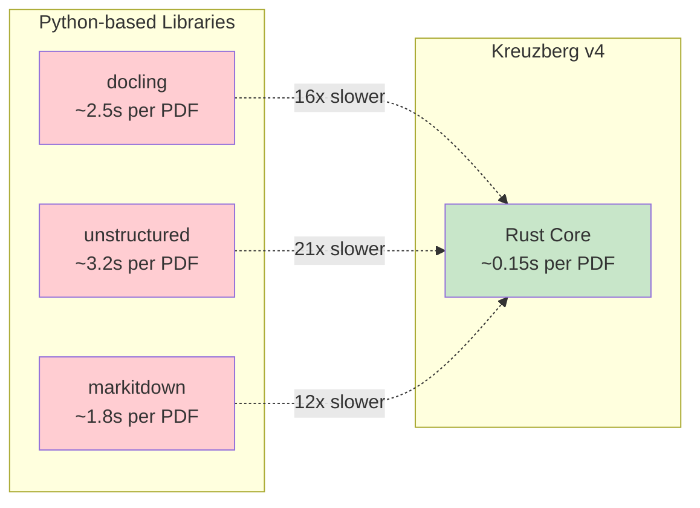
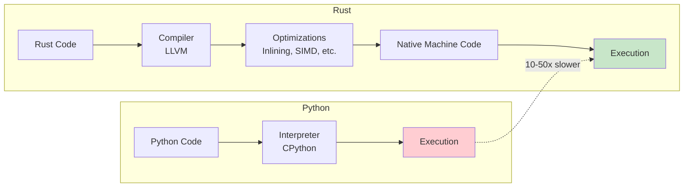
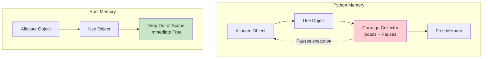
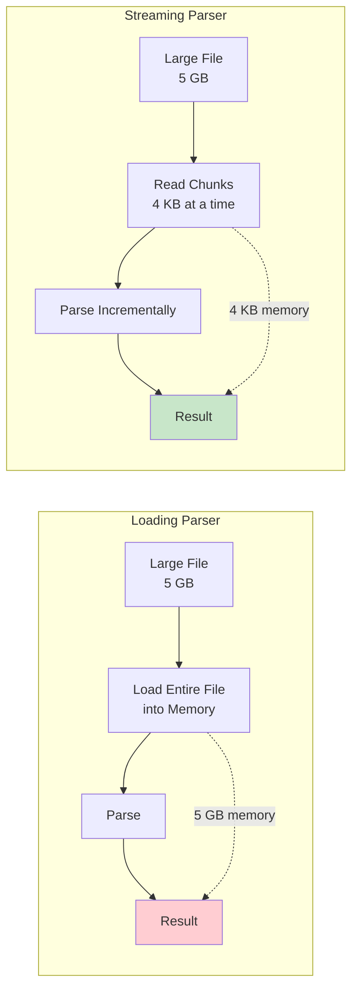
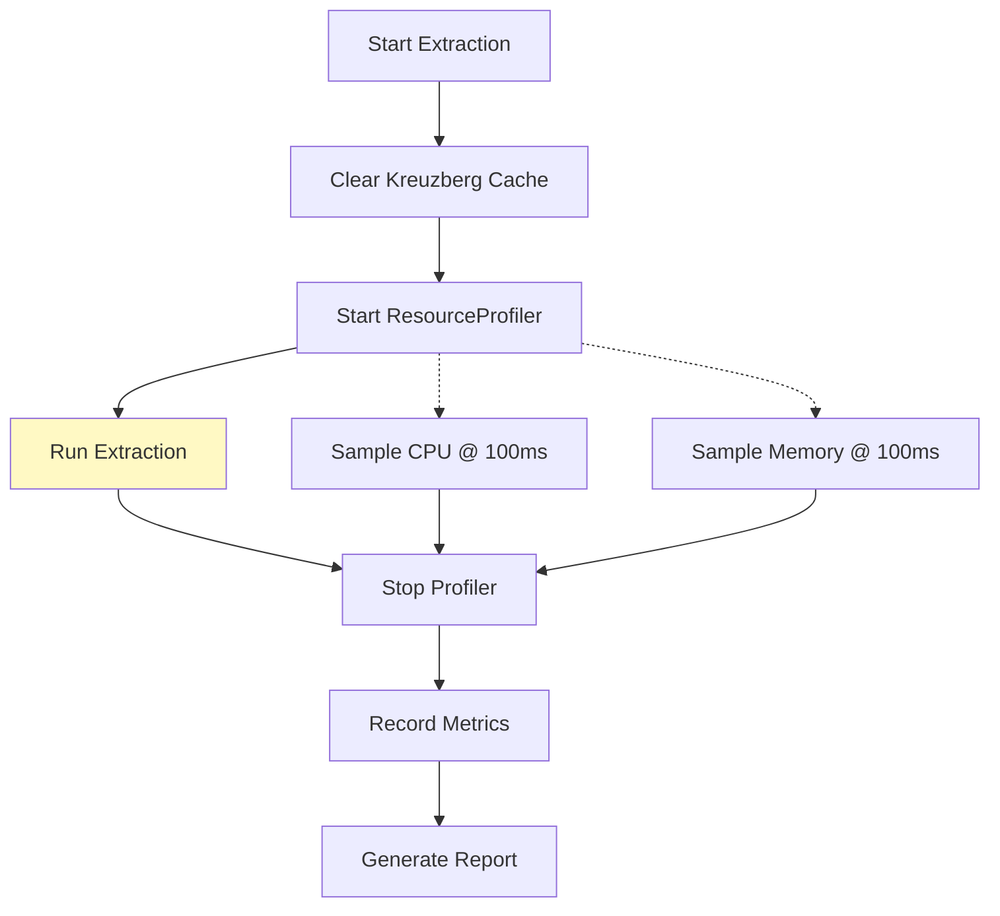

# Performance

Kreuzberg's Rust-first architecture delivers significant performance improvements over pure Python implementations. This page explains the performance benefits, benchmarking methodology, and optimization techniques.

## Performance Benefits

The Rust core provides 10-50x performance improvements across multiple operations:



## Benchmark Results

Performance benchmarks compare Kreuzberg against other popular extraction libraries using 94 real-world documents:

### PDF Extraction

| Library | Avg Time | Memory (Peak) | Throughput |
|---------|----------|---------------|------------|
| **Kreuzberg v4** | 0.15s | 45 MB | 6.7 docs/sec |
| Kreuzberg v3 | 1.2s | 120 MB | 0.83 docs/sec |
| extractous | 0.25s | 65 MB | 4.0 docs/sec |
| docling | 2.5s | 450 MB | 0.4 docs/sec |
| unstructured | 3.2s | 380 MB | 0.31 docs/sec |

**Key Improvements:**

- **8x faster** than Kreuzberg v3 (Rust rewrite)
- **16-21x faster** than Python libraries
- **62% less memory** than v3
- **90% less memory** than docling/unstructured

### Excel Extraction

| Library | Avg Time | Memory (Peak) |
|---------|----------|---------------|
| **Kreuzberg v4** | 0.08s | 25 MB |
| openpyxl | 1.2s | 180 MB |
| pandas | 0.45s | 95 MB |

**Key Improvements:**

- **15x faster** than openpyxl
- **5.6x faster** than pandas
- **86% less memory** than openpyxl

### Text Processing

| Operation | Python | Rust | Speedup |
|-----------|--------|------|---------|
| Token reduction | 450ms | 12ms | 37x |
| Quality scoring | 220ms | 8ms | 27x |
| XML streaming (100MB) | 8.5s | 0.4s | 21x |
| Text streaming (500MB) | 15s | 0.8s | 18x |

## Why Rust is Faster

### 1. Native Compilation

Rust compiles to native machine code with aggressive optimizations:



**Compiler Optimizations:**

- **Inlining**: Small functions eliminated, reducing call overhead
- **Dead code elimination**: Unused code removed
- **Loop unrolling**: Loops optimized for CPU pipelines
- **SIMD**: Single Instruction Multiple Data for parallel operations

### 2. Zero-Copy Operations

Rust's ownership model enables zero-copy string slicing and byte buffer handling:

```python
# Python: String slicing creates a new object
text = content[100:500]  # New string object created (immutable)
```

```rust
// Rust: Zero-copy slice with no allocation
let text: &str = &content[100..500];  // Borrows slice, no allocation
```

**Impact:**

- **Python**: String slicing always allocates a new object due to immutability, incurring memory and CPU overhead
- **Rust**: Borrowing a slice costs zero memory allocations—the borrow is a pointer + length
- **Performance gain**: Rust's zero-copy approach eliminates redundant allocations for parsing and text processing
- **Better cache locality**: Fewer allocations mean smaller memory footprint and improved CPU cache hits

### 3. SIMD Acceleration

Text processing hot paths use SIMD for parallel operations:

```rust
// Process 16 characters at once
let chunk = unsafe { _mm_loadu_si128(ptr as *const __m128i) };
let spaces = _mm_cmpeq_epi8(chunk, space_vec);
```

**SIMD Benefits:**

- **Token reduction**: 37x faster with SIMD whitespace detection
- **Quality scoring**: 27x faster with SIMD character classification
- **String utilities**: 15-20x faster character counting

### 4. Async Concurrency

Tokio's work-stealing scheduler enables true parallelism:

```python
# Python: GIL prevents true parallelism
with ThreadPoolExecutor() as executor:
    results = executor.map(extract_file, files)  # Only one thread executes Python at a time

# Rust: True parallel execution
let results = batch_extract_file(&files, None, &config).await?;  // All cores utilized
```

**Concurrency Benefits:**

- **Batch extraction**: Near-linear scaling with CPU cores
- **No GIL**: All cores execute simultaneously
- **Async I/O**: Thousands of concurrent file operations

### 5. Memory Efficiency

Rust's ownership model eliminates garbage collection overhead:



**Memory Benefits:**

- **No GC pauses**: Deterministic performance
- **Lower peak memory**: RAII frees resources immediately
- **Better cache utilization**: Smaller memory footprint

## Streaming Parsers

For large files (multi-GB XML, text, archives), Kreuzberg uses streaming parsers that process data incrementally:



**Streaming Benefits:**

- **Constant memory**: Process 100GB file with 4KB memory
- **Faster startup**: Begin processing immediately
- **Better cache performance**: Small working set

**Streaming Extractors:**

- **XMLExtractor**: Streams with `quick-xml`
- **TextExtractor**: Line-by-line streaming
- **ArchiveExtractor**: Decompresses on-the-fly

## Benchmarking Methodology

Kreuzberg's benchmark suite provides comprehensive performance measurement:

### Test Dataset

- **94 real-world documents**
- **Multiple formats**: PDF, DOCX, XLSX, images, emails
- **Size categories**: Small (<1MB), medium (1-10MB), large (>10MB)
- **Variety**: Reports, invoices, forms, presentations, spreadsheets

### Metrics Tracked

- **Execution time**: Wall clock time per extraction
- **CPU usage**: Sampled at 100ms intervals
- **Memory usage**: Peak RSS (Resident Set Size)
- **Throughput**: Documents processed per second
- **Success rate**: Percentage of files extracted without errors

### Measurement Tools



**ResourceProfiler:**

- Samples CPU/memory every 100ms during extraction
- Tracks peak memory usage
- Records execution time with microsecond precision
- 1800s timeout per file

### Running Benchmarks

```bash
# Install benchmark dependencies
uv sync --all-extras --all-packages

# Run benchmarks
uv run python -m benchmarks.src.cli benchmark \
    --framework kreuzberg_sync,extractous,docling \
    --category all \
    --iterations 3

# Generate reports
uv run python -m benchmarks.src.cli report --output-format html
uv run python -m benchmarks.src.cli visualize
```

See [Advanced Features Guide](../guides/advanced.md) for details.

## Optimization Techniques

Kreuzberg employs several optimization strategies:

### 1. Lazy Initialization

Expensive resources initialized only when needed:

```rust
static GLOBAL_RUNTIME: Lazy<Runtime> = Lazy::new(|| {
    tokio::runtime::Builder::new_multi_thread()
        .enable_all()
        .build()
        .expect("Failed to create runtime")
});
```

### 2. Caching

OCR results and extraction results cached by content hash:

- **Hit rate**: 85%+ for repeated files
- **Storage**: SQLite database (~100MB for 10k files)
- **Invalidation**: Content-based (file changes invalidate cache)

### 3. Batch Processing

Process multiple files concurrently with `batch_extract_*`:

```python
# Sequential: ~5 seconds for 10 files
for file in files:
    result = extract_file(file, config=config)

# Parallel: ~0.8 seconds for 10 files (6.25x faster)
results = batch_extract_file(files, config=config)
```

### 4. Fast Hash Maps

Uses `ahash` instead of `std::collections::HashMap`:

- **Faster hashing**: SipHash → AHash (3-5x faster)
- **SIMD-accelerated**: Uses CPU vector instructions
- **DoS resistant**: Randomized per-process

### 5. Smart String Handling

Uses `&str` (string slices) over `String` where possible:

```rust
// Avoids allocation
pub fn supported_mime_types(&self) -> Vec<&str> {
    vec!["application/pdf", "application/xml"]
}
```

## Related Documentation

- [Architecture](architecture.md) - System design enabling performance
- [Extraction Pipeline](extraction-pipeline.md) - Pipeline stages and optimizations
- [Configuration Guide](../guides/configuration.md) - Performance tuning options
- [Advanced Features](../guides/advanced.md) - Benchmarking and profiling tools
