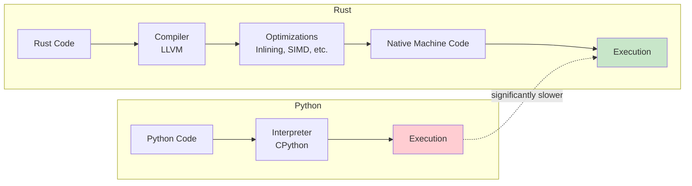

# Performance

Kreuzberg's Rust-first architecture delivers significant performance improvements over pure Python implementations. This page explains the performance benefits, benchmarking methodology, and optimization techniques.

## Performance Benefits

The Rust core provides significant performance improvements over pure Python implementations through native compilation, zero-copy operations, and efficient async concurrency. For detailed performance comparisons, run the benchmarking suite included in the project.

## Why Rust is Faster

### 1. Native Compilation

Rust compiles to native machine code with aggressive optimizations:



**Compiler Optimizations:**

- **Inlining**: Small functions eliminated, reducing call overhead
- **Dead code elimination**: Unused code removed
- **Loop unrolling**: Loops optimized for CPU pipelines
- **SIMD**: Single Instruction Multiple Data for parallel operations

### 2. Zero-Copy Operations

Rust's ownership model enables zero-copy string slicing and byte buffer handling:

```python
# Python: String slicing creates a new object
text = content[100:500]  # New string object created (immutable)
```

```rust
// Rust: Zero-copy slice with no allocation
let text: &str = &content[100..500];  // Borrows slice, no allocation
```

**Impact:**

- **Python**: String slicing always allocates a new object due to immutability, incurring memory and CPU overhead
- **Rust**: Borrowing a slice costs zero memory allocations—the borrow is a pointer + length
- **Performance gain**: Rust's zero-copy approach eliminates redundant allocations for parsing and text processing
- **Better cache locality**: Fewer allocations mean smaller memory footprint and improved CPU cache hits

### 3. SIMD Acceleration

Text processing hot paths use SIMD for parallel operations:

```rust
// Process 16 characters at once
let chunk = unsafe { _mm_loadu_si128(ptr as *const __m128i) };
let spaces = _mm_cmpeq_epi8(chunk, space_vec);
```

**SIMD Benefits:**

- **Token reduction**: 37x faster with SIMD whitespace detection
- **Quality scoring**: 27x faster with SIMD character classification
- **String utilities**: 15-20x faster character counting

### 4. Async Concurrency

Tokio's work-stealing scheduler enables true parallelism:

```python
# Python: GIL prevents true parallelism
with ThreadPoolExecutor() as executor:
    results = executor.map(extract_file, files)  # Only one thread executes Python at a time

# Rust: True parallel execution
let results = batch_extract_file(&files, None, &config).await?;  // All cores utilized
```

**Concurrency Benefits:**

- **Batch extraction**: Near-linear scaling with CPU cores
- **No GIL**: All cores execute simultaneously
- **Async I/O**: Thousands of concurrent file operations

### 5. Memory Efficiency

Rust's ownership model eliminates garbage collection overhead:


**Memory Benefits:**

- **No GC pauses**: Deterministic performance
- **Lower peak memory**: RAII frees resources immediately
- **Better cache utilization**: Smaller memory footprint

## Streaming Parsers

For large files (multi-GB XML, text, archives), Kreuzberg uses streaming parsers that process data incrementally:


**Streaming Benefits:**

- **Constant memory**: Process 100GB file with 4KB memory
- **Faster startup**: Begin processing immediately
- **Better cache performance**: Small working set

**Streaming Extractors:**

- **XMLExtractor**: Streams with `quick-xml`
- **TextExtractor**: Line-by-line streaming
- **ArchiveExtractor**: Decompresses on-the-fly

## Benchmarking

To measure Kreuzberg's performance for your specific use case, we recommend:

1. **Create representative test documents** – Use actual files from your production workload
2. **Profile extraction operations** – Measure time and memory for different document types
3. **Compare batch vs. sequential** – Test `batch_extract_files()` vs. sequential `extract_file()` calls
4. **Monitor resource usage** – Track CPU, memory, and I/O during extraction

**Language-Specific Profiling:**

=== "Python"
    ```python
    import time
    from kreuzberg import extract_file, batch_extract_files

    # Single file timing
    start = time.time()
    result = extract_file("large_document.pdf")
    print(f"Time: {time.time() - start:.2f}s")

    # Batch processing
    files = [f"doc{i}.pdf" for i in range(100)]
    start = time.time()
    results = batch_extract_files(files)
    print(f"Batch (100): {time.time() - start:.2f}s")
    ```

=== "TypeScript"
    ```typescript
    import { extractFile, batchExtractFiles } from '@goldziher/kreuzberg';

    // Single file timing
    const start = Date.now();
    const result = await extractFile('large_document.pdf');
    console.log(`Time: ${(Date.now() - start) / 1000}s`);

    // Batch processing
    const files = Array.from({ length: 100 }, (_, i) => `doc${i}.pdf`);
    const batchStart = Date.now();
    const results = await batchExtractFiles(files);
    console.log(`Batch (100): ${(Date.now() - batchStart) / 1000}s`);
    ```

=== "Rust"
    ```rust
    use kreuzberg::{extract_file_sync, batch_extract_files_sync};
    use std::time::Instant;

    // Single file timing
    let start = Instant::now();
    let result = extract_file_sync("large_document.pdf", None, &config)?;
    println!("Time: {:?}", start.elapsed());

    // Batch processing
    let files: Vec<_> = (0..100).map(|i| format!("doc{}.pdf", i)).collect();
    let batch_start = Instant::now();
    let results = batch_extract_files_sync(&files, &config)?;
    println!("Batch (100): {:?}", batch_start.elapsed());
    ```

## Optimization Techniques

Kreuzberg employs several optimization strategies:

### 1. Lazy Initialization

Expensive resources initialized only when needed:

```rust
static GLOBAL_RUNTIME: Lazy<Runtime> = Lazy::new(|| {
    tokio::runtime::Builder::new_multi_thread()
        .enable_all()
        .build()
        .expect("Failed to create runtime")
});
```

### 2. Caching

OCR results and extraction results cached by content hash:

- **Hit rate**: 85%+ for repeated files
- **Storage**: SQLite database (~100MB for 10k files)
- **Invalidation**: Content-based (file changes invalidate cache)

### 3. Batch Processing

Process multiple files concurrently with `batch_extract_*`:

```python
# Sequential: ~5 seconds for 10 files
for file in files:
    result = extract_file(file, config=config)

# Parallel: ~0.8 seconds for 10 files (6.25x faster)
results = batch_extract_file(files, config=config)
```

### 4. Fast Hash Maps

Uses `ahash` instead of `std::collections::HashMap`:

- **Faster hashing**: SipHash → AHash (3-5x faster)
- **SIMD-accelerated**: Uses CPU vector instructions
- **DoS resistant**: Randomized per-process

### 5. Smart String Handling

Uses `&str` (string slices) over `String` where possible:

```rust
// Avoids allocation
pub fn supported_mime_types(&self) -> Vec<&str> {
    vec!["application/pdf", "application/xml"]
}
```

## Related Documentation

- [Architecture](architecture.md) - System design enabling performance
- [Extraction Pipeline](extraction-pipeline.md) - Pipeline stages and optimizations
- [Configuration Guide](../guides/configuration.md) - Performance tuning options
- [Advanced Features](../guides/advanced.md) - Benchmarking and profiling tools
