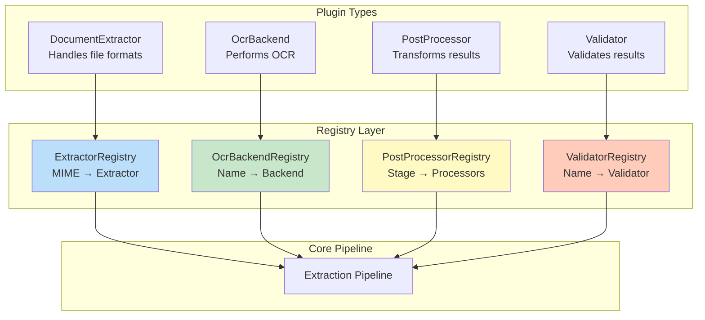
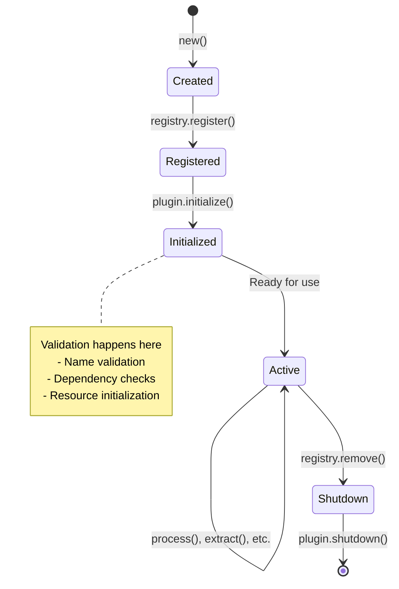
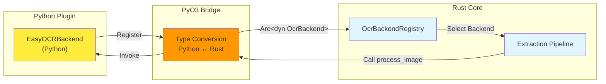

# Plugin System

Kreuzberg's plugin system provides a flexible, type-safe way to extend functionality across language boundaries. The architecture supports four distinct plugin types, each with specific responsibilities in the extraction pipeline.

## Plugin Architecture

The plugin system uses a registry pattern with trait-based plugins stored as `Arc<dyn Trait>` for thread-safe shared access:



## Plugin Types

### 1. DocumentExtractor

Handles extraction for specific file formats. Maps MIME types to extraction implementations.

**Trait Definition:**

```rust
#[async_trait]
pub trait DocumentExtractor: Plugin {
    /// MIME types this extractor supports
    fn supported_mime_types(&self) -> Vec<&str>;

    /// Priority (higher = selected first)
    fn priority(&self) -> i32 { 0 }

    /// Extract from file path
    async fn extract_file(
        &self,
        path: &Path,
        mime_type: &str,
        config: &ExtractionConfig,
    ) -> Result<ExtractionResult>;

    /// Extract from bytes
    async fn extract_bytes(
        &self,
        data: &[u8],
        mime_type: &str,
        config: &ExtractionConfig,
    ) -> Result<ExtractionResult>;
}
```

**Built-in Extractors:**

- **PDFExtractor**: Handles `application/pdf` using pdfium-render
- **ExcelExtractor**: Handles `application/vnd.openxmlformats-officedocument.spreadsheetml.sheet` using calamine
- **ImageExtractor**: Handles image MIME types, routes to OCR
- **XMLExtractor**: Streaming XML parser for `application/xml`, `text/xml`
- **TextExtractor**: Streaming text parser for `text/plain`, `text/markdown`
- **EmailExtractor**: Parses `message/rfc822` (EML) and `application/vnd.ms-outlook` (MSG)

**Priority System:**

When multiple extractors support the same MIME type, priority determines selection:

```rust
// Higher priority = selected first
impl DocumentExtractor for CustomPDFExtractor {
    fn priority(&self) -> i32 { 100 }  // Overrides default PDFExtractor (priority 0)
}
```

### 2. OcrBackend

Performs optical character recognition on images. Supports multiple OCR engines.

**Trait Definition:**

```rust
#[async_trait]
pub trait OcrBackend: Plugin {
    /// Check if backend supports a language
    fn supports_language(&self, language: &str) -> bool;

    /// Perform OCR on image bytes
    async fn process_image(
        &self,
        image_data: &[u8],
        language: Option<&str>,
        config: &OcrConfig,
    ) -> Result<OcrResult>;
}
```

**Built-in Backends:**

- **TesseractBackend**: Native Tesseract integration (Rust, fast)
- **EasyOCRBackend**: Python-based, supports 80+ languages (Python bindings)
- **PaddleOCRBackend**: Python-based, excellent for Chinese/Japanese/Korean (Python bindings)

**Language Support:**

```python
# Check supported languages
registry = get_ocr_backend_registry()
tesseract = registry.get("tesseract")
print(tesseract.supports_language("eng"))  # True
print(tesseract.supports_language("chi_sim"))  # True if Chinese data installed
```

### 3. PostProcessor

Transforms extraction results after initial extraction. Executes in stages for ordering.

**Trait Definition:**

```rust
#[async_trait]
pub trait PostProcessor: Plugin {
    /// Processing stage (Early, Middle, Late)
    fn stage(&self) -> ProcessingStage;

    /// Check if processor should run
    fn should_process(&self, result: &ExtractionResult, config: &ExtractionConfig) -> bool {
        true
    }

    /// Process extraction result
    async fn process(
        &self,
        result: ExtractionResult,
        config: &ExtractionConfig,
    ) -> Result<ExtractionResult>;
}
```

**Processing Stages:**

```rust
pub enum ProcessingStage {
    Early,   // Run first (e.g., text cleanup)
    Middle,  // Run second (e.g., entity extraction)
    Late,    // Run last (e.g., formatting)
}
```

**Example Use Cases:**

- **Early**: Remove control characters, fix encoding issues
- **Middle**: Extract entities, detect language, classify content
- **Late**: Apply formatting, generate summaries

### 4. Validator

Validates extraction results before post-processing. Can fail extraction if requirements not met.

**Trait Definition:**

```rust
#[async_trait]
pub trait Validator: Plugin {
    /// Check if validator should run
    fn should_validate(&self, result: &ExtractionResult, config: &ExtractionConfig) -> bool {
        true
    }

    /// Validate extraction result (returns error if invalid)
    async fn validate(&self, result: &ExtractionResult, config: &ExtractionConfig) -> Result<()>;
}
```

**Example Validators:**

```python
class MinimumLengthValidator:
    """Ensures extracted text meets minimum length"""
    def validate(self, result: ExtractionResult, config: ExtractionConfig) -> None:
        if len(result.content) < 100:
            raise ValidationError("Text too short")

class QualityThresholdValidator:
    """Ensures quality score above threshold"""
    def validate(self, result: ExtractionResult, config: ExtractionConfig) -> None:
        quality = result.metadata.additional.get("quality_score", 0.0)
        if quality < 0.5:
            raise ValidationError("Quality below threshold")
```

## Plugin Lifecycle

All plugins follow a standard lifecycle:



**Lifecycle Methods:**

```rust
pub trait Plugin: Send + Sync {
    fn name(&self) -> &str;              // Unique identifier
    fn version(&self) -> String;         // Semantic version
    fn initialize(&self) -> Result<()>;  // Setup resources
    fn shutdown(&self) -> Result<()>;    // Cleanup resources
}
```

**Registration:**

```rust
// Rust
let registry = get_document_extractor_registry();
let mut registry = registry.write().unwrap();
registry.register("custom-pdf", Arc::new(CustomPDFExtractor::new()))?;
```

```python
# Python
from kreuzberg import get_document_extractor_registry

registry = get_document_extractor_registry()
registry.register(CustomPDFExtractor())
```

## Cross-Language Plugin Support

Plugins can be implemented in any supported language and interact seamlessly:



**Type Conversion:**

The bridge layers (PyO3, NAPI-RS, Magnus) handle type conversion:

- Rust `Vec<u8>` ↔ Python `bytes` ↔ JavaScript `Buffer`
- Rust `String` ↔ Python `str` ↔ JavaScript `string`
- Rust structs ↔ Python dataclasses ↔ JavaScript objects

**Zero-Copy Where Possible:**

For large data (file bytes, images), bindings use buffer protocols to avoid copying:

```python
# Python receives Rust bytes without copying
def extract_bytes(self, data: bytes, mime_type: str, config: dict) -> dict:
    # `data` is a zero-copy view into Rust memory
    return {"content": process(data)}
```

## Plugin Discovery

Plugins can be registered:

1. **Built-in**: Automatically registered on library initialization
2. **Programmatic**: Manually registered via registry API
3. **Configuration**: Loaded from `kreuzberg.toml` (future feature)

## Thread Safety

All plugins must be `Send + Sync` for concurrent access:

- **`Send`**: Plugin can be moved between threads
- **`Sync`**: Plugin can be accessed from multiple threads simultaneously

Interior mutability (via `Mutex`, `RwLock`, `AtomicBool`) enables mutable state in thread-safe plugins.

## Related Documentation

- [Creating Plugins](../guides/plugins.md) - Step-by-step guide to building plugins
- [Architecture](architecture.md) - Overall system design
- [Extraction Pipeline](extraction-pipeline.md) - Where plugins fit in the pipeline
- [API Reference](../reference/api-python.md) - Plugin API documentation
