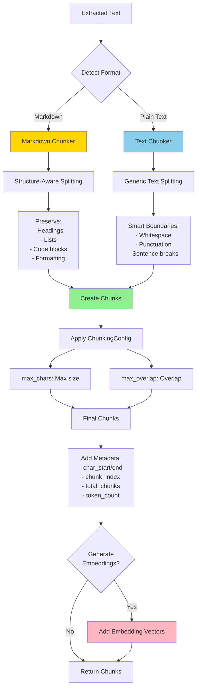
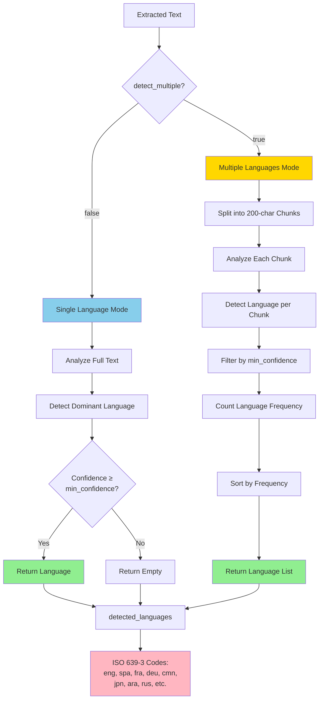

# Advanced Features

Kreuzberg provides text processing, analysis, and optimization features beyond basic extraction.

## Text Chunking



Split extracted text into chunks for downstream processing like RAG (Retrieval-Augmented Generation) systems, vector databases, or LLM context windows.

### Overview

Kreuzberg uses the `text-splitter` library with two chunking strategies:

- **Text Chunker**: Generic text splitting with smart boundaries (whitespace, punctuation)
- **Markdown Chunker**: Structure-aware splitting that preserves headings, lists, code blocks, and formatting

### Configuration

=== "C#"

    --8<-- "docs/snippets/csharp/advanced/chunking_config.cs"

=== "Go"

    --8<-- "docs/snippets/go/config/chunking_config.md"

=== "Java"

    --8<-- "docs/snippets/java/config/chunking_config.md"

=== "Python"

    --8<-- "docs/snippets/python/config/chunking_config.md"

=== "Ruby"

    --8<-- "docs/snippets/ruby/config/chunking_config.md"

=== "Rust"

    --8<-- "docs/snippets/rust/advanced/chunking_config.md"

=== "TypeScript"

    --8<-- "docs/snippets/typescript/config/chunking_config.md"

### Chunk Output

Each chunk includes:

- `content`: The chunk text
- `metadata`:
  - `char_start`: Start position in original text
  - `char_end`: End position in original text
  - `chunk_index`: Zero-based chunk number
  - `total_chunks`: Total number of chunks
  - `token_count`: Token count (if embeddings enabled)
- `embedding`: Optional embedding vector (if configured)

### Example: RAG Pipeline

=== "C#"

    --8<-- "docs/snippets/csharp/advanced/chunking_rag.cs"

=== "Go"

    --8<-- "docs/snippets/go/advanced/chunking_rag.md"

=== "Java"

    --8<-- "docs/snippets/java/advanced/chunking_rag.md"

=== "Python"

    --8<-- "docs/snippets/python/utils/chunking_rag.md"

=== "Ruby"

    --8<-- "docs/snippets/ruby/advanced/chunking_rag.md"

=== "Rust"

    --8<-- "docs/snippets/rust/advanced/chunking_rag.md"

=== "TypeScript"

    --8<-- "docs/snippets/typescript/utils/chunking_rag.md"

## Language Detection



Detect languages in extracted text using the fast `whatlang` library. Supports 60+ languages with ISO 639-3 codes.

### Configuration

=== "C#"

    --8<-- "docs/snippets/csharp/advanced/language_detection_config.cs"

=== "Go"

    --8<-- "docs/snippets/go/config/language_detection_config.md"

=== "Java"

    --8<-- "docs/snippets/java/config/language_detection_config.md"

=== "Python"

    --8<-- "docs/snippets/python/config/language_detection_config.md"

=== "Ruby"

    --8<-- "docs/snippets/ruby/config/language_detection_config.md"

=== "Rust"

    --8<-- "docs/snippets/rust/advanced/language_detection_config.md"

=== "TypeScript"

    --8<-- "docs/snippets/typescript/config/language_detection_config.md"

### Detection Modes

**Single Language** (`detect_multiple: false`):
- Detects dominant language only
- Faster, single-pass detection
- Best for monolingual documents

**Multiple Languages** (`detect_multiple: true`):
- Chunks text into 200-character segments
- Detects language in each chunk
- Returns languages sorted by frequency
- Best for multilingual documents

### Supported Languages

ISO 639-3 codes including:

- **European**: eng (English), spa (Spanish), fra (French), deu (German), ita (Italian), por (Portuguese), rus (Russian), nld (Dutch), pol (Polish), swe (Swedish)
- **Asian**: cmn (Chinese), jpn (Japanese), kor (Korean), tha (Thai), vie (Vietnamese), ind (Indonesian)
- **Middle Eastern**: ara (Arabic), pes (Persian), urd (Urdu), heb (Hebrew)
- **And 40+ more**

### Example

=== "C#"

    --8<-- "docs/snippets/csharp/advanced/language_detection_multilingual.cs"

=== "Go"

    --8<-- "docs/snippets/go/advanced/language_detection_multilingual.md"

=== "Java"

    --8<-- "docs/snippets/java/advanced/language_detection_multilingual.md"

=== "Python"

    --8<-- "docs/snippets/python/utils/language_detection_multilingual.md"

=== "Ruby"

    --8<-- "docs/snippets/ruby/advanced/language_detection_multilingual.md"

=== "Rust"

    --8<-- "docs/snippets/rust/advanced/language_detection_multilingual.md"

=== "TypeScript"

    --8<-- "docs/snippets/typescript/metadata/language_detection_multilingual.md"

## Embedding Generation

Generate embeddings for vector databases, semantic search, and RAG systems using ONNX models via `fastembed-rs`.

### Available Presets

| Preset | Model | Dimensions | Max Tokens | Use Case |
|--------|-------|-----------|------------|----------|
| **fast** | AllMiniLML6V2Q | 384 | 512 | Rapid prototyping, development |
| **balanced** | BGEBaseENV15 | 768 | 1024 | Production RAG, general-purpose |
| **quality** | BGELargeENV15 | 1024 | 2000 | Maximum accuracy, complex docs |
| **multilingual** | MultilingualE5Base | 768 | 1024 | 100+ languages, international |

!!! note "Max Tokens vs. max_chars"
    The "Max Tokens" values shown are the model's maximum token limits. These don't directly correspond to the `max_chars` setting in `ChunkingConfig`, which controls character-based chunking. The embedding model will process chunks up to its token limit.

### Configuration

=== "C#"

    --8<-- "docs/snippets/csharp/advanced/embedding_with_chunking.md"

=== "Go"

    --8<-- "docs/snippets/go/advanced/embedding_with_chunking.md"

=== "Java"

    --8<-- "docs/snippets/java/advanced/embedding_with_chunking.md"

=== "Python"

    --8<-- "docs/snippets/python/utils/embedding_with_chunking.md"

=== "Ruby"

    --8<-- "docs/snippets/ruby/advanced/embedding_with_chunking.md"

=== "Rust"

    --8<-- "docs/snippets/rust/advanced/embedding_with_chunking.md"

=== "TypeScript"

    --8<-- "docs/snippets/typescript/utils/embedding_with_chunking.md"

### Example: Vector Database Integration

=== "C#"

    --8<-- "docs/snippets/csharp/advanced/vector_database_integration.md"

=== "Go"

    --8<-- "docs/snippets/go/advanced/vector_database_integration.md"

=== "Java"

    --8<-- "docs/snippets/java/advanced/vector_database_integration.md"

=== "Python"

    --8<-- "docs/snippets/python/utils/vector_database_integration.md"

=== "Ruby"

    --8<-- "docs/snippets/ruby/advanced/vector_database_integration.md"

=== "Rust"

    --8<-- "docs/snippets/rust/advanced/vector_database_integration.md"

=== "TypeScript"

    --8<-- "docs/snippets/typescript/utils/vector_database_integration.md"

## Token Reduction

Intelligently reduce token count while preserving meaning. Removes stopwords, redundancy, and applies compression.

### Reduction Levels

| Level | Reduction | Features |
|-------|-----------|----------|
| **off** | 0% | No reduction, pass-through |
| **moderate** | 15-25% | Stopwords + redundancy removal |
| **aggressive** | 30-50% | Semantic clustering, importance scoring |

### Configuration

=== "C#"

    --8<-- "docs/snippets/csharp/advanced/token_reduction_config.md"

=== "Go"

    --8<-- "docs/snippets/go/config/token_reduction_config.md"

=== "Java"

    --8<-- "docs/snippets/java/config/token_reduction_config.md"

=== "Python"

    --8<-- "docs/snippets/python/config/token_reduction_config.md"

=== "Ruby"

    --8<-- "docs/snippets/ruby/config/token_reduction_config.md"

=== "Rust"

    --8<-- "docs/snippets/rust/advanced/token_reduction_config.md"

=== "TypeScript"

    --8<-- "docs/snippets/typescript/config/token_reduction_config.md"

### Example

=== "C#"

    --8<-- "docs/snippets/csharp/advanced/token_reduction_example.md"

=== "Go"

    --8<-- "docs/snippets/go/advanced/token_reduction_example.md"

=== "Java"

    --8<-- "docs/snippets/java/advanced/token_reduction_example.md"

=== "Python"

    --8<-- "docs/snippets/python/utils/token_reduction_example.md"

=== "Ruby"

    --8<-- "docs/snippets/ruby/advanced/token_reduction_example.md"

=== "Rust"

    --8<-- "docs/snippets/rust/advanced/token_reduction_example.md"

=== "TypeScript"

    --8<-- "docs/snippets/typescript/utils/token_reduction_example.md"

## Keyword Extraction

Extract important keywords and phrases using YAKE or RAKE algorithms.

!!! note "Feature Flag Required"
    Keyword extraction requires the `keywords` feature flag enabled when building Kreuzberg.

### Available Algorithms

**YAKE (Yet Another Keyword Extractor)**:
- Statistical/unsupervised approach
- Factors: term frequency, position, capitalization, context
- Best for: General-purpose extraction

**RAKE (Rapid Automatic Keyword Extraction)**:
- Co-occurrence based
- Analyzes word frequency and degree in phrases
- Best for: Domain-specific terms, phrase extraction

### Configuration

=== "C#"

    --8<-- "docs/snippets/csharp/advanced/keyword_extraction_config.md"

=== "Go"

    --8<-- "docs/snippets/go/config/keyword_extraction_config.md"

=== "Java"

    --8<-- "docs/snippets/java/config/keyword_extraction_config.md"

=== "Python"

    --8<-- "docs/snippets/python/config/keyword_extraction_config.md"

=== "Ruby"

    --8<-- "docs/snippets/ruby/config/keyword_extraction_config.md"

=== "Rust"

    --8<-- "docs/snippets/rust/advanced/keyword_extraction_config.md"

=== "TypeScript"

    --8<-- "docs/snippets/typescript/config/keyword_extraction_config.md"

### Example

=== "C#"

    --8<-- "docs/snippets/csharp/advanced/keyword_extraction_example.md"

=== "Go"

    --8<-- "docs/snippets/go/advanced/keyword_extraction_example.md"

=== "Java"

    --8<-- "docs/snippets/java/advanced/keyword_extraction_example.md"

=== "Python"

    --8<-- "docs/snippets/python/utils/keyword_extraction_example.md"

=== "Ruby"

    --8<-- "docs/snippets/ruby/advanced/keyword_extraction_example.md"

=== "Rust"

    --8<-- "docs/snippets/rust/advanced/keyword_extraction_example.md"

=== "TypeScript"

    --8<-- "docs/snippets/typescript/utils/keyword_extraction_example.md"

## Quality Processing

Automatic text quality scoring that detects OCR artifacts, script content, navigation elements, and evaluates document structure.

### Quality Factors

| Factor | Weight | Detects |
|--------|--------|---------|
| OCR Artifacts | 30% | Scattered chars, repeated punctuation, malformed words |
| Script Content | 20% | JavaScript, CSS, HTML tags |
| Navigation Elements | 10% | Breadcrumbs, pagination, skip links |
| Document Structure | 20% | Sentence/paragraph length, punctuation |
| Metadata Quality | 10% | Title, author, subject presence |

### Configuration

Quality processing is enabled by default:

=== "C#"

    --8<-- "docs/snippets/csharp/advanced/quality_processing_config.md"

=== "Go"

    --8<-- "docs/snippets/go/config/quality_processing_config.md"

=== "Java"

    --8<-- "docs/snippets/java/config/quality_processing_config.md"

=== "Python"

    --8<-- "docs/snippets/python/config/quality_processing_config.md"

=== "Ruby"

    --8<-- "docs/snippets/ruby/config/quality_processing_config.md"

=== "Rust"

    --8<-- "docs/snippets/rust/advanced/quality_processing_config.md"

=== "TypeScript"

    --8<-- "docs/snippets/typescript/config/quality_processing_config.md"

### Quality Score

The quality score ranges from 0.0 (lowest quality) to 1.0 (highest quality):

- **0.0-0.3**: Very low quality (heavy OCR artifacts, script content)
- **0.3-0.6**: Low quality (some artifacts, poor structure)
- **0.6-0.8**: Moderate quality (clean text, decent structure)
- **0.8-1.0**: High quality (excellent structure, no artifacts)

### Example

=== "C#"

    --8<-- "docs/snippets/csharp/advanced/quality_processing_example.md"

=== "Go"

    --8<-- "docs/snippets/go/advanced/quality_processing_example.md"

=== "Java"

    --8<-- "docs/snippets/java/advanced/quality_processing_example.md"

=== "Python"

    --8<-- "docs/snippets/python/utils/quality_processing_example.md"

=== "Ruby"

    --8<-- "docs/snippets/ruby/advanced/quality_processing_example.md"

=== "Rust"

    --8<-- "docs/snippets/rust/advanced/quality_processing_example.md"

=== "TypeScript"

    --8<-- "docs/snippets/typescript/utils/quality_processing_example.md"

## Combining Features

Advanced features work together:

=== "C#"

    --8<-- "docs/snippets/csharp/advanced/combining_all_features.md"

=== "Go"

    --8<-- "docs/snippets/go/api/combining_all_features.md"

=== "Java"

    --8<-- "docs/snippets/java/api/combining_all_features.md"

=== "Python"

    --8<-- "docs/snippets/python/advanced/combining_all_features.md"

=== "Ruby"

    --8<-- "docs/snippets/ruby/api/combining_all_features.md"

=== "Rust"

    --8<-- "docs/snippets/rust/api/combining_all_features.md"

=== "TypeScript"

    --8<-- "docs/snippets/typescript/getting-started/combining_all_features.md"

## Page Tracking Patterns

Advanced patterns for using page tracking in real-world applications.

### Chunk-to-Page Mapping

When both chunking and page tracking are enabled, chunks automatically include page metadata:

```python
from kreuzberg import extract_file_sync, ExtractionConfig, ChunkingConfig, PageConfig

config = ExtractionConfig(
    chunking=ChunkingConfig(chunk_size=500, overlap=50),
    pages=PageConfig(extract_pages=True)
)

result = extract_file_sync("document.pdf", config=config)

if result.chunks:
    for chunk in result.chunks:
        if chunk.metadata.first_page:
            page_range = (
                f"Page {chunk.metadata.first_page}"
                if chunk.metadata.first_page == chunk.metadata.last_page
                else f"Pages {chunk.metadata.first_page}-{chunk.metadata.last_page}"
            )
            print(f"Chunk: {chunk.text[:50]}... ({page_range})")
```

### Page-Filtered Search

Filter chunks by page range for focused retrieval:

```python
def search_in_pages(chunks: list[Chunk], query: str, page_start: int, page_end: int) -> list[Chunk]:
    """Search only within specified page range."""
    page_chunks = [
        c for c in chunks
        if c.metadata.first_page and c.metadata.last_page
        and c.metadata.first_page >= page_start
        and c.metadata.last_page <= page_end
    ]
    return search_chunks(page_chunks, query)
```

### Page-Aware Embeddings

Include page context in embeddings for better retrieval:

```python
for chunk in result.chunks:
    if chunk.metadata.first_page:
        context = f"Page {chunk.metadata.first_page}: {chunk.text}"
        embedding = embed(context)
        store_with_metadata(embedding, {
            "page": chunk.metadata.first_page,
            "text": chunk.text
        })
```

### Per-Page Processing

Process each page independently:

```python
from kreuzberg import extract_file_sync, ExtractionConfig, PageConfig

config = ExtractionConfig(
    pages=PageConfig(extract_pages=True)
)

result = extract_file_sync("document.pdf", config=config)

if result.pages:
    for page in result.pages:
        print(f"Page {page.page_number}:")
        print(f"  Content: {len(page.content)} chars")
        print(f"  Tables: {len(page.tables)}")
        print(f"  Images: {len(page.images)}")
```

### Format-Specific Strategies

**PDF Documents**: Use byte boundaries for precise page lookups. Ideal for legal documents, research papers.

**Presentations (PPTX)**: Process slides independently. Use `PageUnitType::Slide` to distinguish from regular pages.

**Word Documents (DOCX)**: Page breaks may be approximate. Verify `PageStructure.boundaries` exists before using.

**Multi-Format**: Check `PageStructure` availability:

```python
if result.metadata.pages and result.metadata.pages.boundaries:
    # Page tracking available
    process_with_pages(result)
else:
    # Fallback to page-less processing
    process_without_pages(result)
```
