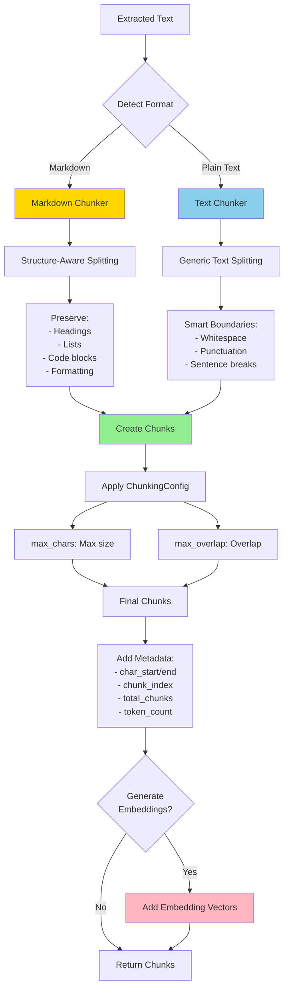
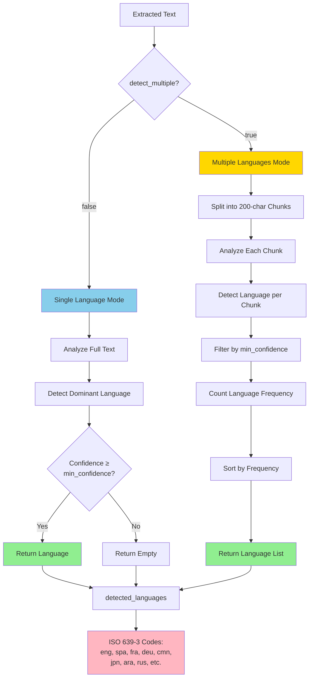

# Advanced Features

Kreuzberg provides text processing, analysis, and optimization features beyond basic extraction.

## Text Chunking



Split extracted text into chunks for downstream processing like RAG (Retrieval-Augmented Generation) systems, vector databases, or LLM context windows.

### Overview

Kreuzberg uses the `text-splitter` library with two chunking strategies:

- **Text Chunker**: Generic text splitting with smart boundaries (whitespace, punctuation)
- **Markdown Chunker**: Structure-aware splitting that preserves headings, lists, code blocks, and formatting

### Configuration

=== "Python"

    ```python
    from kreuzberg import ExtractionConfig, ChunkingConfig

    config = ExtractionConfig(
        chunking=ChunkingConfig(
            max_chars=1000,        # Maximum chunk size
            max_overlap=200        # Overlap between chunks
        )
    )
    ```

=== "TypeScript"

    ```typescript
    import { ExtractionConfig, ChunkingConfig } from '@kreuzberg/sdk';

    const config = new ExtractionConfig({
      chunking: new ChunkingConfig({
        maxChars: 1000,
        maxOverlap: 200
      })
    });
    ```

=== "Rust"

    ```rust
    use kreuzberg::{ExtractionConfig, ChunkingConfig};

    let config = ExtractionConfig {
        chunking: Some(ChunkingConfig {
            max_chars: 1000,
            max_overlap: 200,
            embedding: None,
        }),
        ..Default::default()
    };
    ```

=== "Java"

    ```java
    import dev.kreuzberg.config.ExtractionConfig;
    import dev.kreuzberg.config.ChunkingConfig;

    ExtractionConfig config = ExtractionConfig.builder()
        .chunking(ChunkingConfig.builder()
            .maxChars(1000)
            .maxOverlap(200)
            .build())
        .build();
    ```

=== "Go"

    --8<-- "snippets/go/chunking.md"

!!! note "Ruby Support"
    Ruby bindings are currently under development and not yet production-ready.

### Chunk Output

Each chunk includes:

- `content`: The chunk text
- `metadata`:
  - `char_start`: Start position in original text
  - `char_end`: End position in original text
  - `chunk_index`: Zero-based chunk number
  - `total_chunks`: Total number of chunks
  - `token_count`: Token count (if embeddings enabled)
- `embedding`: Optional embedding vector (if configured)

### Example: RAG Pipeline

=== "Python"

    ```python
    from kreuzberg import extract_file, ExtractionConfig, ChunkingConfig, EmbeddingConfig, EmbeddingModelType

    config = ExtractionConfig(
        chunking=ChunkingConfig(
            max_chars=500,
            max_overlap=50,
            embedding=EmbeddingConfig(
                model=EmbeddingModelType.preset("balanced"),
                normalize=True
            )
        )
    )

    result = extract_file("research_paper.pdf", config=config)

    for chunk in result.chunks:
        print(f"Chunk {chunk.metadata['chunk_index'] + 1}/{chunk.metadata['total_chunks']}")
        print(f"Position: {chunk.metadata['char_start']}-{chunk.metadata['char_end']}")
        print(f"Content: {chunk.content[:100]}...")
        if chunk.embedding:
            print(f"Embedding: {len(chunk.embedding)} dimensions")
    ```

=== "TypeScript"

    ```typescript
    import { extractFile, ExtractionConfig, ChunkingConfig, EmbeddingConfig } from '@kreuzberg/sdk';

    const config = new ExtractionConfig({
      chunking: new ChunkingConfig({
        maxChars: 500,
        maxOverlap: 50,
        embedding: new EmbeddingConfig({
          model: 'balanced',
          normalize: true
        })
      })
    });

    const result = await extractFile('research_paper.pdf', { config });

    for (const chunk of result.chunks) {
      console.log(`Chunk ${chunk.metadata.chunkIndex + 1}/${chunk.metadata.totalChunks}`);
      console.log(`Position: ${chunk.metadata.charStart}-${chunk.metadata.charEnd}`);
      console.log(`Content: ${chunk.content.slice(0, 100)}...`);
      if (chunk.embedding) {
        console.log(`Embedding: ${chunk.embedding.length} dimensions`);
      }
    }
    ```

=== "Go"

    --8<-- "snippets/go/chunking.md"

=== "Rust"

    ```rust
    use kreuzberg::{extract_file, ExtractionConfig, ChunkingConfig, EmbeddingConfig};

    let config = ExtractionConfig {
        chunking: Some(ChunkingConfig {
            max_chars: 500,
            max_overlap: 50,
            embedding: Some(EmbeddingConfig {
                model: "balanced".to_string(),
                normalize: true,
                ..Default::default()
            }),
            ..Default::default()
        }),
        ..Default::default()
    };

    let result = extract_file("research_paper.pdf", None, &config).await?;

    if let Some(chunks) = result.chunks {
        for chunk in chunks {
            println!("Chunk {}/{}",
                chunk.metadata.chunk_index + 1,
                chunk.metadata.total_chunks
            );
            println!("Position: {}-{}",
                chunk.metadata.char_start,
                chunk.metadata.char_end
            );
            println!("Content: {}...", &chunk.content[..100.min(chunk.content.len())]);
            if let Some(embedding) = chunk.embedding {
                println!("Embedding: {} dimensions", embedding.len());
            }
        }
    }
    ```

=== "Java"

    ```java
    import dev.kreuzberg.Kreuzberg;
    import dev.kreuzberg.ExtractionResult;
    import dev.kreuzberg.config.ExtractionConfig;
    import dev.kreuzberg.config.ChunkingConfig;

    ExtractionConfig config = ExtractionConfig.builder()
        .chunking(ChunkingConfig.builder()
            .maxChars(500)
            .maxOverlap(50)
            .embedding("balanced")
            .build())
        .build();

    ExtractionResult result = Kreuzberg.extractFileSync("research_paper.pdf", null, config);

    // Note: Java bindings don't currently support chunks in the result
    // This feature is planned for a future release
    System.out.println("Content: " + result.getContent().substring(0, Math.min(100, result.getContent().length())) + "...");
    ```

## Language Detection



Detect languages in extracted text using the fast `whatlang` library. Supports 60+ languages with ISO 639-3 codes.

### Configuration

=== "Python"

    ```python
    from kreuzberg import ExtractionConfig, LanguageDetectionConfig

    config = ExtractionConfig(
        language_detection=LanguageDetectionConfig(
            enabled=True,
            min_confidence=0.8,      # Confidence threshold (0.0-1.0)
            detect_multiple=False    # Single vs. multiple languages
        )
    )
    ```

=== "TypeScript"

    ```typescript
    import { ExtractionConfig, LanguageDetectionConfig } from '@kreuzberg/sdk';

    const config = new ExtractionConfig({
      languageDetection: new LanguageDetectionConfig({
        enabled: true,
        minConfidence: 0.8,
        detectMultiple: false
      })
    });
    ```

=== "Rust"

    ```rust
    use kreuzberg::{ExtractionConfig, LanguageDetectionConfig};

    let config = ExtractionConfig {
        language_detection: Some(LanguageDetectionConfig {
            enabled: true,
            min_confidence: 0.8,
            detect_multiple: false,
        }),
        ..Default::default()
    };
    ```

=== "Java"

    ```java
    import dev.kreuzberg.config.ExtractionConfig;
    import dev.kreuzberg.config.LanguageDetectionConfig;

    ExtractionConfig config = ExtractionConfig.builder()
        .languageDetection(LanguageDetectionConfig.builder()
            .enabled(true)
            .minConfidence(0.8)
            .build())
        .build();
    ```

### Detection Modes

**Single Language** (`detect_multiple: false`):
- Detects dominant language only
- Faster, single-pass detection
- Best for monolingual documents

**Multiple Languages** (`detect_multiple: true`):
- Chunks text into 200-character segments
- Detects language in each chunk
- Returns languages sorted by frequency
- Best for multilingual documents

### Supported Languages

ISO 639-3 codes including:

- **European**: eng (English), spa (Spanish), fra (French), deu (German), ita (Italian), por (Portuguese), rus (Russian), nld (Dutch), pol (Polish), swe (Swedish)
- **Asian**: cmn (Chinese), jpn (Japanese), kor (Korean), tha (Thai), vie (Vietnamese), ind (Indonesian)
- **Middle Eastern**: ara (Arabic), pes (Persian), urd (Urdu), heb (Hebrew)
- **And 40+ more**

### Example

=== "Python"

    ```python
    from kreuzberg import extract_file, ExtractionConfig, LanguageDetectionConfig

    config = ExtractionConfig(
        language_detection=LanguageDetectionConfig(
            enabled=True,
            min_confidence=0.8,
            detect_multiple=True
        )
    )

    result = extract_file("multilingual_document.pdf", config=config)

    print(f"Detected languages: {result.detected_languages}")
    # Output: ['eng', 'fra', 'deu']
    ```

=== "TypeScript"

    ```typescript
    import { extractFile, ExtractionConfig, LanguageDetectionConfig } from '@kreuzberg/sdk';

    const config = new ExtractionConfig({
      languageDetection: new LanguageDetectionConfig({
        enabled: true,
        minConfidence: 0.8,
        detectMultiple: true
      })
    });

    const result = await extractFile('multilingual_document.pdf', { config });

    console.log(`Detected languages: ${result.detectedLanguages}`);
    // Output: ['eng', 'fra', 'deu']
    ```

=== "Rust"

    ```rust
    use kreuzberg::{extract_file, ExtractionConfig, LanguageDetectionConfig};

    let config = ExtractionConfig {
        language_detection: Some(LanguageDetectionConfig {
            enabled: true,
            min_confidence: 0.8,
            detect_multiple: true,
        }),
        ..Default::default()
    };

    let result = extract_file("multilingual_document.pdf", None, &config).await?;

    println!("Detected languages: {:?}", result.detected_languages);
    // Output: Some(["eng", "fra", "deu"])
    ```

=== "Java"

    ```java
    import dev.kreuzberg.Kreuzberg;
    import dev.kreuzberg.ExtractionResult;
    import dev.kreuzberg.config.ExtractionConfig;
    import dev.kreuzberg.config.LanguageDetectionConfig;

    ExtractionConfig config = ExtractionConfig.builder()
        .languageDetection(LanguageDetectionConfig.builder()
            .enabled(true)
            .minConfidence(0.8)
            .build())
        .build();

    ExtractionResult result = Kreuzberg.extractFileSync("multilingual_document.pdf", null, config);

    System.out.println("Detected languages: " + result.getDetectedLanguages());
    // Output: [eng, fra, deu]
    ```

## Embedding Generation

Generate embeddings for vector databases, semantic search, and RAG systems using ONNX models via `fastembed-rs`.

### Available Presets

| Preset | Model | Dimensions | Max Tokens | Use Case |
|--------|-------|-----------|------------|----------|
| **fast** | AllMiniLML6V2Q | 384 | 512 | Rapid prototyping, development |
| **balanced** | BGEBaseENV15 | 768 | 1024 | Production RAG, general-purpose |
| **quality** | BGELargeENV15 | 1024 | 2000 | Maximum accuracy, complex docs |
| **multilingual** | MultilingualE5Base | 768 | 1024 | 100+ languages, international |

!!! note "Max Tokens vs. max_chars"
    The "Max Tokens" values shown are the model's maximum token limits. These don't directly correspond to the `max_chars` setting in `ChunkingConfig`, which controls character-based chunking. The embedding model will process chunks up to its token limit.

### Configuration

=== "Python"

    ```python
    from kreuzberg import ExtractionConfig, ChunkingConfig, EmbeddingConfig, EmbeddingModelType

    config = ExtractionConfig(
        chunking=ChunkingConfig(
            max_chars=1024,
            max_overlap=100,
            embedding=EmbeddingConfig(
                model=EmbeddingModelType.preset("balanced"),  # EmbeddingModelType object
                normalize=True,             # L2 normalization for cosine similarity
                batch_size=32,              # Batch processing size
                show_download_progress=False
            )
        )
    )
    ```

=== "TypeScript"

    ```typescript
    import { ExtractionConfig, ChunkingConfig, EmbeddingConfig } from '@kreuzberg/sdk';

    const config = new ExtractionConfig({
      chunking: new ChunkingConfig({
        maxChars: 1024,
        maxOverlap: 100,
        embedding: new EmbeddingConfig({
          model: 'balanced',
          normalize: true,
          batchSize: 32,
          showDownloadProgress: false
        })
      })
    });
    ```

=== "Rust"

    ```rust
    use kreuzberg::{ExtractionConfig, ChunkingConfig, EmbeddingConfig};

    let config = ExtractionConfig {
        chunking: Some(ChunkingConfig {
            max_chars: 1024,
            max_overlap: 100,
            embedding: Some(EmbeddingConfig {
                model: "balanced".to_string(),
                normalize: true,
                batch_size: 32,
                show_download_progress: false,
                ..Default::default()
            }),
            ..Default::default()
        }),
        ..Default::default()
    };
    ```

=== "Java"

    ```java
    import dev.kreuzberg.config.ExtractionConfig;
    import dev.kreuzberg.config.ChunkingConfig;

    ExtractionConfig config = ExtractionConfig.builder()
        .chunking(ChunkingConfig.builder()
            .maxChars(1024)
            .maxOverlap(100)
            .embedding("balanced")
            .build())
        .build();
    ```

### Example: Vector Database Integration

=== "Python"

    ```python
    from kreuzberg import extract_file, ExtractionConfig, ChunkingConfig, EmbeddingConfig, EmbeddingModelType
    import chromadb

    config = ExtractionConfig(
        chunking=ChunkingConfig(
            max_chars=512,
            max_overlap=50,
            embedding=EmbeddingConfig(
                model=EmbeddingModelType.preset("balanced"),
                normalize=True
            )
        )
    )

    result = extract_file("document.pdf", config=config)

    client = chromadb.Client()
    collection = client.create_collection("documents")

    for i, chunk in enumerate(result.chunks):
        collection.add(
            ids=[f"doc_chunk_{i}"],
            embeddings=[chunk.embedding],
            documents=[chunk.content],
            metadatas=[chunk.metadata]
        )

    # Semantic search
    query_result = extract_file("query.txt", config=config)
    results = collection.query(
        query_embeddings=[query_result.chunks[0].embedding],
        n_results=5
    )
    ```

=== "TypeScript"

    ```typescript
    import { extractFile, ExtractionConfig, ChunkingConfig, EmbeddingConfig } from '@kreuzberg/sdk';
    import { ChromaClient } from 'chromadb';

    const config = new ExtractionConfig({
      chunking: new ChunkingConfig({
        maxChars: 512,
        maxOverlap: 50,
        embedding: new EmbeddingConfig({ model: 'balanced', normalize: true })
      })
    });

    const result = await extractFile('document.pdf', { config });

    const client = new ChromaClient();
    const collection = await client.createCollection({ name: 'documents' });

    for (let i = 0; i < result.chunks.length; i++) {
      const chunk = result.chunks[i];
      await collection.add({
        ids: [`doc_chunk_${i}`],
        embeddings: [chunk.embedding],
        documents: [chunk.content],
        metadatas: [chunk.metadata]
      });
    }

    // Semantic search
    const queryResult = await extractFile('query.txt', { config });
    const results = await collection.query({
      queryEmbeddings: [queryResult.chunks[0].embedding],
      nResults: 5
    });
    ```

=== "Rust"

    ```rust
    use kreuzberg::{extract_file, ExtractionConfig, ChunkingConfig, EmbeddingConfig};

    let config = ExtractionConfig {
        chunking: Some(ChunkingConfig {
            max_chars: 512,
            max_overlap: 50,
            embedding: Some(EmbeddingConfig {
                model: "balanced".to_string(),
                normalize: true,
                ..Default::default()
            }),
            ..Default::default()
        }),
        ..Default::default()
    };

    let result = extract_file("document.pdf", None, &config).await?;

    if let Some(chunks) = result.chunks {
        for (i, chunk) in chunks.iter().enumerate() {
            if let Some(embedding) = &chunk.embedding {
                // Store in vector database
                println!("Chunk {}: {} dimensions", i, embedding.len());
            }
        }
    }
    ```

=== "Java"

    ```java
    import dev.kreuzberg.Kreuzberg;
    import dev.kreuzberg.ExtractionResult;
    import dev.kreuzberg.config.ExtractionConfig;
    import dev.kreuzberg.config.ChunkingConfig;

    ExtractionConfig config = ExtractionConfig.builder()
        .chunking(ChunkingConfig.builder()
            .maxChars(512)
            .maxOverlap(50)
            .embedding("balanced")
            .build())
        .build();

    ExtractionResult result = Kreuzberg.extractFileSync("document.pdf", null, config);

    // Note: Java bindings don't currently support chunks/embeddings in the result
    // This feature is planned for a future release
    System.out.println("Extracted content: " + result.getContent().length() + " characters");
    ```

## Token Reduction

Intelligently reduce token count while preserving meaning. Removes stopwords, redundancy, and applies compression.

### Reduction Levels

| Level | Reduction | Features |
|-------|-----------|----------|
| **off** | 0% | No reduction, pass-through |
| **moderate** | 15-25% | Stopwords + redundancy removal |
| **aggressive** | 30-50% | Semantic clustering, importance scoring |

### Configuration

=== "Python"

    ```python
    from kreuzberg import ExtractionConfig, TokenReductionConfig

    config = ExtractionConfig(
        token_reduction=TokenReductionConfig(
            mode="moderate",              # "off", "moderate", or "aggressive"
            preserve_markdown=True,
            preserve_code=True,
            language_hint="eng"
        )
    )
    ```

=== "TypeScript"

    ```typescript
    import { ExtractionConfig, TokenReductionConfig } from '@kreuzberg/sdk';

    const config = new ExtractionConfig({
      tokenReduction: new TokenReductionConfig({
        mode: 'moderate',
        preserveMarkdown: true,
        preserveCode: true,
        languageHint: 'eng'
      })
    });
    ```

=== "Rust"

    ```rust
    use kreuzberg::{ExtractionConfig, TokenReductionConfig};

    let config = ExtractionConfig {
        token_reduction: Some(TokenReductionConfig {
            mode: "moderate".to_string(),
            preserve_markdown: true,
            preserve_code: true,
            language_hint: Some("eng".to_string()),
            ..Default::default()
        }),
        ..Default::default()
    };
    ```

=== "Java"

    ```java
    import dev.kreuzberg.config.ExtractionConfig;
    import dev.kreuzberg.config.TokenReductionConfig;

    ExtractionConfig config = ExtractionConfig.builder()
        .tokenReduction(TokenReductionConfig.builder()
            .mode("moderate")
            .preserveImportantWords(true)
            .build())
        .build();
    ```

### Example

=== "Python"

    ```python
    from kreuzberg import extract_file, ExtractionConfig, TokenReductionConfig

    config = ExtractionConfig(
        token_reduction=TokenReductionConfig(
            mode="moderate",
            preserve_markdown=True
        )
    )

    result = extract_file("verbose_document.pdf", config=config)

    # Check reduction statistics in metadata
    original_tokens = result.metadata.get("original_token_count")
    reduced_tokens = result.metadata.get("token_count")
    reduction_ratio = result.metadata.get("token_reduction_ratio")

    print(f"Reduced from {original_tokens} to {reduced_tokens} tokens")
    print(f"Reduction: {reduction_ratio * 100:.1f}%")
    ```

=== "TypeScript"

    ```typescript
    import { extractFile, ExtractionConfig, TokenReductionConfig } from '@kreuzberg/sdk';

    const config = new ExtractionConfig({
      tokenReduction: new TokenReductionConfig({
        mode: 'moderate',
        preserveMarkdown: true
      })
    });

    const result = await extractFile('verbose_document.pdf', { config });

    const originalTokens = result.metadata.original_token_count;
    const reducedTokens = result.metadata.token_count;
    const reductionRatio = result.metadata.token_reduction_ratio;

    console.log(`Reduced from ${originalTokens} to ${reducedTokens} tokens`);
    console.log(`Reduction: ${reductionRatio * 100}%`);
    ```

=== "Rust"

    ```rust
    use kreuzberg::{extract_file, ExtractionConfig, TokenReductionConfig};

    let config = ExtractionConfig {
        token_reduction: Some(TokenReductionConfig {
            mode: "moderate".to_string(),
            preserve_markdown: true,
            ..Default::default()
        }),
        ..Default::default()
    };

    let result = extract_file("verbose_document.pdf", None, &config).await?;

    if let Some(original) = result.metadata.additional.get("original_token_count") {
        println!("Original tokens: {}", original);
    }
    if let Some(reduced) = result.metadata.additional.get("token_count") {
        println!("Reduced tokens: {}", reduced);
    }
    ```

=== "Java"

    ```java
    import dev.kreuzberg.Kreuzberg;
    import dev.kreuzberg.ExtractionResult;
    import dev.kreuzberg.config.ExtractionConfig;
    import dev.kreuzberg.config.TokenReductionConfig;

    ExtractionConfig config = ExtractionConfig.builder()
        .tokenReduction(TokenReductionConfig.builder()
            .mode("moderate")
            .preserveImportantWords(true)
            .build())
        .build();

    ExtractionResult result = Kreuzberg.extractFileSync("verbose_document.pdf", null, config);

    // Check reduction statistics in metadata
    Object originalTokens = result.getMetadata().get("original_token_count");
    Object reducedTokens = result.getMetadata().get("token_count");
    Object reductionRatio = result.getMetadata().get("token_reduction_ratio");

    System.out.println("Reduced from " + originalTokens + " to " + reducedTokens + " tokens");
    System.out.println("Reduction: " + ((Number)reductionRatio).doubleValue() * 100 + "%");
    ```

## Keyword Extraction

Extract important keywords and phrases using YAKE or RAKE algorithms.

!!! note "Feature Flag Required"
    Keyword extraction requires the `keywords` feature flag enabled when building Kreuzberg.

### Available Algorithms

**YAKE (Yet Another Keyword Extractor)**:
- Statistical/unsupervised approach
- Factors: term frequency, position, capitalization, context
- Best for: General-purpose extraction

**RAKE (Rapid Automatic Keyword Extraction)**:
- Co-occurrence based
- Analyzes word frequency and degree in phrases
- Best for: Domain-specific terms, phrase extraction

### Configuration

=== "Python"

    ```python
    from kreuzberg import ExtractionConfig, KeywordConfig, KeywordAlgorithm

    config = ExtractionConfig(
        keywords=KeywordConfig(
            algorithm=KeywordAlgorithm.YAKE,  # or RAKE
            max_keywords=10,
            min_score=0.3,
            ngram_range=(1, 3),          # Unigrams to trigrams
            language="en"
        )
    )
    ```

=== "TypeScript"

    ```typescript
    import { ExtractionConfig, KeywordConfig, KeywordAlgorithm } from '@kreuzberg/sdk';

    const config = new ExtractionConfig({
      keywords: new KeywordConfig({
        algorithm: KeywordAlgorithm.YAKE,
        maxKeywords: 10,
        minScore: 0.3,
        ngramRange: [1, 3],
        language: 'en'
      })
    });
    ```

=== "Rust"

    ```rust
    use kreuzberg::{ExtractionConfig, KeywordConfig, KeywordAlgorithm};

    let config = ExtractionConfig {
        keywords: Some(KeywordConfig {
            algorithm: KeywordAlgorithm::Yake,
            max_keywords: 10,
            min_score: 0.3,
            ngram_range: (1, 3),
            language: Some("en".to_string()),
            ..Default::default()
        }),
        ..Default::default()
    };
    ```

=== "Java"

    ```java
    // Note: Keyword extraction is not yet available in Java bindings
    // This feature requires the 'keywords' feature flag and is planned for a future release
    ```

### Example

=== "Python"

    ```python
    from kreuzberg import extract_file, ExtractionConfig, KeywordConfig, KeywordAlgorithm

    config = ExtractionConfig(
        keywords=KeywordConfig(
            algorithm=KeywordAlgorithm.YAKE,
            max_keywords=10,
            min_score=0.3
        )
    )

    result = extract_file("research_paper.pdf", config=config)

    keywords = result.metadata.get("keywords", [])
    for kw in keywords:
        print(f"{kw['text']}: {kw['score']:.3f}")
    # Output:
    # machine learning: 0.892
    # neural networks: 0.856
    # deep learning: 0.823
    ```

=== "TypeScript"

    ```typescript
    import { extractFile, ExtractionConfig, KeywordConfig, KeywordAlgorithm } from '@kreuzberg/sdk';

    const config = new ExtractionConfig({
      keywords: new KeywordConfig({
        algorithm: KeywordAlgorithm.YAKE,
        maxKeywords: 10,
        minScore: 0.3
      })
    });

    const result = await extractFile('research_paper.pdf', { config });

    const keywords = result.metadata.keywords || [];
    for (const kw of keywords) {
      console.log(`${kw.text}: ${kw.score.toFixed(3)}`);
    }
    ```

=== "Rust"

    ```rust
    use kreuzberg::{extract_file, ExtractionConfig, KeywordConfig, KeywordAlgorithm};

    let config = ExtractionConfig {
        keywords: Some(KeywordConfig {
            algorithm: KeywordAlgorithm::Yake,
            max_keywords: 10,
            min_score: 0.3,
            ..Default::default()
        }),
        ..Default::default()
    };

    let result = extract_file("research_paper.pdf", None, &config).await?;

    if let Some(keywords) = result.metadata.additional.get("keywords") {
        println!("Keywords: {:?}", keywords);
    }
    ```

=== "Java"

    ```java
    // Note: Keyword extraction is not yet available in Java bindings
    // This feature requires the 'keywords' feature flag and is planned for a future release
    ```

## Quality Processing

Automatic text quality scoring that detects OCR artifacts, script content, navigation elements, and evaluates document structure.

### Quality Factors

| Factor | Weight | Detects |
|--------|--------|---------|
| OCR Artifacts | 30% | Scattered chars, repeated punctuation, malformed words |
| Script Content | 20% | JavaScript, CSS, HTML tags |
| Navigation Elements | 10% | Breadcrumbs, pagination, skip links |
| Document Structure | 20% | Sentence/paragraph length, punctuation |
| Metadata Quality | 10% | Title, author, subject presence |

### Configuration

Quality processing is enabled by default:

=== "Python"

    ```python
    from kreuzberg import ExtractionConfig

    config = ExtractionConfig(
        enable_quality_processing=True  # Default
    )
    ```

=== "TypeScript"

    ```typescript
    import { ExtractionConfig } from '@kreuzberg/sdk';

    const config = new ExtractionConfig({
      enableQualityProcessing: true  // Default
    });
    ```

=== "Rust"

    ```rust
    use kreuzberg::ExtractionConfig;

    let config = ExtractionConfig {
        enable_quality_processing: true,  // Default
        ..Default::default()
    };
    ```

=== "Java"

    ```java
    import dev.kreuzberg.config.ExtractionConfig;

    ExtractionConfig config = ExtractionConfig.builder()
        .enableQualityProcessing(true)  // Default
        .build();
    ```

### Quality Score

The quality score ranges from 0.0 (lowest quality) to 1.0 (highest quality):

- **0.0-0.3**: Very low quality (heavy OCR artifacts, script content)
- **0.3-0.6**: Low quality (some artifacts, poor structure)
- **0.6-0.8**: Moderate quality (clean text, decent structure)
- **0.8-1.0**: High quality (excellent structure, no artifacts)

### Example

=== "Python"

    ```python
    from kreuzberg import extract_file, ExtractionConfig

    config = ExtractionConfig(enable_quality_processing=True)
    result = extract_file("scanned_document.pdf", config=config)

    quality_score = result.metadata.get("quality_score", 0.0)

    if quality_score < 0.5:
        print(f"Warning: Low quality extraction ({quality_score:.2f})")
        print("Consider re-scanning with higher DPI or adjusting OCR settings")
    else:
        print(f"Quality score: {quality_score:.2f}")
    ```

=== "TypeScript"

    ```typescript
    import { extractFile, ExtractionConfig } from '@kreuzberg/sdk';

    const config = new ExtractionConfig({ enableQualityProcessing: true });
    const result = await extractFile('scanned_document.pdf', { config });

    const qualityScore = result.metadata.quality_score || 0.0;

    if (qualityScore < 0.5) {
      console.log(`Warning: Low quality extraction (${qualityScore.toFixed(2)})`);
      console.log('Consider re-scanning with higher DPI or adjusting OCR settings');
    } else {
      console.log(`Quality score: ${qualityScore.toFixed(2)}`);
    }
    ```

=== "Rust"

    ```rust
    use kreuzberg::{extract_file, ExtractionConfig};

    let config = ExtractionConfig {
        enable_quality_processing: true,
        ..Default::default()
    };
    let result = extract_file("scanned_document.pdf", None, &config).await?;

    if let Some(quality) = result.metadata.additional.get("quality_score") {
        let score: f64 = quality.as_f64().unwrap_or(0.0);
        if score < 0.5 {
            println!("Warning: Low quality extraction ({:.2})", score);
        } else {
            println!("Quality score: {:.2}", score);
        }
    }
    ```

=== "Java"

    ```java
    import dev.kreuzberg.Kreuzberg;
    import dev.kreuzberg.ExtractionResult;
    import dev.kreuzberg.config.ExtractionConfig;

    ExtractionConfig config = ExtractionConfig.builder()
        .enableQualityProcessing(true)
        .build();

    ExtractionResult result = Kreuzberg.extractFileSync("scanned_document.pdf", null, config);

    Object qualityObj = result.getMetadata().get("quality_score");
    double qualityScore = qualityObj != null ? ((Number)qualityObj).doubleValue() : 0.0;

    if (qualityScore < 0.5) {
        System.out.printf("Warning: Low quality extraction (%.2f)%n", qualityScore);
        System.out.println("Consider re-scanning with higher DPI or adjusting OCR settings");
    } else {
        System.out.printf("Quality score: %.2f%n", qualityScore);
    }
    ```

## Combining Features

Advanced features work seamlessly together:

=== "Python"

    ```python
    from kreuzberg import (
        extract_file,
        ExtractionConfig,
        ChunkingConfig,
        EmbeddingConfig,
        EmbeddingModelType,
        LanguageDetectionConfig,
        TokenReductionConfig,
        KeywordConfig,
        KeywordAlgorithm
    )

    config = ExtractionConfig(
        # Enable quality scoring
        enable_quality_processing=True,

        # Detect languages
        language_detection=LanguageDetectionConfig(
            enabled=True,
            detect_multiple=True
        ),

        # Reduce tokens before chunking
        token_reduction=TokenReductionConfig(
            mode="moderate",
            preserve_markdown=True
        ),

        # Chunk with embeddings
        chunking=ChunkingConfig(
            max_chars=512,
            max_overlap=50,
            embedding=EmbeddingConfig(
                model=EmbeddingModelType.preset("balanced"),
                normalize=True
            )
        ),

        # Extract keywords
        keywords=KeywordConfig(
            algorithm=KeywordAlgorithm.YAKE,
            max_keywords=10
        )
    )

    result = extract_file("document.pdf", config=config)

    print(f"Quality: {result.metadata['quality_score']:.2f}")
    print(f"Languages: {result.detected_languages}")
    print(f"Keywords: {[kw['text'] for kw in result.metadata['keywords']]}")
    if result.chunks and result.chunks[0].embedding:
        print(f"Chunks: {len(result.chunks)} with {len(result.chunks[0].embedding)} dimensions")
    ```

=== "TypeScript"

    ```typescript
    import {
      extractFile,
      ExtractionConfig,
      ChunkingConfig,
      EmbeddingConfig,
      LanguageDetectionConfig,
      TokenReductionConfig,
      KeywordConfig,
      KeywordAlgorithm
    } from '@kreuzberg/sdk';

    const config = new ExtractionConfig({
      enableQualityProcessing: true,

      languageDetection: new LanguageDetectionConfig({
        enabled: true,
        detectMultiple: true
      }),

      tokenReduction: new TokenReductionConfig({
        mode: 'moderate',
        preserveMarkdown: true
      }),

      chunking: new ChunkingConfig({
        maxChars: 512,
        maxOverlap: 50,
        embedding: new EmbeddingConfig({
          model: 'balanced',
          normalize: true
        })
      }),

      keywords: new KeywordConfig({
        algorithm: KeywordAlgorithm.YAKE,
        maxKeywords: 10
      })
    });

    const result = await extractFile('document.pdf', { config });

    console.log(`Quality: ${result.metadata.quality_score.toFixed(2)}`);
    console.log(`Languages: ${result.detectedLanguages}`);
    console.log(`Keywords: ${result.metadata.keywords.map(k => k.text)}`);
    console.log(`Chunks: ${result.chunks.length} with ${result.chunks[0].embedding.length} dimensions`);
    ```

=== "Rust"

    ```rust
    use kreuzberg::{
        extract_file, ExtractionConfig, ChunkingConfig, EmbeddingConfig,
        LanguageDetectionConfig, TokenReductionConfig,
        KeywordConfig, KeywordAlgorithm
    };

    let config = ExtractionConfig {
        enable_quality_processing: true,

        language_detection: Some(LanguageDetectionConfig {
            enabled: true,
            detect_multiple: true,
            ..Default::default()
        }),

        token_reduction: Some(TokenReductionConfig {
            mode: "moderate".to_string(),
            preserve_markdown: true,
            ..Default::default()
        }),

        chunking: Some(ChunkingConfig {
            max_chars: 512,
            max_overlap: 50,
            embedding: Some(EmbeddingConfig {
                model: "balanced".to_string(),
                normalize: true,
                ..Default::default()
            }),
            ..Default::default()
        }),

        keywords: Some(KeywordConfig {
            algorithm: KeywordAlgorithm::Yake,
            max_keywords: 10,
            ..Default::default()
        }),

        ..Default::default()
    };

    let result = extract_file("document.pdf", None, &config).await?;

    println!("Quality: {:.2}", result.metadata.additional.get("quality_score").unwrap());
    println!("Languages: {:?}", result.detected_languages);
    println!("Keywords: {:?}", result.metadata.additional.get("keywords"));
    if let Some(chunks) = result.chunks {
        if let Some(first_chunk) = chunks.first() {
            if let Some(embedding) = &first_chunk.embedding {
                println!("Chunks: {} with {} dimensions", chunks.len(), embedding.len());
            }
        }
    }
    ```

=== "Java"

    ```java
    import dev.kreuzberg.Kreuzberg;
    import dev.kreuzberg.ExtractionResult;
    import dev.kreuzberg.config.ExtractionConfig;
    import dev.kreuzberg.config.ChunkingConfig;
    import dev.kreuzberg.config.LanguageDetectionConfig;
    import dev.kreuzberg.config.TokenReductionConfig;

    ExtractionConfig config = ExtractionConfig.builder()
        // Enable quality scoring
        .enableQualityProcessing(true)

        // Detect languages
        .languageDetection(LanguageDetectionConfig.builder()
            .enabled(true)
            .minConfidence(0.8)
            .build())

        // Reduce tokens before chunking
        .tokenReduction(TokenReductionConfig.builder()
            .mode("moderate")
            .preserveImportantWords(true)
            .build())

        // Chunk with embeddings
        .chunking(ChunkingConfig.builder()
            .maxChars(512)
            .maxOverlap(50)
            .embedding("balanced")
            .build())

        .build();

    ExtractionResult result = Kreuzberg.extractFileSync("document.pdf", null, config);

    // Display results
    Object qualityScore = result.getMetadata().get("quality_score");
    System.out.printf("Quality: %.2f%n", ((Number)qualityScore).doubleValue());
    System.out.println("Languages: " + result.getDetectedLanguages());
    System.out.println("Content length: " + result.getContent().length() + " characters");

    // Note: Chunks and keywords not yet available in Java bindings
    ```
