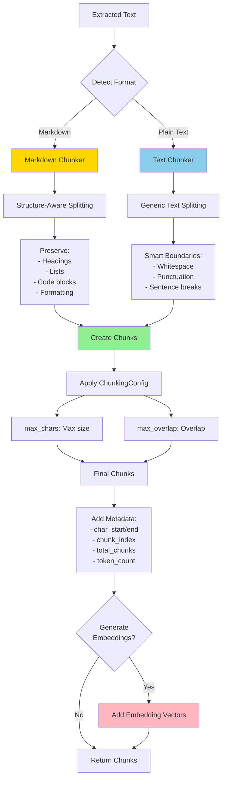
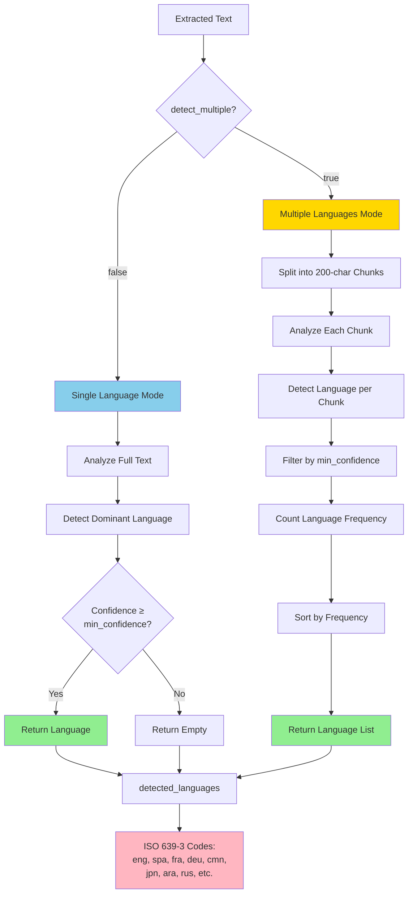

# Advanced Features

Kreuzberg provides text processing, analysis, and optimization features beyond basic extraction.

## Text Chunking

Split extracted text into chunks for downstream processing like RAG (Retrieval-Augmented Generation) systems, vector databases, or LLM context windows.

### Overview

Kreuzberg uses the `text-splitter` library with two chunking strategies:

- **Text Chunker**: Generic text splitting with smart boundaries (whitespace, punctuation)
- **Markdown Chunker**: Structure-aware splitting that preserves headings, lists, code blocks, and formatting

### Configuration

=== "C#"

    --8<-- "snippets/csharp/advanced/chunking_config.md"

=== "Go"

    --8<-- "snippets/go/chunking_config.md"

=== "Java"

    --8<-- "snippets/java/chunking_config.md"

=== "Python"

    --8<-- "snippets/python/chunking_config.md"

=== "Ruby"

    --8<-- "snippets/ruby/chunking_config.md"

=== "Rust"

    --8<-- "snippets/rust/chunking_config.md"

=== "TypeScript"

    --8<-- "snippets/typescript/chunking_config.md"

### Chunk Output

Each chunk includes:

- `content`: The chunk text
- `metadata`:
  - `char_start`: Start position in original text
  - `char_end`: End position in original text
  - `chunk_index`: Zero-based chunk number
  - `total_chunks`: Total number of chunks
  - `token_count`: Token count (if embeddings enabled)
- `embedding`: Optional embedding vector (if configured)

### Example: RAG Pipeline

=== "C#"

    --8<-- "snippets/csharp/advanced/chunking_rag.md"

=== "Go"

    --8<-- "snippets/go/chunking_rag.md"

=== "Java"

    --8<-- "snippets/java/chunking_rag.md"

=== "Python"

    --8<-- "snippets/python/chunking_rag.md"

=== "Ruby"

    --8<-- "snippets/ruby/chunking_rag.md"

=== "Rust"

    --8<-- "snippets/rust/chunking_rag.md"

=== "TypeScript"

    --8<-- "snippets/typescript/chunking_rag.md"

## Language Detection

Detect languages in extracted text using the fast `whatlang` library. Supports 60+ languages with ISO 639-3 codes.

### Configuration

=== "C#"

    --8<-- "snippets/csharp/advanced/language_detection_config.md"

=== "Go"

    --8<-- "snippets/go/language_detection_config.md"

=== "Java"

    --8<-- "snippets/java/language_detection_config.md"

=== "Python"

    --8<-- "snippets/python/language_detection_config.md"

=== "Ruby"

    --8<-- "snippets/ruby/language_detection_config.md"

=== "Rust"

    --8<-- "snippets/rust/language_detection_config.md"

=== "TypeScript"

    --8<-- "snippets/typescript/language_detection_config.md"

### Detection Modes

**Single Language** (`detect_multiple: false`):
- Detects dominant language only
- Faster, single-pass detection
- Best for monolingual documents

**Multiple Languages** (`detect_multiple: true`):
- Chunks text into 200-character segments
- Detects language in each chunk
- Returns languages sorted by frequency
- Best for multilingual documents

### Supported Languages

ISO 639-3 codes including:

- **European**: eng (English), spa (Spanish), fra (French), deu (German), ita (Italian), por (Portuguese), rus (Russian), nld (Dutch), pol (Polish), swe (Swedish)
- **Asian**: cmn (Chinese), jpn (Japanese), kor (Korean), tha (Thai), vie (Vietnamese), ind (Indonesian)
- **Middle Eastern**: ara (Arabic), pes (Persian), urd (Urdu), heb (Hebrew)
- **And 40+ more**

### Example

=== "C#"

    --8<-- "snippets/csharp/advanced/language_detection_multilingual.md"

=== "Go"

    --8<-- "snippets/go/language_detection_multilingual.md"

=== "Java"

    --8<-- "snippets/java/language_detection_multilingual.md"

=== "Python"

    --8<-- "snippets/python/language_detection_multilingual.md"

=== "Ruby"

    --8<-- "snippets/ruby/language_detection_multilingual.md"

=== "Rust"

    --8<-- "snippets/rust/language_detection_multilingual.md"

=== "TypeScript"

    --8<-- "snippets/typescript/language_detection_multilingual.md"

## Embedding Generation

Generate embeddings for vector databases, semantic search, and RAG systems using ONNX models via `fastembed-rs`.

### Available Presets

| Preset | Model | Dimensions | Max Tokens | Use Case |
|--------|-------|-----------|------------|----------|
| **fast** | AllMiniLML6V2Q | 384 | 512 | Rapid prototyping, development |
| **balanced** | BGEBaseENV15 | 768 | 1024 | Production RAG, general-purpose |
| **quality** | BGELargeENV15 | 1024 | 2000 | Maximum accuracy, complex docs |
| **multilingual** | MultilingualE5Base | 768 | 1024 | 100+ languages, international |

!!! note "Max Tokens vs. max_chars"
    The "Max Tokens" values shown are the model's maximum token limits. These don't directly correspond to the `max_chars` setting in `ChunkingConfig`, which controls character-based chunking. The embedding model will process chunks up to its token limit.

### Configuration

=== "C#"

    --8<-- "snippets/csharp/advanced/embedding_with_chunking.md"

=== "Go"

    --8<-- "snippets/go/embedding_with_chunking.md"

=== "Java"

    --8<-- "snippets/java/embedding_with_chunking.md"

=== "Python"

    --8<-- "snippets/python/embedding_with_chunking.md"

=== "Ruby"

    --8<-- "snippets/ruby/embedding_with_chunking.md"

=== "Rust"

    --8<-- "snippets/rust/embedding_with_chunking.md"

=== "TypeScript"

    --8<-- "snippets/typescript/embedding_with_chunking.md"

### Example: Vector Database Integration

=== "C#"

    --8<-- "snippets/csharp/advanced/vector_database_integration.md"

=== "Go"

    --8<-- "snippets/go/vector_database_integration.md"

=== "Java"

    --8<-- "snippets/java/vector_database_integration.md"

=== "Python"

    --8<-- "snippets/python/vector_database_integration.md"

=== "Ruby"

    --8<-- "snippets/ruby/vector_database_integration.md"

=== "Rust"

    --8<-- "snippets/rust/vector_database_integration.md"

=== "TypeScript"

    --8<-- "snippets/typescript/vector_database_integration.md"

## Token Reduction

Intelligently reduce token count while preserving meaning. Removes stopwords, redundancy, and applies compression.

### Reduction Levels

| Level | Reduction | Features |
|-------|-----------|----------|
| **off** | 0% | No reduction, pass-through |
| **moderate** | 15-25% | Stopwords + redundancy removal |
| **aggressive** | 30-50% | Semantic clustering, importance scoring |

### Configuration

=== "C#"

    --8<-- "snippets/csharp/advanced/token_reduction_config.md"

=== "Go"

    --8<-- "snippets/go/token_reduction_config.md"

=== "Java"

    --8<-- "snippets/java/token_reduction_config.md"

=== "Python"

    --8<-- "snippets/python/token_reduction_config.md"

=== "Ruby"

    --8<-- "snippets/ruby/token_reduction_config.md"

=== "Rust"

    --8<-- "snippets/rust/token_reduction_config.md"

=== "TypeScript"

    --8<-- "snippets/typescript/token_reduction_config.md"

### Example

=== "C#"

    --8<-- "snippets/csharp/advanced/token_reduction_example.md"

=== "Go"

    --8<-- "snippets/go/token_reduction_example.md"

=== "Java"

    --8<-- "snippets/java/token_reduction_example.md"

=== "Python"

    --8<-- "snippets/python/token_reduction_example.md"

=== "Ruby"

    --8<-- "snippets/ruby/token_reduction_example.md"

=== "Rust"

    --8<-- "snippets/rust/token_reduction_example.md"

=== "TypeScript"

    --8<-- "snippets/typescript/token_reduction_example.md"

## Keyword Extraction

Extract important keywords and phrases using YAKE or RAKE algorithms.

!!! note "Feature Flag Required"
    Keyword extraction requires the `keywords` feature flag enabled when building Kreuzberg.

### Available Algorithms

**YAKE (Yet Another Keyword Extractor)**:
- Statistical/unsupervised approach
- Factors: term frequency, position, capitalization, context
- Best for: General-purpose extraction

**RAKE (Rapid Automatic Keyword Extraction)**:
- Co-occurrence based
- Analyzes word frequency and degree in phrases
- Best for: Domain-specific terms, phrase extraction

### Configuration

=== "C#"

    --8<-- "snippets/csharp/advanced/keyword_extraction_config.md"

=== "Go"

    --8<-- "snippets/go/keyword_extraction_config.md"

=== "Java"

    --8<-- "snippets/java/keyword_extraction_config.md"

=== "Python"

    --8<-- "snippets/python/keyword_extraction_config.md"

=== "Ruby"

    --8<-- "snippets/ruby/keyword_extraction_config.md"

=== "Rust"

    --8<-- "snippets/rust/keyword_extraction_config.md"

=== "TypeScript"

    --8<-- "snippets/typescript/keyword_extraction_config.md"

### Example

=== "C#"

    --8<-- "snippets/csharp/advanced/keyword_extraction_example.md"

=== "Go"

    --8<-- "snippets/go/keyword_extraction_example.md"

=== "Java"

    --8<-- "snippets/java/keyword_extraction_example.md"

=== "Python"

    --8<-- "snippets/python/keyword_extraction_example.md"

=== "Ruby"

    --8<-- "snippets/ruby/keyword_extraction_example.md"

=== "Rust"

    --8<-- "snippets/rust/keyword_extraction_example.md"

=== "TypeScript"

    --8<-- "snippets/typescript/keyword_extraction_example.md"

## Quality Processing

Automatic text quality scoring that detects OCR artifacts, script content, navigation elements, and evaluates document structure.

### Quality Factors

| Factor | Weight | Detects |
|--------|--------|---------|
| OCR Artifacts | 30% | Scattered chars, repeated punctuation, malformed words |
| Script Content | 20% | JavaScript, CSS, HTML tags |
| Navigation Elements | 10% | Breadcrumbs, pagination, skip links |
| Document Structure | 20% | Sentence/paragraph length, punctuation |
| Metadata Quality | 10% | Title, author, subject presence |

### Configuration

Quality processing is enabled by default:

=== "C#"

    --8<-- "snippets/csharp/advanced/quality_processing_config.md"

=== "Go"

    --8<-- "snippets/go/quality_processing_config.md"

=== "Java"

    --8<-- "snippets/java/quality_processing_config.md"

=== "Python"

    --8<-- "snippets/python/quality_processing_config.md"

=== "Ruby"

    --8<-- "snippets/ruby/quality_processing_config.md"

=== "Rust"

    --8<-- "snippets/rust/quality_processing_config.md"

=== "TypeScript"

    --8<-- "snippets/typescript/quality_processing_config.md"

### Quality Score

The quality score ranges from 0.0 (lowest quality) to 1.0 (highest quality):

- **0.0-0.3**: Very low quality (heavy OCR artifacts, script content)
- **0.3-0.6**: Low quality (some artifacts, poor structure)
- **0.6-0.8**: Moderate quality (clean text, decent structure)
- **0.8-1.0**: High quality (excellent structure, no artifacts)

### Example

=== "C#"

    --8<-- "snippets/csharp/advanced/quality_processing_example.md"

=== "Go"

    --8<-- "snippets/go/quality_processing_example.md"

=== "Java"

    --8<-- "snippets/java/quality_processing_example.md"

=== "Python"

    --8<-- "snippets/python/quality_processing_example.md"

=== "Ruby"

    --8<-- "snippets/ruby/quality_processing_example.md"

=== "Rust"

    --8<-- "snippets/rust/quality_processing_example.md"

=== "TypeScript"

    --8<-- "snippets/typescript/quality_processing_example.md"

## Combining Features

Advanced features work together:

=== "C#"

    --8<-- "snippets/csharp/advanced/combining_all_features.md"

=== "Go"

    --8<-- "snippets/go/combining_all_features.md"

=== "Java"

    --8<-- "snippets/java/combining_all_features.md"

=== "Python"

    --8<-- "snippets/python/combining_all_features.md"

=== "Ruby"

    --8<-- "snippets/ruby/combining_all_features.md"

=== "Rust"

    --8<-- "snippets/rust/combining_all_features.md"

=== "TypeScript"

    --8<-- "snippets/typescript/combining_all_features.md"
