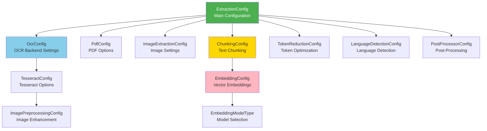
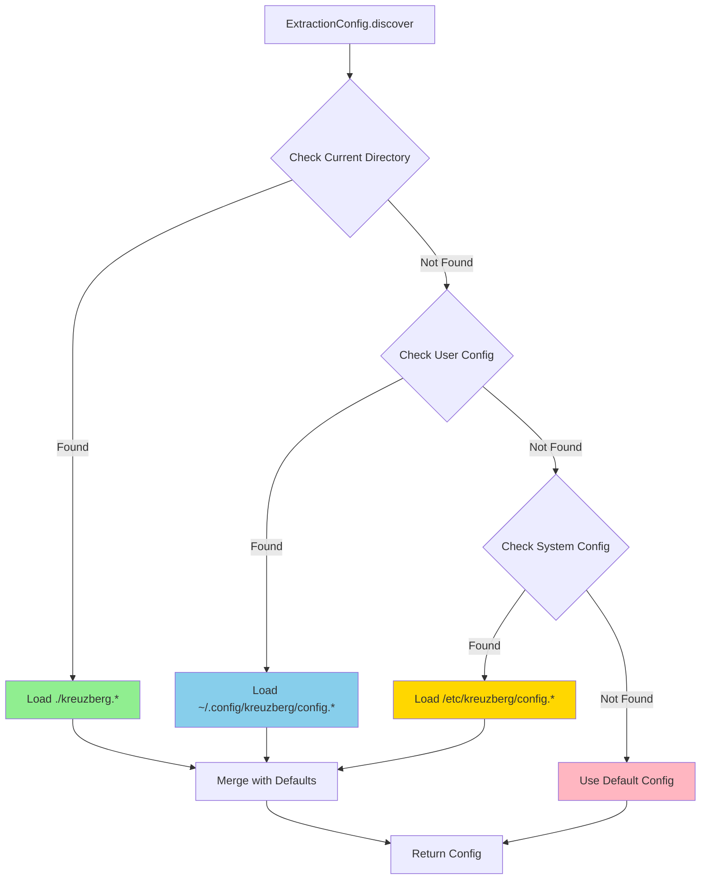

# Configuration



Kreuzberg's behavior is controlled through configuration objects. All settings are optional with sensible defaults, allowing you to configure only what you need.

## Configuration Methods

Kreuzberg supports four ways to configure extraction:

=== "Programmatic"

    --8<-- "snippets/python/config_programmatic.md"

=== "TypeScript"

    ```typescript
    import { ExtractionConfig, extractFile } from '@kreuzberg/sdk';

    const config = await ExtractionConfig.discover();
    const result = await extractFile('document.pdf', { config });
    ```

=== "Rust"

    ```rust
    use kreuzberg::ExtractionConfig;

    let config = ExtractionConfig::discover()?;
    let result = extract_file("document.pdf", None, &config).await?;
    ```

=== "Ruby"

    ```ruby
    require 'kreuzberg'

    config = Kreuzberg::ExtractionConfig.discover
    result = Kreuzberg.extract_file('document.pdf', config: config)
    ```

=== "Java"

    ```java
    import dev.kreuzberg.config.ExtractionConfig;
    import dev.kreuzberg.Kreuzberg;
    import dev.kreuzberg.ExtractionResult;
    import dev.kreuzberg.KreuzbergException;
    import java.io.IOException;

    ExtractionConfig config = ExtractionConfig.discover();
    ExtractionResult result = Kreuzberg.extractFile("document.pdf", null, config);
    ```

=== "Go"

    --8<-- "snippets/go/config_file.md"

=== "Go"

    --8<-- "snippets/go/config_programmatic.md"

=== "TOML File"

    ```toml
    # kreuzberg.toml
    use_cache = true
    enable_quality_processing = true

    [ocr]
    backend = "tesseract"
    language = "eng"

    [ocr.tesseract_config]
    psm = 3
    ```

=== "YAML File"

    ```yaml
    # kreuzberg.yaml
    use_cache: true
    enable_quality_processing: true

    ocr:
      backend: tesseract
      language: eng
      tesseract_config:
        psm: 3
    ```

=== "JSON File"

    ```json
    {
      "use_cache": true,
      "enable_quality_processing": true,
      "ocr": {
        "backend": "tesseract",
        "language": "eng",
        "tesseract_config": {
          "psm": 3
        }
      }
    }
    ```

### Configuration Discovery



Kreuzberg automatically discovers configuration files in the following locations (in order):

1. Current directory: `./kreuzberg.{toml,yaml,yml,json}`
2. User config: `~/.config/kreuzberg/config.{toml,yaml,yml,json}`
3. System config: `/etc/kreuzberg/config.{toml,yaml,yml,json}`

=== "Python"

    ```python
    from kreuzberg import ExtractionConfig

    config = ExtractionConfig.discover()
    result = extract_file("document.pdf", config=config)
    ```

=== "TypeScript"

    ```typescript
    import { ExtractionConfig, extractFile } from '@kreuzberg/sdk';

    const config = await ExtractionConfig.discover();
    const result = await extractFile('document.pdf', { config });
    ```

=== "Rust"

    ```rust
    use kreuzberg::ExtractionConfig;

    let config = ExtractionConfig::discover()?;
    let result = extract_file("document.pdf", None, &config).await?;
    ```

=== "Ruby"

    ```ruby
    require 'kreuzberg'

    config = Kreuzberg::ExtractionConfig.discover
    result = Kreuzberg.extract_file('document.pdf', config: config)
    ```

=== "Java"

    ```java
    import dev.kreuzberg.Kreuzberg;
    import dev.kreuzberg.ExtractionResult;
    import dev.kreuzberg.config.ExtractionConfig;

    ExtractionConfig config = ExtractionConfig.builder().build();
    ExtractionResult result = Kreuzberg.extractFileSync("document.pdf", null, config);
    ```

## ExtractionConfig

The main configuration object controlling extraction behavior.

| Field | Type | Default | Description |
|-------|------|---------|-------------|
| `use_cache` | `bool` | `true` | Enable caching of extraction results |
| `enable_quality_processing` | `bool` | `true` | Enable quality post-processing |
| `force_ocr` | `bool` | `false` | Force OCR even for text-based PDFs |
| `ocr` | `OcrConfig?` | `None` | OCR configuration (if None, OCR disabled) |
| `pdf_options` | `PdfConfig?` | `None` | PDF-specific configuration |
| `images` | `ImageExtractionConfig?` | `None` | Image extraction configuration |
| `chunking` | `ChunkingConfig?` | `None` | Text chunking configuration |
| `token_reduction` | `TokenReductionConfig?` | `None` | Token reduction configuration |
| `language_detection` | `LanguageDetectionConfig?` | `None` | Language detection configuration |
| `keywords` | `KeywordConfig?` | `None` | Keyword extraction configuration (requires `keywords-yake` or `keywords-rake` feature flag) |
| `postprocessor` | `PostProcessorConfig?` | `None` | Post-processing pipeline configuration |

### Basic Example

=== "Python"

    ```python
    from kreuzberg import extract_file, ExtractionConfig

    config = ExtractionConfig(
        use_cache=True,
        enable_quality_processing=True
    )
    result = extract_file("document.pdf", config=config)
    ```

=== "TypeScript"

    ```typescript
    import { extractFile, ExtractionConfig } from '@kreuzberg/sdk';

    const config = new ExtractionConfig({
      useCache: true,
      enableQualityProcessing: true
    });
    const result = await extractFile('document.pdf', { config });
    ```

=== "Rust"

    ```rust
    use kreuzberg::{extract_file, ExtractionConfig};

    let config = ExtractionConfig {
        use_cache: true,
        enable_quality_processing: true,
        ..Default::default()
    };
    let result = extract_file("document.pdf", None, &config).await?;
    ```

=== "Ruby"

    ```ruby
    require 'kreuzberg'

    config = Kreuzberg::ExtractionConfig.new(
      use_cache: true,
      enable_quality_processing: true
    )
    result = Kreuzberg.extract_file('document.pdf', config: config)
    ```

=== "Java"

    ```java
    import dev.kreuzberg.Kreuzberg;
    import dev.kreuzberg.ExtractionResult;
    import dev.kreuzberg.config.ExtractionConfig;

    ExtractionConfig config = ExtractionConfig.builder()
        .useCache(true)
        .enableQualityProcessing(true)
        .build();
    ExtractionResult result = Kreuzberg.extractFileSync("document.pdf", null, config);
    ```

## OcrConfig

Configuration for OCR processing. Set to enable OCR on images and scanned PDFs.

| Field | Type | Default | Description |
|-------|------|---------|-------------|
| `backend` | `str` | `"tesseract"` | OCR backend: `"tesseract"`, `"easyocr"`, `"paddleocr"` |
| `language` | `str` | `"eng"` | Language code(s), e.g., `"eng"`, `"eng+fra"` |
| `tesseract_config` | `TesseractConfig?` | `None` | Tesseract-specific configuration |

### Example

=== "Python"

    ```python
    from kreuzberg import ExtractionConfig, OcrConfig, TesseractConfig

    config = ExtractionConfig(
        ocr=OcrConfig(
            backend="tesseract",
            language="eng+fra",
            tesseract_config=TesseractConfig(psm=3)
        )
    )
    ```

=== "TypeScript"

    ```typescript
    import { ExtractionConfig, OcrConfig, TesseractConfig } from '@kreuzberg/sdk';

    const config = new ExtractionConfig({
      ocr: new OcrConfig({
        backend: 'tesseract',
        language: 'eng+fra',
        tesseractConfig: new TesseractConfig({ psm: 3 })
      })
    });
    ```

=== "Rust"

    ```rust
    use kreuzberg::{ExtractionConfig, OcrConfig, TesseractConfig};

    let config = ExtractionConfig {
        ocr: Some(OcrConfig {
            backend: "tesseract".to_string(),
            language: "eng+fra".to_string(),
            tesseract_config: Some(TesseractConfig {
                psm: 3,
                ..Default::default()
            }),
        }),
        ..Default::default()
    };
    ```

=== "Ruby"

    ```ruby
    require 'kreuzberg'

    config = Kreuzberg::ExtractionConfig.new(
      ocr: Kreuzberg::OcrConfig.new(
        backend: 'tesseract',
        language: 'eng+fra',
        tesseract_config: Kreuzberg::TesseractConfig.new(psm: 3)
      )
    )
    ```

=== "Java"

    ```java
    import dev.kreuzberg.config.ExtractionConfig;
    import dev.kreuzberg.config.OcrConfig;

    ExtractionConfig config = ExtractionConfig.builder()
        .ocr(OcrConfig.builder()
            .backend("tesseract")
            .language("eng+fra")
            .build())
        .build();
    ```

## TesseractConfig

Tesseract OCR engine configuration.

| Field | Type | Default | Description |
|-------|------|---------|-------------|
| `language` | `str` | `"eng"` | Language code(s), e.g., `"eng"`, `"eng+fra"` |
| `psm` | `int` | `3` | Page segmentation mode (0-13) |
| `output_format` | `str` | `"text"` | Output format: `"text"`, `"hocr"` |
| `oem` | `int` | `3` | OCR engine mode (0-3) |
| `min_confidence` | `float` | `0.0` | Minimum confidence threshold (0.0-1.0) |
| `preprocessing` | `ImagePreprocessingConfig?` | `None` | Image preprocessing configuration |
| `enable_table_detection` | `bool` | `false` | Enable table detection and extraction |
| `table_min_confidence` | `float` | `0.5` | Minimum confidence for table cells |
| `table_column_threshold` | `int` | `50` | Pixel threshold for column detection |
| `table_row_threshold_ratio` | `float` | `0.5` | Row threshold ratio |
| `use_cache` | `bool` | `true` | Enable OCR result caching |
| `classify_use_pre_adapted_templates` | `bool` | `false` | Tesseract variable |
| `language_model_ngram_on` | `bool` | `false` | Tesseract variable |
| `tessedit_dont_blkrej_good_wds` | `bool` | `false` | Tesseract variable |
| `tessedit_dont_rowrej_good_wds` | `bool` | `false` | Tesseract variable |
| `tessedit_enable_dict_correction` | `bool` | `false` | Tesseract variable |
| `tessedit_char_whitelist` | `str` | `""` | Allowed characters |
| `tessedit_char_blacklist` | `str` | `""` | Disallowed characters |
| `tessedit_use_primary_params_model` | `bool` | `false` | Tesseract variable |
| `textord_space_size_is_variable` | `bool` | `false` | Tesseract variable |
| `thresholding_method` | `bool` | `false` | Tesseract variable |

### Page Segmentation Modes (PSM)

- `0`: Orientation and script detection only
- `1`: Automatic page segmentation with OSD
- `2`: Automatic page segmentation (no OSD, no OCR)
- `3`: Fully automatic page segmentation (default)
- `4`: Single column of text
- `5`: Single uniform block of vertically aligned text
- `6`: Single uniform block of text
- `7`: Single text line
- `8`: Single word
- `9`: Single word in a circle
- `10`: Single character
- `11`: Sparse text, no particular order
- `12`: Sparse text with OSD
- `13`: Raw line (no assumptions about text layout)

### OCR Engine Modes (OEM)

- `0`: Legacy engine only
- `1`: Neural nets LSTM engine only
- `2`: Legacy + LSTM engines
- `3`: Default based on what's available (default)

### Example

=== "Python"

    ```python
    from kreuzberg import ExtractionConfig, OcrConfig, TesseractConfig

    config = ExtractionConfig(
        ocr=OcrConfig(
            language="eng+fra+deu",
            tesseract_config=TesseractConfig(
                psm=6,
                oem=1,
                min_confidence=0.8,
                tessedit_char_whitelist="ABCDEFGHIJKLMNOPQRSTUVWXYZabcdefghijklmnopqrstuvwxyz0123456789 .,!?",
                enable_table_detection=True
            )
        )
    )
    ```

=== "TypeScript"

    ```typescript
    import { ExtractionConfig, OcrConfig, TesseractConfig } from '@kreuzberg/sdk';

    const config = new ExtractionConfig({
      ocr: new OcrConfig({
        language: 'eng+fra+deu',
        tesseractConfig: new TesseractConfig({
          psm: 6,
          oem: 1,
          minConfidence: 0.8,
          tesseditCharWhitelist: 'ABCDEFGHIJKLMNOPQRSTUVWXYZabcdefghijklmnopqrstuvwxyz0123456789 .,!?',
          enableTableDetection: true
        })
      })
    });
    ```

=== "Rust"

    ```rust
    use kreuzberg::{ExtractionConfig, OcrConfig, TesseractConfig};

    let config = ExtractionConfig {
        ocr: Some(OcrConfig {
            language: "eng+fra+deu".to_string(),
            tesseract_config: Some(TesseractConfig {
                psm: 6,
                oem: 1,
                min_confidence: 0.8,
                tessedit_char_whitelist: "ABCDEFGHIJKLMNOPQRSTUVWXYZabcdefghijklmnopqrstuvwxyz0123456789 .,!?".to_string(),
                enable_table_detection: true,
                ..Default::default()
            }),
            ..Default::default()
        }),
        ..Default::default()
    };
    ```

=== "Ruby"

    ```ruby
    require 'kreuzberg'

    config = Kreuzberg::ExtractionConfig.new(
      ocr: Kreuzberg::OcrConfig.new(
        language: 'eng+fra+deu',
        tesseract_config: Kreuzberg::TesseractConfig.new(
          psm: 6,
          oem: 1,
          min_confidence: 0.8,
          tessedit_char_whitelist: 'ABCDEFGHIJKLMNOPQRSTUVWXYZabcdefghijklmnopqrstuvwxyz0123456789 .,!?',
          enable_table_detection: true
        )
      )
    )
    ```

=== "Java"

    ```java
    import dev.kreuzberg.config.ExtractionConfig;
    import dev.kreuzberg.config.OcrConfig;

    ExtractionConfig config = ExtractionConfig.builder()
        .ocr(OcrConfig.builder()
            .language("eng+fra+deu")
            .build())
        .build();
    ```

## ImagePreprocessingConfig

Image preprocessing configuration for OCR.

| Field | Type | Default | Description |
|-------|------|---------|-------------|
| `target_dpi` | `int` | `300` | Target DPI for OCR processing |
| `auto_rotate` | `bool` | `true` | Automatically rotate images based on orientation |
| `deskew` | `bool` | `true` | Apply deskewing to straighten tilted text |
| `denoise` | `bool` | `true` | Apply denoising filter |
| `contrast_enhance` | `bool` | `true` | Enhance image contrast |
| `binarization_method` | `str` | `"otsu"` | Binarization method: `"otsu"`, `"adaptive"`, `"none"` |
| `invert_colors` | `bool` | `false` | Invert image colors (useful for white-on-black text) |

### Example

=== "Python"

    ```python
    from kreuzberg import ExtractionConfig, OcrConfig, TesseractConfig, ImagePreprocessingConfig

    config = ExtractionConfig(
        ocr=OcrConfig(
            tesseract_config=TesseractConfig(
                preprocessing=ImagePreprocessingConfig(
                    target_dpi=300,
                    denoise=True,
                    deskew=True,
                    contrast_enhance=True,
                    binarization_method="otsu"
                )
            )
        )
    )
    ```

=== "TypeScript"

    ```typescript
    import { ExtractionConfig, OcrConfig, TesseractConfig, ImagePreprocessingConfig } from '@kreuzberg/sdk';

    const config = new ExtractionConfig({
      ocr: new OcrConfig({
        tesseractConfig: new TesseractConfig({
          preprocessing: new ImagePreprocessingConfig({
            targetDpi: 300,
            denoise: true,
            deskew: true,
            contrastEnhance: true,
            binarizationMethod: 'otsu'
          })
        })
      })
    });
    ```

=== "Rust"

    ```rust
    use kreuzberg::{ExtractionConfig, OcrConfig, TesseractConfig, ImagePreprocessingConfig};

    let config = ExtractionConfig {
        ocr: Some(OcrConfig {
            tesseract_config: Some(TesseractConfig {
                preprocessing: Some(ImagePreprocessingConfig {
                    target_dpi: 300,
                    denoise: true,
                    deskew: true,
                    contrast_enhance: true,
                    binarization_method: "otsu".to_string(),
                    ..Default::default()
                }),
                ..Default::default()
            }),
            ..Default::default()
        }),
        ..Default::default()
    };
    ```

=== "Ruby"

    ```ruby
    require 'kreuzberg'

    config = Kreuzberg::ExtractionConfig.new(
      ocr: Kreuzberg::OcrConfig.new(
        tesseract_config: Kreuzberg::TesseractConfig.new(
          preprocessing: Kreuzberg::ImagePreprocessingConfig.new(
            target_dpi: 300,
            denoise: true,
            deskew: true,
            contrast_enhance: true,
            binarization_method: 'otsu'
          )
        )
      )
    )
    ```

=== "Java"

    ```java
    import dev.kreuzberg.config.ExtractionConfig;
    import dev.kreuzberg.config.ImagePreprocessingConfig;

    ExtractionConfig config = ExtractionConfig.builder()
        .imagePreprocessing(ImagePreprocessingConfig.builder()
            .targetDpi(300)
            .denoise(true)
            .deskew(true)
            .contrastEnhance(true)
            .binarizationMethod("otsu")
            .build())
        .build();
    ```

## PdfConfig

PDF-specific extraction configuration.

| Field | Type | Default | Description |
|-------|------|---------|-------------|
| `extract_images` | `bool` | `true` | Extract embedded images from PDF |
| `extract_metadata` | `bool` | `true` | Extract PDF metadata (title, author, etc.) |
| `passwords` | `list[str]?` | `None` | List of passwords to try for encrypted PDFs |

### Example

=== "Python"

    ```python
    from kreuzberg import ExtractionConfig, PdfConfig

    config = ExtractionConfig(
        pdf_options=PdfConfig(
            extract_images=True,
            extract_metadata=True,
            passwords=["password1", "password2"]
        )
    )
    ```

=== "TypeScript"

    ```typescript
    import { ExtractionConfig, PdfConfig } from '@kreuzberg/sdk';

    const config = new ExtractionConfig({
      pdfOptions: new PdfConfig({
        extractImages: true,
        extractMetadata: true,
        passwords: ['password1', 'password2']
      })
    });
    ```

=== "Rust"

    ```rust
    use kreuzberg::{ExtractionConfig, PdfConfig};

    let config = ExtractionConfig {
        pdf_options: Some(PdfConfig {
            extract_images: true,
            extract_metadata: true,
            passwords: Some(vec!["password1".to_string(), "password2".to_string()]),
        }),
        ..Default::default()
    };
    ```

=== "Ruby"

    ```ruby
    require 'kreuzberg'

    config = Kreuzberg::ExtractionConfig.new(
      pdf_options: Kreuzberg::PdfConfig.new(
        extract_images: true,
        extract_metadata: true,
        passwords: ['password1', 'password2']
      )
    )
    ```

=== "Java"

    ```java
    import dev.kreuzberg.config.ExtractionConfig;
    import dev.kreuzberg.config.PdfConfig;
    import java.util.Arrays;

    ExtractionConfig config = ExtractionConfig.builder()
        .pdfOptions(PdfConfig.builder()
            .extractImages(true)
            .extractMetadata(true)
            .passwords(Arrays.asList("password1", "password2"))
            .build())
        .build();
    ```

## ImageExtractionConfig

Configuration for extracting images from documents.

| Field | Type | Default | Description |
|-------|------|---------|-------------|
| `extract_images` | `bool` | `true` | Extract images from documents |
| `target_dpi` | `int` | `300` | Target DPI for extracted images |
| `max_image_dimension` | `int` | `4096` | Maximum image dimension (width or height) in pixels |
| `auto_adjust_dpi` | `bool` | `true` | Automatically adjust DPI based on image size |
| `min_dpi` | `int` | `72` | Minimum DPI when auto-adjusting |
| `max_dpi` | `int` | `600` | Maximum DPI when auto-adjusting |

### Example

=== "Python"

    ```python
    from kreuzberg import ExtractionConfig, ImageExtractionConfig

    config = ExtractionConfig(
        images=ImageExtractionConfig(
            extract_images=True,
            target_dpi=200,
            max_image_dimension=2048,
            auto_adjust_dpi=True
        )
    )
    ```

=== "TypeScript"

    ```typescript
    import { ExtractionConfig, ImageExtractionConfig } from '@kreuzberg/sdk';

    const config = new ExtractionConfig({
      images: new ImageExtractionConfig({
        extractImages: true,
        targetDpi: 200,
        maxImageDimension: 2048,
        autoAdjustDpi: true
      })
    });
    ```

=== "Rust"

    ```rust
    use kreuzberg::{ExtractionConfig, ImageExtractionConfig};

    let config = ExtractionConfig {
        images: Some(ImageExtractionConfig {
            extract_images: true,
            target_dpi: 200,
            max_image_dimension: 2048,
            auto_adjust_dpi: true,
            ..Default::default()
        }),
        ..Default::default()
    };
    ```

=== "Ruby"

    ```ruby
    require 'kreuzberg'

    config = Kreuzberg::ExtractionConfig.new(
      images: Kreuzberg::ImageExtractionConfig.new(
        extract_images: true,
        target_dpi: 200,
        max_image_dimension: 2048,
        auto_adjust_dpi: true
      )
    )
    ```

=== "Java"

    ```java
    import dev.kreuzberg.config.ExtractionConfig;
    import dev.kreuzberg.config.ImageExtractionConfig;

    ExtractionConfig config = ExtractionConfig.builder()
        .imageExtraction(ImageExtractionConfig.builder()
            .extractImages(true)
            .targetDpi(200)
            .maxImageDimension(2048)
            .autoAdjustDpi(true)
            .build())
        .build();
    ```

## ChunkingConfig

Text chunking configuration for splitting extracted text into chunks.

| Field | Type | Default | Description |
|-------|------|---------|-------------|
| `max_chars` | `int` | `1000` | Maximum chunk size in characters |
| `max_overlap` | `int` | `200` | Overlap between chunks in characters |
| `embedding` | `EmbeddingConfig?` | `None` | Embedding configuration for chunks |
| `preset` | `str?` | `None` | Chunking preset: `"small"`, `"medium"`, `"large"` |

### Example

=== "Python"

    ```python
    from kreuzberg import ExtractionConfig, ChunkingConfig

    config = ExtractionConfig(
        chunking=ChunkingConfig(
            max_chars=500,
            max_overlap=50
        )
    )
    ```

=== "TypeScript"

    ```typescript
    import { ExtractionConfig, ChunkingConfig } from '@kreuzberg/sdk';

    const config = new ExtractionConfig({
      chunking: new ChunkingConfig({
        maxChars: 500,
        maxOverlap: 50
      })
    });
    ```

=== "Rust"

    ```rust
    use kreuzberg::{ExtractionConfig, ChunkingConfig};

    let config = ExtractionConfig {
        chunking: Some(ChunkingConfig {
            max_chars: 500,
            max_overlap: 50,
            ..Default::default()
        }),
        ..Default::default()
    };
    ```

=== "Ruby"

    ```ruby
    require 'kreuzberg'

    config = Kreuzberg::ExtractionConfig.new(
      chunking: Kreuzberg::ChunkingConfig.new(
        max_chars: 500,
        max_overlap: 50
      )
    )
    ```

=== "Java"

    ```java
    import dev.kreuzberg.config.ExtractionConfig;
    import dev.kreuzberg.config.ChunkingConfig;

    ExtractionConfig config = ExtractionConfig.builder()
        .chunking(ChunkingConfig.builder()
            .maxChars(500)
            .maxOverlap(50)
            .build())
        .build();
    ```

## EmbeddingConfig

Configuration for generating embeddings from extracted text or chunks.

| Field | Type | Default | Description |
|-------|------|---------|-------------|
| `model` | `EmbeddingModelType` | `preset("all-MiniLM-L6-v2")` | Embedding model configuration |
| `normalize` | `bool` | `true` | Normalize embeddings to unit length |
| `batch_size` | `int` | `32` | Batch size for embedding generation |
| `show_download_progress` | `bool` | `true` | Show download progress for models |
| `cache_dir` | `str?` | `None` | Custom cache directory for models |

### EmbeddingModelType

Create embedding models using these factory methods:

- `EmbeddingModelType.preset(name)`: Use a preset model
  - `"all-MiniLM-L6-v2"`: Fast, 384-dimensional embeddings (default)
  - `"all-mpnet-base-v2"`: High quality, 768-dimensional embeddings
  - `"paraphrase-multilingual-MiniLM-L12-v2"`: Multilingual support

- `EmbeddingModelType.fastembed(model, dimensions)`: Use a FastEmbed model
  - Example: `fastembed("BAAI/bge-small-en-v1.5", 384)`

- `EmbeddingModelType.custom(model_id, dimensions)`: Use a custom model
  - Example: `custom("sentence-transformers/all-MiniLM-L6-v2", 384)`

### Example

=== "Python"

    ```python
    from kreuzberg import ExtractionConfig, ChunkingConfig, EmbeddingConfig, EmbeddingModelType

    config = ExtractionConfig(
        chunking=ChunkingConfig(
            max_chars=1000,
            embedding=EmbeddingConfig(
                model=EmbeddingModelType.preset("all-mpnet-base-v2"),
                batch_size=16,
                normalize=True,
                show_download_progress=True
            )
        )
    )
    ```

=== "TypeScript"

    ```typescript
    import { ExtractionConfig, ChunkingConfig, EmbeddingConfig, EmbeddingModelType } from '@kreuzberg/sdk';

    const config = new ExtractionConfig({
      chunking: new ChunkingConfig({
        maxChars: 1000,
        embedding: new EmbeddingConfig({
          model: EmbeddingModelType.preset('all-mpnet-base-v2'),
          batchSize: 16,
          normalize: true,
          showDownloadProgress: true
        })
      })
    });
    ```

=== "Rust"

    ```rust
    use kreuzberg::{ExtractionConfig, ChunkingConfig, EmbeddingConfig, EmbeddingModelType};

    let config = ExtractionConfig {
        chunking: Some(ChunkingConfig {
            max_chars: 1000,
            embedding: Some(EmbeddingConfig {
                model: EmbeddingModelType::preset("all-mpnet-base-v2"),
                batch_size: 16,
                normalize: true,
                show_download_progress: true,
                ..Default::default()
            }),
            ..Default::default()
        }),
        ..Default::default()
    };
    ```

=== "Ruby"

    ```ruby
    require 'kreuzberg'

    config = Kreuzberg::ExtractionConfig.new(
      chunking: Kreuzberg::ChunkingConfig.new(
        max_chars: 1000,
        embedding: Kreuzberg::EmbeddingConfig.new(
          model: Kreuzberg::EmbeddingModelType.preset('all-mpnet-base-v2'),
          batch_size: 16,
          normalize: true,
          show_download_progress: true
        )
      )
    )
    ```

=== "Java"

    ```java
    import dev.kreuzberg.config.ExtractionConfig;
    import dev.kreuzberg.config.ChunkingConfig;

    ExtractionConfig config = ExtractionConfig.builder()
        .chunking(ChunkingConfig.builder()
            .maxChars(1000)
            .build())
        .build();
    ```

## TokenReductionConfig

Configuration for reducing token count in extracted text.

| Field | Type | Default | Description |
|-------|------|---------|-------------|
| `mode` | `str` | `"off"` | Reduction mode: `"off"`, `"moderate"`, `"aggressive"` |
| `preserve_important_words` | `bool` | `true` | Preserve important words during reduction |

### Example

=== "Python"

    ```python
    from kreuzberg import ExtractionConfig, TokenReductionConfig

    config = ExtractionConfig(
        token_reduction=TokenReductionConfig(
            mode="moderate",
            preserve_important_words=True
        )
    )
    ```

=== "TypeScript"

    ```typescript
    import { ExtractionConfig, TokenReductionConfig } from '@kreuzberg/sdk';

    const config = new ExtractionConfig({
      tokenReduction: new TokenReductionConfig({
        mode: 'moderate',
        preserveImportantWords: true
      })
    });
    ```

=== "Rust"

    ```rust
    use kreuzberg::{ExtractionConfig, TokenReductionConfig};

    let config = ExtractionConfig {
        token_reduction: Some(TokenReductionConfig {
            mode: "moderate".to_string(),
            preserve_important_words: true,
        }),
        ..Default::default()
    };
    ```

=== "Ruby"

    ```ruby
    require 'kreuzberg'

    config = Kreuzberg::ExtractionConfig.new(
      token_reduction: Kreuzberg::TokenReductionConfig.new(
        mode: 'moderate',
        preserve_important_words: true
      )
    )
    ```

=== "Java"

    ```java
    import dev.kreuzberg.config.ExtractionConfig;
    import dev.kreuzberg.config.TokenReductionConfig;

    ExtractionConfig config = ExtractionConfig.builder()
        .tokenReduction(TokenReductionConfig.builder()
            .mode("moderate")
            .preserveImportantWords(true)
            .build())
        .build();
    ```

## LanguageDetectionConfig

Configuration for automatic language detection.

| Field | Type | Default | Description |
|-------|------|---------|-------------|
| `enabled` | `bool` | `true` | Enable language detection |
| `min_confidence` | `float` | `0.8` | Minimum confidence threshold (0.0-1.0) |
| `detect_multiple` | `bool` | `false` | Detect multiple languages (vs. dominant only) |

### Example

=== "Python"

    ```python
    from kreuzberg import ExtractionConfig, LanguageDetectionConfig

    config = ExtractionConfig(
        language_detection=LanguageDetectionConfig(
            enabled=True,
            min_confidence=0.9,
            detect_multiple=True
        )
    )
    ```

=== "TypeScript"

    ```typescript
    import { ExtractionConfig, LanguageDetectionConfig } from '@kreuzberg/sdk';

    const config = new ExtractionConfig({
      languageDetection: new LanguageDetectionConfig({
        enabled: true,
        minConfidence: 0.9,
        detectMultiple: true
      })
    });
    ```

=== "Rust"

    ```rust
    use kreuzberg::{ExtractionConfig, LanguageDetectionConfig};

    let config = ExtractionConfig {
        language_detection: Some(LanguageDetectionConfig {
            enabled: true,
            min_confidence: 0.9,
            detect_multiple: true,
        }),
        ..Default::default()
    };
    ```

=== "Ruby"

    ```ruby
    require 'kreuzberg'

    config = Kreuzberg::ExtractionConfig.new(
      language_detection: Kreuzberg::LanguageDetectionConfig.new(
        enabled: true,
        min_confidence: 0.9,
        detect_multiple: true
      )
    )
    ```

=== "Java"

    ```java
    import dev.kreuzberg.config.ExtractionConfig;
    import dev.kreuzberg.config.LanguageDetectionConfig;

    ExtractionConfig config = ExtractionConfig.builder()
        .languageDetection(LanguageDetectionConfig.builder()
            .enabled(true)
            .minConfidence(0.9)
            .build())
        .build();
    ```

## PostProcessorConfig

Configuration for post-processing pipeline.

| Field | Type | Default | Description |
|-------|------|---------|-------------|
| `enabled` | `bool` | `true` | Enable post-processing pipeline |
| `enabled_processors` | `list[str]?` | `None` | Specific processors to enable (if None, all enabled) |
| `disabled_processors` | `list[str]?` | `None` | Specific processors to disable |

### Example

=== "Python"

    ```python
    from kreuzberg import ExtractionConfig, PostProcessorConfig

    config = ExtractionConfig(
        postprocessor=PostProcessorConfig(
            enabled=True,
            enabled_processors=["deduplication", "whitespace_normalization"],
            disabled_processors=["mojibake_fix"]
        )
    )
    ```

=== "TypeScript"

    ```typescript
    import { ExtractionConfig, PostProcessorConfig } from '@kreuzberg/sdk';

    const config = new ExtractionConfig({
      postprocessor: new PostProcessorConfig({
        enabled: true,
        enabledProcessors: ['deduplication', 'whitespace_normalization'],
        disabledProcessors: ['mojibake_fix']
      })
    });
    ```

=== "Rust"

    ```rust
    use kreuzberg::{ExtractionConfig, PostProcessorConfig};

    let config = ExtractionConfig {
        postprocessor: Some(PostProcessorConfig {
            enabled: true,
            enabled_processors: Some(vec![
                "deduplication".to_string(),
                "whitespace_normalization".to_string()
            ]),
            disabled_processors: Some(vec!["mojibake_fix".to_string()]),
        }),
        ..Default::default()
    };
    ```

=== "Ruby"

    ```ruby
    require 'kreuzberg'

    config = Kreuzberg::ExtractionConfig.new(
      postprocessor: Kreuzberg::PostProcessorConfig.new(
        enabled: true,
        enabled_processors: ['deduplication', 'whitespace_normalization'],
        disabled_processors: ['mojibake_fix']
      )
    )
    ```

=== "Java"

    ```java
    import dev.kreuzberg.config.ExtractionConfig;
    import dev.kreuzberg.config.PostProcessorConfig;
    import java.util.Arrays;

    ExtractionConfig config = ExtractionConfig.builder()
        .postprocessor(PostProcessorConfig.builder()
            .enabled(true)
            .enabledProcessors(Arrays.asList("deduplication", "whitespace_normalization"))
            .disabledProcessors(Arrays.asList("mojibake_fix"))
            .build())
        .build();
    ```

## Complete Example

Here's a complete example showing all configuration options together:

=== "Python"

    ```python
    from kreuzberg import (
        extract_file,
        ExtractionConfig,
        OcrConfig,
        TesseractConfig,
        ImagePreprocessingConfig,
        PdfConfig,
        ImageExtractionConfig,
        ChunkingConfig,
        EmbeddingConfig,
        EmbeddingModelType,
        TokenReductionConfig,
        LanguageDetectionConfig,
        PostProcessorConfig,
    )

    config = ExtractionConfig(
        use_cache=True,
        enable_quality_processing=True,
        force_ocr=False,
        ocr=OcrConfig(
            backend="tesseract",
            language="eng+fra",
            tesseract_config=TesseractConfig(
                psm=3,
                oem=3,
                min_confidence=0.8,
                preprocessing=ImagePreprocessingConfig(
                    target_dpi=300,
                    denoise=True,
                    deskew=True,
                    contrast_enhance=True,
                ),
                enable_table_detection=True,
            ),
        ),
        pdf_options=PdfConfig(
            extract_images=True,
            extract_metadata=True,
        ),
        images=ImageExtractionConfig(
            extract_images=True,
            target_dpi=150,
            max_image_dimension=4096,
        ),
        chunking=ChunkingConfig(
            max_chars=1000,
            max_overlap=200,
            embedding=EmbeddingConfig(
                model=EmbeddingModelType.preset("all-MiniLM-L6-v2"),
                batch_size=32,
            ),
        ),
        token_reduction=TokenReductionConfig(
            mode="moderate",
            preserve_important_words=True,
        ),
        language_detection=LanguageDetectionConfig(
            enabled=True,
            min_confidence=0.8,
            detect_multiple=False,
        ),
        postprocessor=PostProcessorConfig(
            enabled=True,
        ),
    )

    result = extract_file("document.pdf", config=config)
    ```

=== "TOML"

    ```toml
    # kreuzberg.toml
    use_cache = true
    enable_quality_processing = true
    force_ocr = false

    [ocr]
    backend = "tesseract"
    language = "eng+fra"

    [ocr.tesseract_config]
    psm = 3
    oem = 3
    min_confidence = 0.8
    enable_table_detection = true

    [ocr.tesseract_config.preprocessing]
    target_dpi = 300
    denoise = true
    deskew = true
    contrast_enhance = true

    [pdf_options]
    extract_images = true
    extract_metadata = true

    [images]
    extract_images = true
    target_dpi = 150
    max_image_dimension = 4096

    [chunking]
    max_chars = 1000
    max_overlap = 200

    [chunking.embedding]
    batch_size = 32

    [token_reduction]
    mode = "moderate"
    preserve_important_words = true

    [language_detection]
    enabled = true
    min_confidence = 0.8
    detect_multiple = false

    [postprocessor]
    enabled = true
    ```

=== "Java"

    ```java
    import dev.kreuzberg.Kreuzberg;
    import dev.kreuzberg.ExtractionResult;
    import dev.kreuzberg.config.*;

    ExtractionConfig config = ExtractionConfig.builder()
        .useCache(true)
        .enableQualityProcessing(true)
        .forceOcr(false)
        .ocr(OcrConfig.builder()
            .backend("tesseract")
            .language("eng+fra")
            .build())
        .pdfOptions(PdfConfig.builder()
            .extractImages(true)
            .extractMetadata(true)
            .build())
        .imageExtraction(ImageExtractionConfig.builder()
            .extractImages(true)
            .targetDpi(150)
            .maxImageDimension(4096)
            .build())
        .imagePreprocessing(ImagePreprocessingConfig.builder()
            .targetDpi(300)
            .denoise(true)
            .deskew(true)
            .contrastEnhance(true)
            .build())
        .chunking(ChunkingConfig.builder()
            .maxChars(1000)
            .maxOverlap(200)
            .build())
        .tokenReduction(TokenReductionConfig.builder()
            .mode("moderate")
            .preserveImportantWords(true)
            .build())
        .languageDetection(LanguageDetectionConfig.builder()
            .enabled(true)
            .minConfidence(0.8)
            .build())
        .postprocessor(PostProcessorConfig.builder()
            .enabled(true)
            .build())
        .build();

    ExtractionResult result = Kreuzberg.extractFileSync("document.pdf", null, config);
    ```
