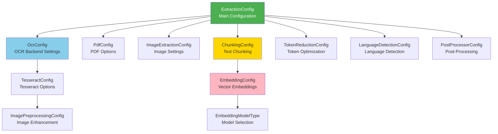
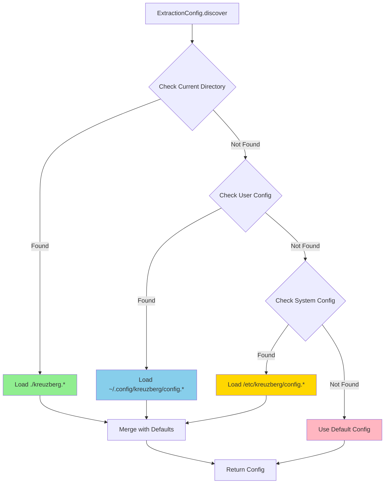

# Configuration



Kreuzberg's behavior is controlled through configuration objects. All settings are optional with sensible defaults, allowing you to configure only what you need.

## Configuration Methods

Kreuzberg supports four ways to configure extraction:

=== "C#"

    --8<-- "docs/snippets/csharp/config_discover.md"

=== "Go"

    --8<-- "docs/snippets/go/config/config_discover.md"

=== "Java"

    --8<-- "docs/snippets/java/config/config_discover.md"

=== "Python"

    --8<-- "docs/snippets/python/config/config_discover.md"

=== "Ruby"

    --8<-- "docs/snippets/ruby/config/config_discover.md"

=== "Rust"

    --8<-- "docs/snippets/rust/config/config_discover.md"

=== "TypeScript"

    --8<-- "docs/snippets/typescript/config/config_discover.md"

=== "TOML File"

    ```toml title="kreuzberg.toml"
    use_cache = true
    enable_quality_processing = true

    [ocr]
    backend = "tesseract"
    language = "eng"

    [ocr.tesseract_config]
    psm = 3
    ```

=== "YAML File"

    ```yaml
    # kreuzberg.yaml
    use_cache: true
    enable_quality_processing: true

    ocr:
      backend: tesseract
      language: eng
      tesseract_config:
        psm: 3
    ```

=== "JSON File"

    ```json
    {
      "use_cache": true,
      "enable_quality_processing": true,
      "ocr": {
        "backend": "tesseract",
        "language": "eng",
        "tesseract_config": {
          "psm": 3
        }
      }
    }
    ```

### Configuration Discovery



Kreuzberg automatically discovers configuration files in the following locations (in order):

1. Current directory: `./kreuzberg.{toml,yaml,yml,json}`
2. User config: `~/.config/kreuzberg/config.{toml,yaml,yml,json}`
3. System config: `/etc/kreuzberg/config.{toml,yaml,yml,json}`

=== "C#"

    --8<-- "docs/snippets/csharp/config_discover.md"

=== "Go"

    --8<-- "docs/snippets/go/config/config_discover.md"

=== "Java"

    --8<-- "docs/snippets/java/config/config_discover.md"

=== "Python"

    --8<-- "docs/snippets/python/config/config_discover.md"

=== "Ruby"

    --8<-- "docs/snippets/ruby/config/config_discover.md"

=== "Rust"

    --8<-- "docs/snippets/rust/config/config_discover.md"

=== "TypeScript"

    --8<-- "docs/snippets/typescript/config/config_discover.md"

## ExtractionConfig

The main configuration object controlling extraction behavior.

| Field | Type | Default | Description |
|-------|------|---------|-------------|
| `use_cache` | `bool` | `true` | Enable caching of extraction results |
| `enable_quality_processing` | `bool` | `true` | Enable quality post-processing |
| `force_ocr` | `bool` | `false` | Force OCR even for text-based PDFs |
| `ocr` | `OcrConfig?` | `None` | OCR configuration (if None, OCR disabled) |
| `pdf_options` | `PdfConfig?` | `None` | PDF-specific configuration |
| `images` | `ImageExtractionConfig?` | `None` | Image extraction configuration |
| `chunking` | `ChunkingConfig?` | `None` | Text chunking configuration |
| `token_reduction` | `TokenReductionConfig?` | `None` | Token reduction configuration |
| `language_detection` | `LanguageDetectionConfig?` | `None` | Language detection configuration |
| `keywords` | `KeywordConfig?` | `None` | Keyword extraction configuration (requires `keywords-yake` or `keywords-rake` feature flag) |
| `postprocessor` | `PostProcessorConfig?` | `None` | Post-processing pipeline configuration |

### Basic Example

=== "C#"

    --8<-- "docs/snippets/csharp/config_basic.md"

=== "Go"

    --8<-- "docs/snippets/go/config/config_basic.md"

=== "Java"

    --8<-- "docs/snippets/java/config/config_basic.md"

=== "Python"

    --8<-- "docs/snippets/python/config/config_basic.md"

=== "Ruby"

    --8<-- "docs/snippets/ruby/config/config_basic.md"

=== "Rust"

    --8<-- "docs/snippets/rust/config/config_basic.md"

=== "TypeScript"

    --8<-- "docs/snippets/typescript/config/config_basic.md"

## OcrConfig

Configuration for OCR processing. Set to enable OCR on images and scanned PDFs.

| Field | Type | Default | Description |
|-------|------|---------|-------------|
| `backend` | `str` | `"tesseract"` | OCR backend: `"tesseract"`, `"easyocr"`, `"paddleocr"` |
| `language` | `str` | `"eng"` | Language code(s), e.g., `"eng"`, `"eng+fra"` |
| `tesseract_config` | `TesseractConfig?` | `None` | Tesseract-specific configuration |

### Example

=== "C#"

    --8<-- "docs/snippets/csharp/config_ocr.md"

=== "Go"

    --8<-- "docs/snippets/go/config/config_ocr.md"

=== "Java"

    --8<-- "docs/snippets/java/config/config_ocr.md"

=== "Python"

    --8<-- "docs/snippets/python/config/config_ocr.md"

=== "Ruby"

    --8<-- "docs/snippets/ruby/config/config_ocr.md"

=== "Rust"

    --8<-- "docs/snippets/rust/ocr/config_ocr.md"

=== "TypeScript"

    --8<-- "docs/snippets/typescript/config/config_ocr.md"

## TesseractConfig

Tesseract OCR engine configuration.

| Field | Type | Default | Description |
|-------|------|---------|-------------|
| `language` | `str` | `"eng"` | Language code(s), e.g., `"eng"`, `"eng+fra"` |
| `psm` | `int` | `3` | Page segmentation mode (0-13) |
| `output_format` | `str` | `"text"` | Output format: `"text"`, `"hocr"` |
| `oem` | `int` | `3` | OCR engine mode (0-3) |
| `min_confidence` | `float` | `0.0` | Minimum confidence threshold (0.0-1.0) |
| `preprocessing` | `ImagePreprocessingConfig?` | `None` | Image preprocessing configuration |
| `enable_table_detection` | `bool` | `false` | Enable table detection and extraction |
| `table_min_confidence` | `float` | `0.5` | Minimum confidence for table cells |
| `table_column_threshold` | `int` | `50` | Pixel threshold for column detection |
| `table_row_threshold_ratio` | `float` | `0.5` | Row threshold ratio |
| `use_cache` | `bool` | `true` | Enable OCR result caching |
| `classify_use_pre_adapted_templates` | `bool` | `false` | Tesseract variable |
| `language_model_ngram_on` | `bool` | `false` | Tesseract variable |
| `tessedit_dont_blkrej_good_wds` | `bool` | `false` | Tesseract variable |
| `tessedit_dont_rowrej_good_wds` | `bool` | `false` | Tesseract variable |
| `tessedit_enable_dict_correction` | `bool` | `false` | Tesseract variable |
| `tessedit_char_whitelist` | `str` | `""` | Allowed characters |
| `tessedit_char_blacklist` | `str` | `""` | Disallowed characters |
| `tessedit_use_primary_params_model` | `bool` | `false` | Tesseract variable |
| `textord_space_size_is_variable` | `bool` | `false` | Tesseract variable |
| `thresholding_method` | `bool` | `false` | Tesseract variable |

### Page Segmentation Modes (PSM)

- `0`: Orientation and script detection only
- `1`: Automatic page segmentation with OSD
- `2`: Automatic page segmentation (no OSD, no OCR)
- `3`: Fully automatic page segmentation (default)
- `4`: Single column of text
- `5`: Single uniform block of vertically aligned text
- `6`: Single uniform block of text
- `7`: Single text line
- `8`: Single word
- `9`: Single word in a circle
- `10`: Single character
- `11`: Sparse text, no particular order
- `12`: Sparse text with OSD
- `13`: Raw line (no assumptions about text layout)

### OCR Engine Modes (OEM)

- `0`: Legacy engine only
- `1`: Neural nets LSTM engine only
- `2`: Legacy + LSTM engines
- `3`: Default based on what's available (default)

### Example

=== "C#"

    --8<-- "docs/snippets/csharp/tesseract_config.md"

=== "Go"

    --8<-- "docs/snippets/go/config/tesseract_config.md"

=== "Java"

    --8<-- "docs/snippets/java/config/tesseract_config.md"

=== "Python"

    --8<-- "docs/snippets/python/config/tesseract_config.md"

=== "Ruby"

    --8<-- "docs/snippets/ruby/config/tesseract_config.md"

=== "Rust"

    --8<-- "docs/snippets/rust/ocr/tesseract_config.md"

=== "TypeScript"

    --8<-- "docs/snippets/typescript/config/tesseract_config.md"

## ImagePreprocessingConfig

Image preprocessing configuration for OCR.

| Field | Type | Default | Description |
|-------|------|---------|-------------|
| `target_dpi` | `int` | `300` | Target DPI for OCR processing |
| `auto_rotate` | `bool` | `true` | Automatically rotate images based on orientation |
| `deskew` | `bool` | `true` | Apply deskewing to straighten tilted text |
| `denoise` | `bool` | `true` | Apply denoising filter |
| `contrast_enhance` | `bool` | `true` | Enhance image contrast |
| `binarization_method` | `str` | `"otsu"` | Binarization method: `"otsu"`, `"adaptive"`, `"none"` |
| `invert_colors` | `bool` | `false` | Invert image colors (useful for white-on-black text) |

### Example

=== "C#"

    --8<-- "docs/snippets/csharp/image_preprocessing.md"

=== "Go"

    --8<-- "docs/snippets/go/ocr/image_preprocessing.md"

=== "Java"

    --8<-- "docs/snippets/java/ocr/image_preprocessing.md"

=== "Python"

    --8<-- "docs/snippets/python/utils/image_preprocessing.md"

=== "Ruby"

    --8<-- "docs/snippets/ruby/ocr/image_preprocessing.md"

=== "Rust"

    --8<-- "docs/snippets/rust/metadata/image_preprocessing.md"

=== "TypeScript"

    --8<-- "docs/snippets/typescript/api/image_preprocessing.md"

## PdfConfig

PDF-specific extraction configuration.

| Field | Type | Default | Description |
|-------|------|---------|-------------|
| `extract_images` | `bool` | `true` | Extract embedded images from PDF |
| `extract_metadata` | `bool` | `true` | Extract PDF metadata (title, author, etc.) |
| `passwords` | `list[str]?` | `None` | List of passwords to try for encrypted PDFs |

### Example

=== "C#"

    --8<-- "docs/snippets/csharp/pdf_config.md"

=== "Go"

    --8<-- "docs/snippets/go/config/pdf_config.md"

=== "Java"

    --8<-- "docs/snippets/java/config/pdf_config.md"

=== "Python"

    --8<-- "docs/snippets/python/config/pdf_config.md"

=== "Ruby"

    --8<-- "docs/snippets/ruby/config/pdf_config.md"

=== "Rust"

    --8<-- "docs/snippets/rust/ocr/pdf_config.md"

=== "TypeScript"

    --8<-- "docs/snippets/typescript/config/pdf_config.md"

## Page Configuration

Configure page extraction and boundary tracking.

### Overview

Page tracking enables:
- Per-page content extraction
- Byte-accurate page boundaries
- Automatic chunk-to-page mapping
- Page markers for LLM context

### Configuration Options

| Field | Type | Default | Description |
|-------|------|---------|-------------|
| `extract_pages` | `bool` | `false` | Extract pages array with per-page content |
| `insert_page_markers` | `bool` | `false` | Insert page markers in combined content |
| `marker_format` | `String` | `"\\n\\n<!-- PAGE {page_num} -->\\n\\n"` | Page marker template |

### Example Configuration

=== "C#"

    ```csharp title="page_config.cs"
    var config = new ExtractionConfig
    {
        Pages = new PageConfig
        {
            ExtractPages = true,
            InsertPageMarkers = true,
            MarkerFormat = "\n\n--- Page {page_num} ---\n\n"
        }
    };
    ```

=== "Go"

    ```go title="page_config.go"
    config := &ExtractionConfig{
        Pages: &PageConfig{
            ExtractPages:      true,
            InsertPageMarkers: true,
            MarkerFormat:      "\n\n--- Page {page_num} ---\n\n",
        },
    }
    ```

=== "Java"

    ```java title="PageConfig.java"
    var config = ExtractionConfig.builder()
        .pages(PageConfig.builder()
            .extractPages(true)
            .insertPageMarkers(true)
            .markerFormat("\n\n--- Page {page_num} ---\n\n")
            .build())
        .build();
    ```

=== "Python"

    ```python title="page_config.py"
    config = ExtractionConfig(
        pages=PageConfig(
            extract_pages=True,
            insert_page_markers=True,
            marker_format="\n\n--- Page {page_num} ---\n\n"
        )
    )
    ```

=== "Ruby"

    ```ruby title="page_config.rb"
    config = ExtractionConfig.new(
      pages: PageConfig.new(
        extract_pages: true,
        insert_page_markers: true,
        marker_format: "\n\n--- Page {page_num} ---\n\n"
      )
    )
    ```

=== "Rust"

    ```rust title="page_config.rs"
    let config = ExtractionConfig {
        pages: Some(PageConfig {
            extract_pages: true,
            insert_page_markers: true,
            marker_format: "\n\n--- Page {page_num} ---\n\n".to_string(),
        }),
        ..Default::default()
    };
    ```

=== "TypeScript"

    ```typescript title="page_config.ts"
    const config: ExtractionConfig = {
      pages: {
        extractPages: true,
        insertPageMarkers: true,
        markerFormat: "\n\n--- Page {page_num} ---\n\n"
      }
    };
    ```

### Field Details

**extract_pages**: When `true`, populates `ExtractionResult.pages` with per-page content. Each page contains its text, tables, and images separately.

**insert_page_markers**: When `true`, inserts page markers into the combined `content` string at page boundaries. Useful for LLMs to understand document structure.

**marker_format**: Template string for page markers. Use `{page_num}` placeholder for the page number. Default HTML comment format is LLM-friendly.

### Format-Specific Behavior

**PDF**: Full byte-accurate page tracking with O(1) lookup performance. Every page boundary is tracked precisely.

**PPTX**: Slide boundaries tracked. Each slide is treated as a "page" with `PageUnitType::Slide`.

**DOCX**: Best-effort detection using explicit page breaks. Only pages with `<w:br type="page"/>` tags are tracked.

**Other formats**: Page tracking not available. `PageStructure` will be `None`/`null`.

### Byte Offsets vs Character Offsets

Page boundaries use **byte offsets** (not character offsets) for UTF-8 safety and performance:

```python
# Correct: Use byte offsets
boundary = boundaries[0]
page_text = content.encode('utf-8')[boundary.byte_start:boundary.byte_end].decode('utf-8')

# Incorrect: Don't use as character indices
page_text = content[boundary.byte_start:boundary.byte_end]  # Wrong for multi-byte chars
```

See [Byte Offset Handling](../migration/v3-to-v4.md#byte-offset-changes) in the migration guide.

## ImageExtractionConfig

Configuration for extracting images from documents.

| Field | Type | Default | Description |
|-------|------|---------|-------------|
| `extract_images` | `bool` | `true` | Extract images from documents |
| `target_dpi` | `int` | `300` | Target DPI for extracted images |
| `max_image_dimension` | `int` | `4096` | Maximum image dimension (width or height) in pixels |
| `auto_adjust_dpi` | `bool` | `true` | Automatically adjust DPI based on image size |
| `min_dpi` | `int` | `72` | Minimum DPI when auto-adjusting |
| `max_dpi` | `int` | `600` | Maximum DPI when auto-adjusting |

### Example

=== "C#"

    --8<-- "docs/snippets/csharp/image_extraction.md"

=== "Go"

    --8<-- "docs/snippets/go/ocr/image_extraction.md"

=== "Java"

    --8<-- "docs/snippets/java/ocr/image_extraction.md"

=== "Python"

    --8<-- "docs/snippets/python/utils/image_extraction.md"

=== "Ruby"

    --8<-- "docs/snippets/ruby/ocr/image_extraction.md"

=== "Rust"

    --8<-- "docs/snippets/rust/metadata/image_extraction.md"

=== "TypeScript"

    --8<-- "docs/snippets/typescript/api/image_extraction.md"

## ChunkingConfig

Text chunking configuration for splitting extracted text into chunks.

| Field | Type | Default | Description |
|-------|------|---------|-------------|
| `max_chars` | `int` | `1000` | Maximum chunk size in characters |
| `max_overlap` | `int` | `200` | Overlap between chunks in characters |
| `embedding` | `EmbeddingConfig?` | `None` | Embedding configuration for chunks |
| `preset` | `str?` | `None` | Chunking preset: `"small"`, `"medium"`, `"large"` |

### Example

=== "C#"

    --8<-- "docs/snippets/csharp/advanced/embedding_with_chunking.md"

=== "Go"

    --8<-- "docs/snippets/go/utils/chunking.md"

=== "Java"

    --8<-- "docs/snippets/java/utils/chunking.md"

=== "Python"

    --8<-- "docs/snippets/python/utils/chunking.md"

=== "Ruby"

    --8<-- "docs/snippets/ruby/utils/chunking.md"

=== "Rust"

    --8<-- "docs/snippets/rust/advanced/chunking.md"

=== "TypeScript"

    --8<-- "docs/snippets/typescript/utils/chunking.md"

## EmbeddingConfig

Configuration for generating embeddings from extracted text or chunks.

| Field | Type | Default | Description |
|-------|------|---------|-------------|
| `model` | `EmbeddingModelType` | `preset("all-MiniLM-L6-v2")` | Embedding model configuration |
| `normalize` | `bool` | `true` | Normalize embeddings to unit length |
| `batch_size` | `int` | `32` | Batch size for embedding generation |
| `show_download_progress` | `bool` | `true` | Show download progress for models |
| `cache_dir` | `str?` | `None` | Custom cache directory for models |

### EmbeddingModelType

Create embedding models using these factory methods:

- `EmbeddingModelType.preset(name)`: Use a preset model
  - `"all-MiniLM-L6-v2"`: Fast, 384-dimensional embeddings (default)
  - `"all-mpnet-base-v2"`: High quality, 768-dimensional embeddings
  - `"paraphrase-multilingual-MiniLM-L12-v2"`: Multilingual support

- `EmbeddingModelType.fastembed(model, dimensions)`: Use a FastEmbed model
  - Example: `fastembed("BAAI/bge-small-en-v1.5", 384)`

- `EmbeddingModelType.custom(model_id, dimensions)`: Use a custom model
  - Example: `custom("sentence-transformers/all-MiniLM-L6-v2", 384)`

### Example

=== "C#"

    --8<-- "docs/snippets/csharp/advanced/embedding_config.md"

=== "Go"

    --8<-- "docs/snippets/go/config/embedding_config.md"

=== "Java"

    --8<-- "docs/snippets/java/config/embedding_config.md"

=== "Python"

    --8<-- "docs/snippets/python/config/embedding_config.md"

=== "Ruby"

    --8<-- "docs/snippets/ruby/config/embedding_config.md"

=== "Rust"

    --8<-- "docs/snippets/rust/advanced/embedding_config.md"

=== "TypeScript"

    --8<-- "docs/snippets/typescript/config/embedding_config.md"

## TokenReductionConfig

Configuration for reducing token count in extracted text.

| Field | Type | Default | Description |
|-------|------|---------|-------------|
| `mode` | `str` | `"off"` | Reduction mode: `"off"`, `"moderate"`, `"aggressive"` |
| `preserve_important_words` | `bool` | `true` | Preserve important words during reduction |

### Example

=== "C#"

    --8<-- "docs/snippets/csharp/token_reduction.md"

=== "Go"

    --8<-- "docs/snippets/go/utils/token_reduction.md"

=== "Java"

    --8<-- "docs/snippets/java/utils/token_reduction.md"

=== "Python"

    --8<-- "docs/snippets/python/utils/token_reduction.md"

=== "Ruby"

    --8<-- "docs/snippets/ruby/utils/token_reduction.md"

=== "Rust"

    --8<-- "docs/snippets/rust/advanced/token_reduction.md"

=== "TypeScript"

    --8<-- "docs/snippets/typescript/utils/token_reduction.md"

## LanguageDetectionConfig

Configuration for automatic language detection.

| Field | Type | Default | Description |
|-------|------|---------|-------------|
| `enabled` | `bool` | `true` | Enable language detection |
| `min_confidence` | `float` | `0.8` | Minimum confidence threshold (0.0-1.0) |
| `detect_multiple` | `bool` | `false` | Detect multiple languages (vs. dominant only) |

### Example

=== "C#"

    --8<-- "docs/snippets/csharp/language_detection.md"

=== "Go"

    --8<-- "docs/snippets/go/metadata/language_detection.md"

=== "Java"

    --8<-- "docs/snippets/java/metadata/language_detection.md"

=== "Python"

    --8<-- "docs/snippets/python/utils/language_detection.md"

=== "Ruby"

    --8<-- "docs/snippets/ruby/metadata/language_detection.md"

=== "Rust"

    --8<-- "docs/snippets/rust/advanced/language_detection.md"

=== "TypeScript"

    --8<-- "docs/snippets/typescript/metadata/language_detection.md"

## PostProcessorConfig

Configuration for post-processing pipeline.

| Field | Type | Default | Description |
|-------|------|---------|-------------|
| `enabled` | `bool` | `true` | Enable post-processing pipeline |
| `enabled_processors` | `list[str]?` | `None` | Specific processors to enable (if None, all enabled) |
| `disabled_processors` | `list[str]?` | `None` | Specific processors to disable |

### Example

=== "C#"

    --8<-- "docs/snippets/csharp/postprocessor_config.md"

=== "Go"

    --8<-- "docs/snippets/go/config/postprocessor_config.md"

=== "Java"

    --8<-- "docs/snippets/java/config/postprocessor_config.md"

=== "Python"

    --8<-- "docs/snippets/python/config/postprocessor_config.md"

=== "Ruby"

    --8<-- "docs/snippets/ruby/config/postprocessor_config.md"

=== "Rust"

    --8<-- "docs/snippets/rust/advanced/postprocessor_config.md"

=== "TypeScript"

    --8<-- "docs/snippets/typescript/config/postprocessor_config.md"

## Complete Example

Here's a complete example showing all configuration options together:

=== "C#"

    --8<-- "docs/snippets/csharp/complete_example.md"

=== "Go"

    --8<-- "docs/snippets/go/api/complete_example.md"

=== "Java"

    --8<-- "docs/snippets/java/api/complete_example.md"

=== "Python"

    --8<-- "docs/snippets/python/advanced/complete_example.md"

=== "Ruby"

    --8<-- "docs/snippets/ruby/api/complete_example.md"

=== "Rust"

    --8<-- "docs/snippets/rust/api/complete_example.md"

=== "TOML"

    ```toml title="kreuzberg.toml"
    use_cache = true
    enable_quality_processing = true
    force_ocr = false

    [ocr]
    backend = "tesseract"
    language = "eng+fra"

    [ocr.tesseract_config]
    psm = 3
    oem = 3
    min_confidence = 0.8
    enable_table_detection = true

    [ocr.tesseract_config.preprocessing]
    target_dpi = 300
    denoise = true
    deskew = true
    contrast_enhance = true

    [pdf_options]
    extract_images = true
    extract_metadata = true

    [images]
    extract_images = true
    target_dpi = 150
    max_image_dimension = 4096

    [chunking]
    max_chars = 1000
    max_overlap = 200

    [chunking.embedding]
    batch_size = 32

    [token_reduction]
    mode = "moderate"
    preserve_important_words = true

    [language_detection]
    enabled = true
    min_confidence = 0.8
    detect_multiple = false

    [postprocessor]
    enabled = true
    ```

=== "TypeScript"

    --8<-- "docs/snippets/typescript/getting-started/complete_example.md"
