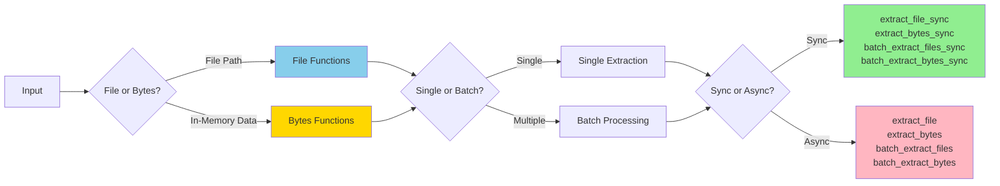
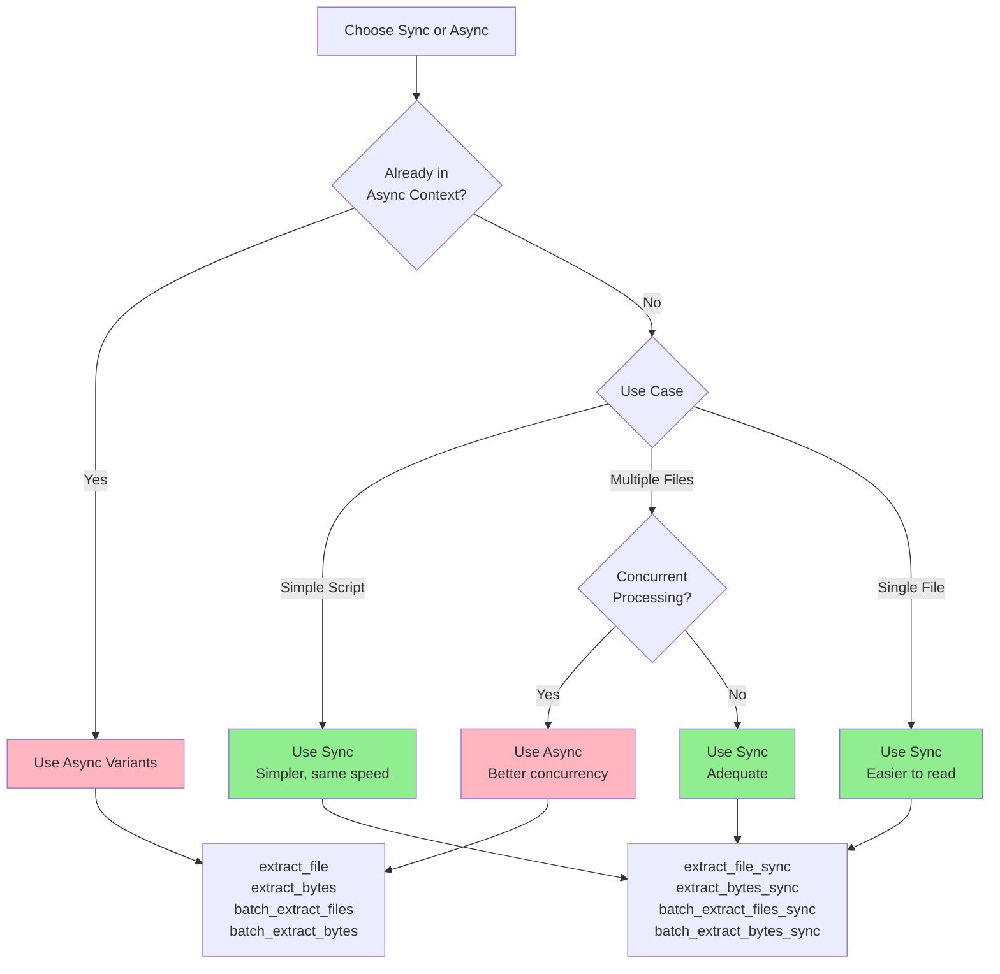
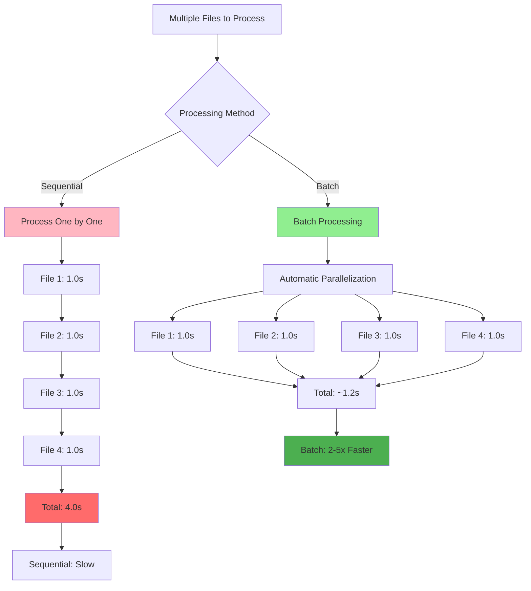

# Extraction Basics



Kreuzberg provides 8 core extraction functions organized into 4 categories: file extraction, bytes extraction, batch file extraction, and batch bytes extraction. Each has both sync and async variants.

## Extract from Files

Extract text, tables, and metadata from a file on disk.

### Synchronous

=== "Python"

    ```python
    from kreuzberg import extract_file_sync, ExtractionConfig

    result = extract_file_sync("document.pdf", config=ExtractionConfig())

    print(result.content)
    print(f"Tables: {len(result.tables)}")
    print(f"Metadata: {result.metadata}")
    ```

=== "TypeScript"

    ```typescript
    import { extractFileSync, ExtractionConfig } from 'kreuzberg';

    const result = extractFileSync('document.pdf', null, new ExtractionConfig());

    console.log(result.content);
    console.log(`Tables: ${result.tables.length}`);
    console.log(`Metadata: ${JSON.stringify(result.metadata)}`);
    ```

=== "Rust"

    ```rust
    use kreuzberg::{extract_file_sync, ExtractionConfig};

    fn main() -> kreuzberg::Result<()> {
        let result = extract_file_sync("document.pdf", None, &ExtractionConfig::default())?;

        println!("{}", result.content);
        println!("Tables: {}", result.tables.len());
        println!("Metadata: {:?}", result.metadata);
        Ok(())
    }
    ```

=== "Ruby"

    ```ruby
    require 'kreuzberg'

    result = Kreuzberg.extract_file_sync('document.pdf')

    puts result.content
    puts "Tables: #{result.tables.length}"
    puts "Metadata: #{result.metadata}"
    ```

=== "Java"

    ```java
    import dev.kreuzberg.Kreuzberg;
    import dev.kreuzberg.ExtractionResult;
    import dev.kreuzberg.KreuzbergException;
    import java.io.IOException;

    try {
        ExtractionResult result = Kreuzberg.extractFileSync("document.pdf");

        System.out.println(result.getContent());
        System.out.println("Tables: " + result.getTables().size());
        System.out.println("Metadata: " + result.getMetadata());
    } catch (IOException | KreuzbergException e) {
        e.printStackTrace();
    }
    ```

### Asynchronous

=== "Python"

    ```python
    import asyncio
    from kreuzberg import extract_file, ExtractionConfig

    async def main():
        result = await extract_file("document.pdf", config=ExtractionConfig())
        print(result.content)

    asyncio.run(main())
    ```

=== "TypeScript"

    ```typescript
    import { extractFile, ExtractionConfig } from 'kreuzberg';

    async function main() {
        const result = await extractFile('document.pdf', null, new ExtractionConfig());
        console.log(result.content);
    }

    main();
    ```

=== "Rust"

    ```rust
    use kreuzberg::{extract_file, ExtractionConfig};

    #[tokio::main]
    async fn main() -> kreuzberg::Result<()> {
        let result = extract_file("document.pdf", None, &ExtractionConfig::default()).await?;
        println!("{}", result.content);
        Ok(())
    }
    ```

=== "Ruby"

    ```ruby
    require 'kreuzberg'

    result = Kreuzberg.extract_file('document.pdf')
    puts result.content
    ```

=== "Java"

    ```java
    import dev.kreuzberg.Kreuzberg;
    import dev.kreuzberg.ExtractionResult;
    import java.util.concurrent.CompletableFuture;

    public class Example {
        public static void main(String[] args) {
            CompletableFuture<ExtractionResult> future =
                Kreuzberg.extractFileAsync("document.pdf");

            future.thenAccept(result -> {
                System.out.println(result.getContent());
                System.out.println("Tables: " + result.getTables().size());
            }).join(); // Wait for completion (or compose further)
        }
    }
    ```



## TypeScript / Node.js {#typescript-nodejs}

All TypeScript/Node.js examples in this guide use the `@goldziher/kreuzberg` package. Import synchronous APIs from the root module and asynchronous helpers from the same namespace. See the [TypeScript API Reference](../reference/api-typescript.md) for complete type definitions.

```typescript
import { extractFileSync, ExtractionConfig } from '@goldziher/kreuzberg';

const result = extractFileSync('document.pdf', null, new ExtractionConfig());
console.log(result.content);
```

## Ruby {#ruby}

Ruby bindings mirror the same function names (`extract_file_sync`, `extract_bytes`, `batch_extract_files`, etc.) under the `Kreuzberg` module. Configuration objects live under `Kreuzberg::Config`. See the [Ruby API Reference](../reference/api-ruby.md) for details.

```ruby
require 'kreuzberg'

config = Kreuzberg::Config::Extraction.new(force_ocr: true)
result = Kreuzberg.extract_file_sync('document.pdf', config: config)
puts result.content
```

!!! tip "When to Use Async"
    Use async variants when you're already in an async context or processing multiple files concurrently. For simple scripts, sync variants are simpler and just as fast.

## Extract from Bytes

Extract from data already loaded in memory.

### Synchronous

=== "Python"

    ```python
    from kreuzberg import extract_bytes_sync, ExtractionConfig

    with open("document.pdf", "rb") as f:
        data = f.read()

    result = extract_bytes_sync(
        data,
        mime_type="application/pdf",
        config=ExtractionConfig()
    )
    print(result.content)
    ```

=== "TypeScript"

    ```typescript
    import { extractBytesSync, ExtractionConfig } from 'kreuzberg';
    import { readFileSync } from 'fs';

    const data = readFileSync('document.pdf');

    const result = extractBytesSync(
        data,
        'application/pdf',
        new ExtractionConfig()
    );
    console.log(result.content);
    ```

=== "Rust"

    ```rust
    use kreuzberg::{extract_bytes_sync, ExtractionConfig};
    use std::fs;

    fn main() -> kreuzberg::Result<()> {
        let data = fs::read("document.pdf")?;

        let result = extract_bytes_sync(
            &data,
            "application/pdf",
            &ExtractionConfig::default()
        )?;
        println!("{}", result.content);
        Ok(())
    }
    ```

=== "Ruby"

    ```ruby
    require 'kreuzberg'

    data = File.binread('document.pdf')

    result = Kreuzberg.extract_bytes_sync(
        data,
        'application/pdf'
    )
    puts result.content
    ```

=== "Java"

    ```java
    import dev.kreuzberg.Kreuzberg;
    import dev.kreuzberg.ExtractionResult;
    import dev.kreuzberg.KreuzbergException;
    import java.io.IOException;
    import java.nio.file.Files;
    import java.nio.file.Paths;

    try {
        byte[] data = Files.readAllBytes(Paths.get("document.pdf"));

        ExtractionResult result = Kreuzberg.extractBytesSync(
            data,
            "application/pdf"
        );
        System.out.println(result.getContent());
    } catch (IOException | KreuzbergException e) {
        e.printStackTrace();
    }
    ```

### Asynchronous

=== "Python"

    ```python
    import asyncio
    from kreuzberg import extract_bytes, ExtractionConfig

    async def main():
        with open("document.pdf", "rb") as f:
            data = f.read()

        result = await extract_bytes(
            data,
            mime_type="application/pdf",
            config=ExtractionConfig()
        )
        print(result.content)

    asyncio.run(main())
    ```

=== "TypeScript"

    ```typescript
    import { extractBytes, ExtractionConfig } from 'kreuzberg';
    import { readFile } from 'fs/promises';

    async function main() {
        const data = await readFile('document.pdf');

        const result = await extractBytes(
            data,
            'application/pdf',
            new ExtractionConfig()
        );
        console.log(result.content);
    }

    main();
    ```

=== "Rust"

    ```rust
    use kreuzberg::{extract_bytes, ExtractionConfig};
    use tokio::fs;

    #[tokio::main]
    async fn main() -> kreuzberg::Result<()> {
        let data = fs::read("document.pdf").await?;

        let result = extract_bytes(
            &data,
            "application/pdf",
            &ExtractionConfig::default()
        ).await?;
        println!("{}", result.content);
        Ok(())
    }
    ```

=== "Ruby"

    ```ruby
    require 'kreuzberg'

    data = File.binread('document.pdf')

    result = Kreuzberg.extract_bytes(
        data,
        'application/pdf'
    )
    puts result.content
    ```

=== "Java"

    ```java
    import dev.kreuzberg.Kreuzberg;
    import dev.kreuzberg.ExtractionResult;
    import dev.kreuzberg.KreuzbergException;
    import java.io.IOException;
    import java.nio.file.Files;
    import java.nio.file.Paths;

    public class Example {
        public static void main(String[] args) {
            try {
                byte[] data = Files.readAllBytes(Paths.get("document.pdf"));

                ExtractionResult result = Kreuzberg.extractBytesSync(
                    data,
                    "application/pdf"
                );
                System.out.println(result.getContent());
            } catch (IOException | KreuzbergException e) {
                e.printStackTrace();
            }
        }
    }
    ```

!!! note "MIME Type Detection"
    Kreuzberg automatically detects MIME types from file extensions. When extracting from bytes, you must provide the MIME type explicitly.

## Batch Processing

Process multiple files concurrently for better performance.

### Batch Extract Files

=== "Python"

    ```python
    from kreuzberg import batch_extract_files_sync, ExtractionConfig

    files = ["doc1.pdf", "doc2.docx", "doc3.pptx"]
    config = ExtractionConfig()

    results = batch_extract_files_sync(files, config=config)

    for i, result in enumerate(results):
        print(f"File {i+1}: {len(result.content)} characters")
    ```

=== "TypeScript"

    ```typescript
    import { batchExtractFilesSync, ExtractionConfig } from 'kreuzberg';

    const files = ['doc1.pdf', 'doc2.docx', 'doc3.pptx'];
    const config = new ExtractionConfig();

    const results = batchExtractFilesSync(files, config);

    results.forEach((result, i) => {
        console.log(`File ${i+1}: ${result.content.length} characters`);
    });
    ```

=== "Rust"

    ```rust
    use kreuzberg::{batch_extract_file_sync, ExtractionConfig};

    fn main() -> kreuzberg::Result<()> {
        let files = vec!["doc1.pdf", "doc2.docx", "doc3.pptx"];
        let config = ExtractionConfig::default();

        let results = batch_extract_file_sync(&files, None, &config)?;

        for (i, result) in results.iter().enumerate() {
            println!("File {}: {} characters", i+1, result.content.len());
        }
        Ok(())
    }
    ```

=== "Ruby"

    ```ruby
    require 'kreuzberg'

    files = ['doc1.pdf', 'doc2.docx', 'doc3.pptx']

    results = Kreuzberg.batch_extract_files_sync(files)

    results.each_with_index do |result, i|
        puts "File #{i+1}: #{result.content.length} characters"
    end
    ```

=== "Java"

    ```java
    import dev.kreuzberg.Kreuzberg;
    import dev.kreuzberg.ExtractionResult;
    import dev.kreuzberg.KreuzbergException;
    import java.io.IOException;
    import java.util.Arrays;
    import java.util.List;

    try {
        List<String> files = Arrays.asList("doc1.pdf", "doc2.docx", "doc3.pptx");

        List<ExtractionResult> results = Kreuzberg.batchExtractFilesSync(files);

        for (int i = 0; i < results.size(); i++) {
            ExtractionResult result = results.get(i);
            System.out.println("File " + (i+1) + ": " + result.getContent().length() + " characters");
        }
    } catch (IOException | KreuzbergException e) {
        e.printStackTrace();
    }
    ```

### Batch Extract Bytes

=== "Python"

    ```python
    from kreuzberg import batch_extract_bytes_sync, ExtractionConfig

    files = ["doc1.pdf", "doc2.docx"]
    data_list = []
    mime_types = []

    for file in files:
        with open(file, "rb") as f:
            data_list.append(f.read())
        mime_types.append("application/pdf" if file.endswith(".pdf") else "application/vnd.openxmlformats-officedocument.wordprocessingml.document")

    results = batch_extract_bytes_sync(
        data_list,
        mime_types=mime_types,
        config=ExtractionConfig()
    )

    for i, result in enumerate(results):
        print(f"Document {i+1}: {len(result.content)} characters")
    ```

=== "TypeScript"

    ```typescript
    import { batchExtractBytesSync, ExtractionConfig } from 'kreuzberg';
    import { readFileSync } from 'fs';

    const files = ['doc1.pdf', 'doc2.docx'];
    const dataList = files.map(f => readFileSync(f));
    const mimeTypes = files.map(f =>
        f.endsWith('.pdf') ? 'application/pdf' :
        'application/vnd.openxmlformats-officedocument.wordprocessingml.document'
    );

    const results = batchExtractBytesSync(
        dataList,
        mimeTypes,
        new ExtractionConfig()
    );

    results.forEach((result, i) => {
        console.log(`Document ${i+1}: ${result.content.length} characters`);
    });
    ```

=== "Rust"

    ```rust
    use kreuzberg::{batch_extract_bytes_sync, ExtractionConfig};
    use std::fs;

    fn main() -> kreuzberg::Result<()> {
        let files = vec!["doc1.pdf", "doc2.docx"];

        let data_list: Vec<Vec<u8>> = files.iter()
            .map(|f| fs::read(f).unwrap())
            .collect();

        let mime_types: Vec<&str> = files.iter()
            .map(|f| if f.ends_with(".pdf") {
                "application/pdf"
            } else {
                "application/vnd.openxmlformats-officedocument.wordprocessingml.document"
            })
            .collect();

        let results = batch_extract_bytes_sync(
            &data_list,
            &mime_types,
            &ExtractionConfig::default()
        )?;

        for (i, result) in results.iter().enumerate() {
            println!("Document {}: {} characters", i+1, result.content.len());
        }
        Ok(())
    }
    ```

=== "Ruby"

    ```ruby
    require 'kreuzberg'

    files = ['doc1.pdf', 'doc2.docx']

    data_list = files.map { |f| File.binread(f) }
    mime_types = files.map do |f|
        f.end_with?('.pdf') ? 'application/pdf' :
        'application/vnd.openxmlformats-officedocument.wordprocessingml.document'
    end

    results = Kreuzberg.batch_extract_bytes_sync(
        data_list,
        mime_types
    )

    results.each_with_index do |result, i|
        puts "Document #{i+1}: #{result.content.length} characters"
    end
    ```

=== "Java"

    ```java
    import dev.kreuzberg.Kreuzberg;
    import dev.kreuzberg.ExtractionResult;
    import dev.kreuzberg.BytesWithMime;
    import dev.kreuzberg.KreuzbergException;
    import java.io.IOException;
    import java.nio.file.Files;
    import java.nio.file.Paths;
    import java.util.ArrayList;
    import java.util.Arrays;
    import java.util.List;

    try {
        List<String> files = Arrays.asList("doc1.pdf", "doc2.docx");

        List<BytesWithMime> dataList = new ArrayList<>();
        for (String file : files) {
            byte[] data = Files.readAllBytes(Paths.get(file));
            String mimeType = file.endsWith(".pdf") ? "application/pdf" :
                "application/vnd.openxmlformats-officedocument.wordprocessingml.document";
            dataList.add(new BytesWithMime(data, mimeType));
        }

        List<ExtractionResult> results = Kreuzberg.batchExtractBytesSync(dataList);

        for (int i = 0; i < results.size(); i++) {
            ExtractionResult result = results.get(i);
            System.out.println("Document " + (i+1) + ": " + result.getContent().length() + " characters");
        }
    } catch (IOException | KreuzbergException e) {
        e.printStackTrace();
    }
    ```



!!! tip "Performance"
    Batch processing provides automatic parallelization. For large sets of files, this can be 2-5x faster than processing files sequentially.

## Supported Formats

Kreuzberg supports 118+ file formats across 8 categories:

| Format | Extensions | Notes |
|--------|-----------|-------|
| **PDF** | `.pdf` | Native text + OCR for scanned pages |
| **Images** | `.png`, `.jpg`, `.jpeg`, `.tiff`, `.bmp`, `.webp` | Requires OCR backend |
| **Office** | `.docx`, `.pptx`, `.xlsx` | Modern formats via native parsers |
| **Legacy Office** | `.doc`, `.ppt` | Requires LibreOffice |
| **Email** | `.eml`, `.msg` | Full support including attachments |
| **Web** | `.html`, `.htm` | Converted to Markdown with metadata |
| **Text** | `.md`, `.txt`, `.xml`, `.json`, `.yaml`, `.toml`, `.csv` | Direct extraction |
| **Archives** | `.zip`, `.tar`, `.tar.gz`, `.tar.bz2` | Recursive extraction |

See the [installation guide](../getting-started/installation.md#system-dependencies) for optional dependencies (Tesseract, LibreOffice, Pandoc).

## Error Handling

All extraction functions raise exceptions on failure:

=== "Python"

    ```python
    from kreuzberg import (
        extract_file_sync,
        ExtractionConfig,
        KreuzbergError,
        ValidationError,
        ParsingError,
        OCRError,
        MissingDependencyError
    )

    try:
        result = extract_file_sync("document.pdf", config=ExtractionConfig())
        print(result.content)
    except ValidationError as e:
        print(f"Invalid configuration: {e}")
    except ParsingError as e:
        print(f"Failed to parse document: {e}")
        print(f"Context: {e.context}")
    except OCRError as e:
        print(f"OCR processing failed: {e}")
    except MissingDependencyError as e:
        print(f"Missing dependency: {e}")
    except KreuzbergError as e:
        print(f"Extraction error: {e}")
    except (OSError, RuntimeError) as e:
        print(f"System error: {e}")
    ```

=== "TypeScript"

    ```typescript
    import {
        extractFileSync,
        ExtractionConfig,
        KreuzbergError
    } from 'kreuzberg';

    try {
        const result = extractFileSync('document.pdf', null, new ExtractionConfig());
        console.log(result.content);
    } catch (error) {
        if (error instanceof KreuzbergError) {
            console.error(`Extraction error: ${error.message}`);
        } else {
            throw error;
        }
    }
    ```

=== "Rust"

    ```rust
    use kreuzberg::{extract_file_sync, ExtractionConfig, KreuzbergError};

    fn main() {
        let result = extract_file_sync("document.pdf", None, &ExtractionConfig::default());

        match result {
            Ok(extraction) => {
                println!("{}", extraction.content);
            }
            Err(KreuzbergError::Validation(msg)) => {
                eprintln!("Invalid configuration: {}", msg);
            }
            Err(KreuzbergError::Parsing { message, context }) => {
                eprintln!("Failed to parse document: {}", message);
                eprintln!("Context: {:?}", context);
            }
            Err(KreuzbergError::Ocr(msg)) => {
                eprintln!("OCR processing failed: {}", msg);
            }
            Err(KreuzbergError::MissingDependency { dependency, message }) => {
                eprintln!("Missing dependency {}: {}", dependency, message);
            }
            Err(KreuzbergError::Io(e)) => {
                eprintln!("I/O error: {}", e);
            }
            Err(e) => {
                eprintln!("Extraction error: {}", e);
            }
        }
    }
    ```

=== "Ruby"

    ```ruby
    require 'kreuzberg'

    begin
        result = Kreuzberg.extract_file_sync('document.pdf')
        puts result.content
    rescue Kreuzberg::ValidationError => e
        puts "Invalid configuration: #{e.message}"
    rescue Kreuzberg::ParsingError => e
        puts "Failed to parse document: #{e.message}"
    rescue Kreuzberg::OCRError => e
        puts "OCR processing failed: #{e.message}"
    rescue Kreuzberg::MissingDependencyError => e
        puts "Missing dependency: #{e.message}"
    rescue Kreuzberg::Error => e
        puts "Extraction error: #{e.message}"
    rescue StandardError => e
        puts "System error: #{e.message}"
    end
    ```

=== "Java"

    ```java
    import dev.kreuzberg.Kreuzberg;
    import dev.kreuzberg.ExtractionResult;
    import dev.kreuzberg.KreuzbergException;
    import dev.kreuzberg.ValidationException;
    import dev.kreuzberg.ParsingException;
    import dev.kreuzberg.OcrException;
    import dev.kreuzberg.MissingDependencyException;
    import java.io.IOException;

    try {
        ExtractionResult result = Kreuzberg.extractFileSync("document.pdf");
        System.out.println(result.getContent());
    } catch (ValidationException e) {
        System.err.println("Invalid configuration: " + e.getMessage());
    } catch (ParsingException e) {
        System.err.println("Failed to parse document: " + e.getMessage());
    } catch (OcrException e) {
        System.err.println("OCR processing failed: " + e.getMessage());
    } catch (MissingDependencyException e) {
        System.err.println("Missing dependency: " + e.getMessage());
    } catch (KreuzbergException e) {
        System.err.println("Extraction error: " + e.getMessage());
    } catch (IOException e) {
        System.err.println("System error: " + e.getMessage());
    }
    ```

!!! warning "System Errors"
    `OSError` (Python), `IOException` (Rust), and system-level errors always bubble up to users. These indicate real system problems that need to be addressed (permissions, disk space, etc.).

## Next Steps

- [Configuration](configuration.md) - Learn about all configuration options
- [OCR Guide](ocr.md) - Set up optical character recognition
- [Advanced Features](advanced.md) - Chunking, language detection, and more
- [API Reference](../reference/api-python.md) - Detailed API documentation
