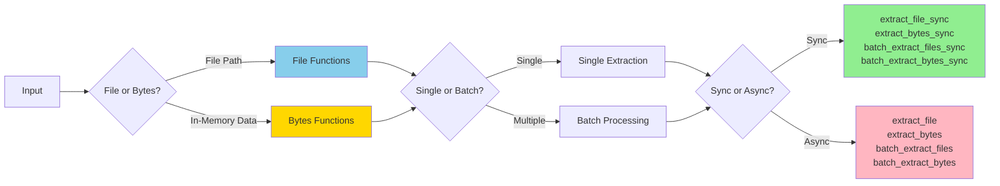
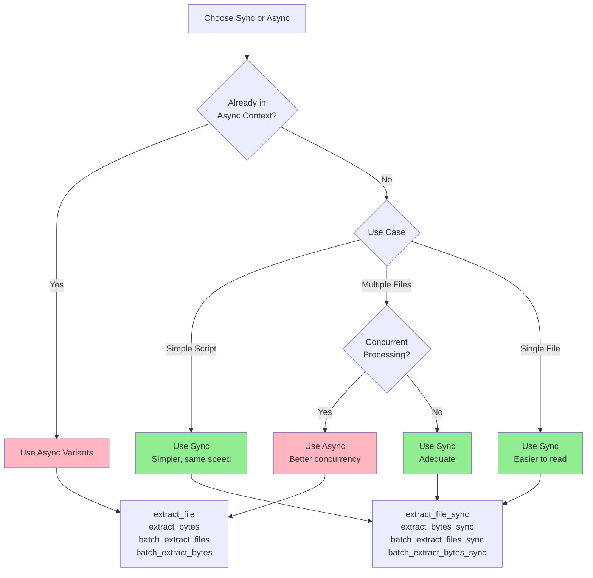
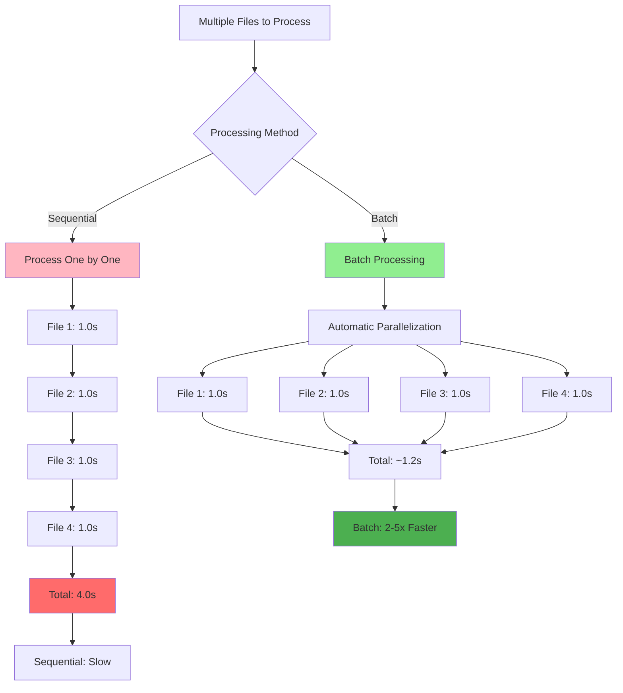

# Extraction Basics



Kreuzberg provides 8 core extraction functions organized into 4 categories: file extraction, bytes extraction, batch file extraction, and batch bytes extraction. Each has both sync and async variants.

## Extract from Files

Extract text, tables, and metadata from a file on disk.

### Synchronous

=== "Python"

    --8<-- "snippets/python/extract_file_sync.md"

=== "TypeScript"

    --8<-- "snippets/typescript/extract_file_sync.md"

=== "Rust"

    --8<-- "snippets/rust/extract_file_sync.md"

=== "Ruby"

    --8<-- "snippets/ruby/extract_file_sync.md"

=== "Java"

    --8<-- "snippets/java/extract_file_sync.md"

=== "Go"

    --8<-- "snippets/go/extract_file_sync.md"

### Asynchronous

=== "Python"

    --8<-- "snippets/python/extract_file_async.md"

=== "TypeScript"

    --8<-- "snippets/typescript/extract_file_async.md"

=== "Rust"

    --8<-- "snippets/rust/extract_file_async.md"

=== "Ruby"

    --8<-- "snippets/ruby/extract_file_async.md"

=== "Java"

    --8<-- "snippets/java/extract_file_async.md"

=== "Go"

    --8<-- "snippets/go/extract_file_async.md"



## TypeScript / Node.js {#typescript-nodejs}

All TypeScript/Node.js examples in this guide use the `@goldziher/kreuzberg` package. Import synchronous APIs from the root module and asynchronous helpers from the same namespace. See the [TypeScript API Reference](../reference/api-typescript.md) for complete type definitions.

```typescript
--8<-- "snippets/typescript/extract_file_sync.md"
```

## Ruby {#ruby}

Ruby bindings mirror the same function names (`extract_file_sync`, `extract_bytes`, `batch_extract_files`, etc.) under the `Kreuzberg` module. Configuration objects live under `Kreuzberg::Config`. See the [Ruby API Reference](../reference/api-ruby.md) for details.

```ruby
--8<-- "snippets/ruby/extract_file_sync.md"
```

!!! tip "When to Use Async"
    Use async variants when you're already in an async context or processing multiple files concurrently. For simple scripts, sync variants are simpler and just as fast.

## Extract from Bytes

Extract from data already loaded in memory.

### Synchronous

=== "Python"

    --8<-- "snippets/python/extract_bytes_sync.md"

=== "TypeScript"

    --8<-- "snippets/typescript/extract_bytes_sync.md"

=== "Rust"

    --8<-- "snippets/rust/extract_bytes_sync.md"

=== "Ruby"

    --8<-- "snippets/ruby/extract_bytes_sync.md"

=== "Java"

    --8<-- "snippets/java/extract_bytes_sync.md"

=== "Go"

    --8<-- "snippets/go/extract_bytes_sync.md"

### Asynchronous

=== "Python"

    --8<-- "snippets/python/extract_bytes_async.md"

=== "TypeScript"

    --8<-- "snippets/typescript/extract_bytes_async.md"

=== "Rust"

    --8<-- "snippets/rust/extract_bytes_async.md"

=== "Ruby"

    --8<-- "snippets/ruby/extract_bytes_async.md"

=== "Java"

    --8<-- "snippets/java/extract_bytes_async.md"

=== "Go"

    --8<-- "snippets/go/extract_bytes_async.md"

!!! note "MIME Type Detection"
    Kreuzberg automatically detects MIME types from file extensions. When extracting from bytes, you must provide the MIME type explicitly.

## Batch Processing

Process multiple files concurrently for better performance.

### Batch Extract Files

=== "Python"

    --8<-- "snippets/python/batch_extract_files_sync.md"

=== "TypeScript"

    --8<-- "snippets/typescript/batch_extract_files_sync.md"

=== "Rust"

    --8<-- "snippets/rust/batch_extract_files_sync.md"

=== "Ruby"

    --8<-- "snippets/ruby/batch_extract_files_sync.md"

=== "Java"

    --8<-- "snippets/java/batch_extract_files_sync.md"

=== "Go"

    --8<-- "snippets/go/batch_extract_files_sync.md"

### Batch Extract Bytes

=== "Python"

    --8<-- "snippets/python/batch_extract_bytes_sync.md"

=== "TypeScript"

    --8<-- "snippets/typescript/batch_extract_bytes_sync.md"

=== "Rust"

    --8<-- "snippets/rust/batch_extract_bytes_sync.md"

=== "Ruby"

    --8<-- "snippets/ruby/batch_extract_bytes_sync.md"

=== "Java"

    --8<-- "snippets/java/batch_extract_bytes_sync.md"

=== "Go"

    --8<-- "snippets/go/batch_extract_bytes_sync.md"



!!! tip "Performance"
    Batch processing provides automatic parallelization. For large sets of files, this can be 2-5x faster than processing files sequentially.

## Supported Formats

Kreuzberg supports 118+ file formats across 8 categories:

| Format | Extensions | Notes |
|--------|-----------|-------|
| **PDF** | `.pdf` | Native text + OCR for scanned pages |
| **Images** | `.png`, `.jpg`, `.jpeg`, `.tiff`, `.bmp`, `.webp` | Requires OCR backend |
| **Office** | `.docx`, `.pptx`, `.xlsx` | Modern formats via native parsers |
| **Legacy Office** | `.doc`, `.ppt` | Requires LibreOffice |
| **Email** | `.eml`, `.msg` | Full support including attachments |
| **Web** | `.html`, `.htm` | Converted to Markdown with metadata |
| **Text** | `.md`, `.txt`, `.xml`, `.json`, `.yaml`, `.toml`, `.csv` | Direct extraction |
| **Archives** | `.zip`, `.tar`, `.tar.gz`, `.tar.bz2` | Recursive extraction |

See the [installation guide](../getting-started/installation.md#system-dependencies) for optional dependencies (Tesseract, LibreOffice, Pandoc).

## Error Handling

All extraction functions raise exceptions on failure:

=== "Python"

    --8<-- "snippets/python/error_handling.md"

=== "TypeScript"

    --8<-- "snippets/typescript/error_handling.md"

=== "Rust"

    --8<-- "snippets/rust/error_handling.md"

=== "Ruby"

    --8<-- "snippets/ruby/error_handling.md"

=== "Java"

    --8<-- "snippets/java/error_handling.md"

!!! warning "System Errors"
    `OSError` (Python), `IOException` (Rust), and system-level errors always bubble up to users. These indicate real system problems that need to be addressed (permissions, disk space, etc.).

## Next Steps

- [Configuration](configuration.md) - Learn about all configuration options
- [OCR Guide](ocr.md) - Set up optical character recognition
- [Advanced Features](advanced.md) - Chunking, language detection, and more
- [API Reference](../reference/api-python.md) - Detailed API documentation
=== "Go"

    --8<-- "snippets/go/error_handling.md"
