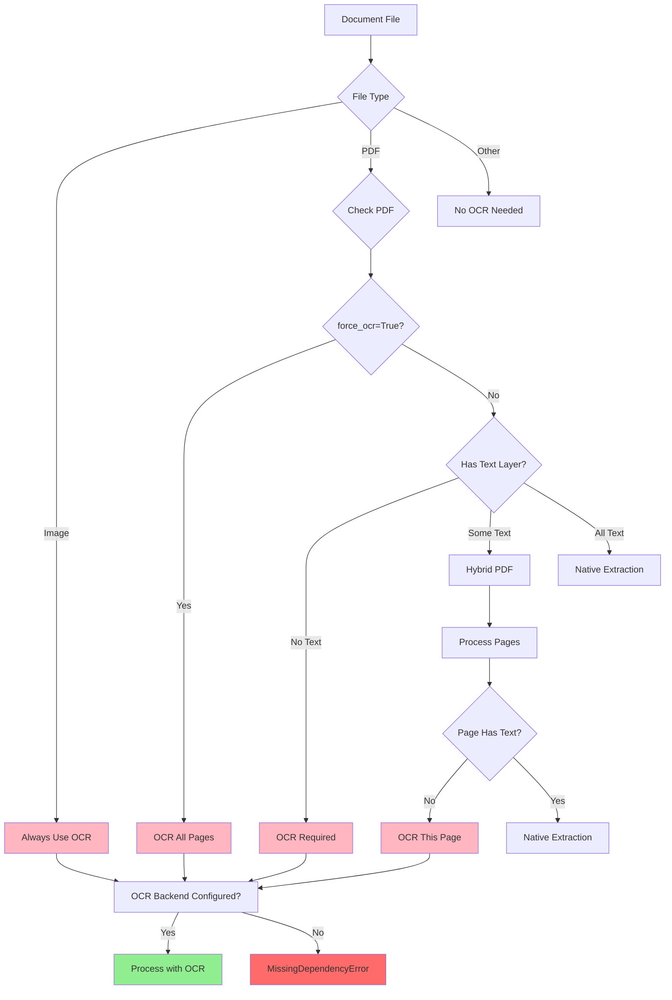
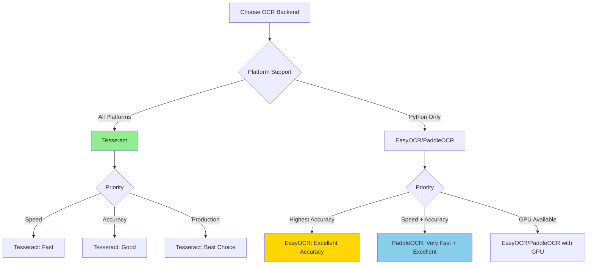

# OCR (Optical Character Recognition)

Extract text from images and scanned PDFs using OCR.

## When OCR is Needed



Kreuzberg automatically determines when OCR is required:

- **Images** (`.png`, `.jpg`, `.tiff`, `.bmp`, `.webp`) - Always requires OCR
- **PDFs with no text layer** - Scanned documents automatically trigger OCR
- **Hybrid PDFs** - Pages without text are processed with OCR, others use native extraction
- **Force OCR** - Use `force_ocr=True` to OCR all pages regardless of text layer

!!! note "Automatic Detection"
    You don't need to manually enable OCR for images. Kreuzberg detects the file type and applies OCR automatically when an OCR backend is configured.

## OCR Backend Comparison



Kreuzberg supports three OCR backends with different strengths:

| Feature | **Tesseract** | **EasyOCR** | **PaddleOCR** |
|---------|--------------|-------------|---------------|
| **Speed** | Fast | Moderate | Very Fast |
| **Accuracy** | Good | Excellent | Excellent |
| **Languages** | 100+ | 80+ | 80+ |
| **Installation** | System package | Python package | Python package |
| **Model Size** | Small (~10MB) | Large (~100MB) | Medium (~50MB) |
| **CPU/GPU** | CPU only | CPU + GPU | CPU + GPU |
| **Platform Support** | All | Python only | Python only |
| **Best For** | General use, production | High accuracy needs | Speed + accuracy |

### Recommendation

- **Production/CLI**: Use **Tesseract** for simplicity and broad platform support
- **Python + Accuracy**: Use **EasyOCR** for best accuracy with deep learning models
- **Python + Speed**: Use **PaddleOCR** for fast processing with good accuracy

## Installation

### Tesseract (Recommended)

Available on all platforms (Python, TypeScript, Rust, Ruby):

=== "macOS"

    ```bash title="Terminal"
    brew install tesseract
    ```

=== "Ubuntu/Debian"

    ```bash title="Terminal"
    sudo apt-get install tesseract-ocr
    ```

=== "RHEL/CentOS/Fedora"

    ```bash title="Terminal"
    sudo dnf install tesseract
    ```

=== "Windows"

    Download from [GitHub releases](https://github.com/UB-Mannheim/tesseract/wiki)

### Additional Languages

```bash title="Terminal"
# macOS
brew install tesseract-lang

# Ubuntu/Debian
sudo apt-get install tesseract-ocr-deu  # German
sudo apt-get install tesseract-ocr-fra  # French
sudo apt-get install tesseract-ocr-spa  # Spanish

# List all installed languages
tesseract --list-langs
```

### EasyOCR (Python Only)

Available only in Python with deep learning models:

```bash title="Terminal"
pip install "kreuzberg[easyocr]"
```

!!! warning "Python 3.14 Compatibility"
    EasyOCR is not supported on Python 3.14 due to upstream PyTorch compatibility. Use Python 3.10-3.13 or use Tesseract on Python 3.14.

### PaddleOCR (Python Only)

Available only in Python with optimized deep learning:

```bash title="Terminal"
pip install "kreuzberg[paddleocr]"
```

!!! warning "Python 3.14 Compatibility"
    PaddleOCR is not supported on Python 3.14 due to upstream compatibility issues. Use Python 3.10-3.13.

## Configuration

### Basic Configuration

=== "Go"

    --8<-- "snippets/go/ocr/ocr_extraction.md"

=== "Java"

    --8<-- "snippets/java/ocr/ocr_extraction.md"

=== "Python"

    --8<-- "snippets/python/ocr/ocr_extraction.md"

=== "Ruby"

    --8<-- "snippets/ruby/ocr/ocr_extraction.md"

=== "Rust"

    --8<-- "snippets/rust/ocr/ocr_extraction.md"

=== "TypeScript"

    --8<-- "snippets/typescript/ocr/ocr_extraction.md"

=== "WASM"

    --8<-- "snippets/wasm/ocr/ocr_extraction.md"

### Multiple Languages

=== "Go"

    --8<-- "snippets/go/ocr/ocr_multi_language.md"

=== "Java"

    --8<-- "snippets/java/ocr/ocr_multi_language.md"

=== "Python"

    --8<-- "snippets/python/ocr/ocr_multi_language.md"

=== "Ruby"

    --8<-- "snippets/ruby/ocr/ocr_multi_language.md"

=== "Rust"

    --8<-- "snippets/rust/ocr/ocr_multi_language.md"

=== "TypeScript"

    --8<-- "snippets/typescript/ocr/ocr_multi_language.md"

=== "WASM"

    ```typescript
    import { enableOcr, extractFromFile, initWasm } from '@kreuzberg/wasm';

    await initWasm();
    await enableOcr();

    const fileInput = document.getElementById('file') as HTMLInputElement;
    const file = fileInput.files?.[0];

    if (file) {
      const result = await extractFromFile(file, file.type, {
        ocr: {
          backend: 'tesseract-wasm',
          language: 'eng+deu', // Multiple languages
        },
      });
      console.log(result.content);
    }
    ```

### Force OCR on All Pages

Process PDFs with OCR even when they have a text layer:

=== "Go"

    --8<-- "snippets/go/ocr/ocr_force_all_pages.md"

=== "Java"

    --8<-- "snippets/java/ocr/ocr_force_all_pages.md"

=== "Python"

    --8<-- "snippets/python/ocr/ocr_force_all_pages.md"

=== "Ruby"

    --8<-- "snippets/ruby/ocr/ocr_force_all_pages.md"

=== "Rust"

    --8<-- "snippets/rust/ocr/ocr_force_all_pages.md"

=== "TypeScript"

    --8<-- "snippets/typescript/ocr/ocr_force_all_pages.md"

=== "WASM"

    ```typescript
    import { enableOcr, extractFromFile, initWasm } from '@kreuzberg/wasm';

    await initWasm();
    await enableOcr();

    const fileInput = document.getElementById('file') as HTMLInputElement;
    const file = fileInput.files?.[0];

    if (file) {
      const result = await extractFromFile(file, file.type, {
        force_ocr: true,
        ocr: {
          backend: 'tesseract-wasm',
          language: 'eng',
        },
      });
      console.log(result.content);
    }
    ```

### Using EasyOCR (Python Only)

=== "Go"

    --8<-- "snippets/go/ocr/ocr_easyocr.md"

=== "Java"

    --8<-- "snippets/java/ocr/ocr_easyocr.md"

=== "Python"

    --8<-- "snippets/python/ocr/ocr_easyocr.md"

=== "Ruby"

    --8<-- "snippets/ruby/ocr/ocr_easyocr.md"

=== "Rust"

    --8<-- "snippets/rust/ocr/ocr_easyocr.md"

=== "TypeScript"

    --8<-- "snippets/typescript/ocr/ocr_easyocr.md"

!!! tip "GPU Acceleration"
    EasyOCR and PaddleOCR support GPU acceleration via PyTorch/PaddlePaddle. Set `use_gpu=True` to enable.

### Using PaddleOCR (Python Only)

=== "Go"

    --8<-- "snippets/go/ocr/ocr_paddleocr.md"

=== "Java"

    --8<-- "snippets/java/ocr/ocr_paddleocr.md"

=== "Python"

    --8<-- "snippets/python/ocr/ocr_paddleocr.md"

=== "Ruby"

    --8<-- "snippets/ruby/ocr/ocr_paddleocr.md"

=== "Rust"

    --8<-- "snippets/rust/ocr/ocr_paddleocr.md"

=== "TypeScript"

    --8<-- "snippets/typescript/ocr/ocr_paddleocr.md"

## Advanced OCR Options

### DPI Configuration

Control image resolution for OCR processing:

=== "Go"

    --8<-- "snippets/go/config/ocr_dpi_config.md"

=== "Java"

    --8<-- "snippets/java/config/ocr_dpi_config.md"

=== "Python"

    --8<-- "snippets/python/config/ocr_dpi_config.md"

=== "Ruby"

    --8<-- "snippets/ruby/config/ocr_dpi_config.md"

=== "Rust"

    --8<-- "snippets/rust/ocr/ocr_dpi_config.md"

=== "TypeScript"

    --8<-- "snippets/typescript/ocr/ocr_dpi_config.md"

!!! tip "DPI Recommendations"
    - **150 DPI**: Fast processing, lower accuracy
    - **300 DPI** (default): Balanced speed and accuracy
    - **600 DPI**: High accuracy, slower processing

### Image Preprocessing

Kreuzberg automatically preprocesses images for better OCR results:

- **Grayscale conversion** - Reduces noise
- **Contrast enhancement** - Improves text visibility
- **Noise reduction** - Removes artifacts
- **Deskewing** - Corrects rotation

These are applied automatically and require no configuration.

## Troubleshooting

??? question "Tesseract not found"

    **Error**: `MissingDependencyError: tesseract`

    **Solution**: Install Tesseract OCR:

    ```bash title="Terminal"
    # macOS
    brew install tesseract

    # Ubuntu/Debian
    sudo apt-get install tesseract-ocr

    # Verify installation
    tesseract --version
    ```

??? question "Language not found"

    **Error**: `Failed to initialize tesseract with language 'deu'`

    **Solution**: Install the language data:

    ```bash title="Terminal"
    # macOS
    brew install tesseract-lang

    # Ubuntu/Debian
    sudo apt-get install tesseract-ocr-deu

    # List installed languages
    tesseract --list-langs
    ```

??? question "Poor OCR accuracy"

    **Problem**: Extracted text has many errors

    **Solutions**:

    1. **Increase DPI**: Try 600 DPI for better quality
        ```python title="ocr_high_quality.py"
        config = ExtractionConfig(
            ocr=OcrConfig(backend="tesseract"),
            pdf=PdfConfig(dpi=600)
        )
        ```

    2. **Try different backend**: EasyOCR often has better accuracy
        ```python title="ocr_easyocr.py"
        config = ExtractionConfig(
            ocr=OcrConfig(backend="easyocr", language="en")
        )
        ```

    3. **Specify correct language**: Use the document's language
        ```python title="ocr_german.py"
        config = ExtractionConfig(
            ocr=OcrConfig(backend="tesseract", language="deu")
        )
        ```

??? question "OCR is very slow"

    **Problem**: Processing takes too long

    **Solutions**:

    1. **Reduce DPI**: Use 150 DPI for faster processing
        ```python title="ocr_fast.py"
        config = ExtractionConfig(
            ocr=OcrConfig(backend="tesseract"),
            pdf=PdfConfig(dpi=150)
        )
        ```

    2. **Use GPU acceleration** (EasyOCR/PaddleOCR):
        ```python title="ocr_gpu.py"
        config = ExtractionConfig(
            ocr=OcrConfig(backend="paddleocr", use_gpu=True)
        )
        ```

    3. **Use batch processing**: Process multiple files concurrently
        ```python title="batch_ocr.py"
        results = batch_extract_files_sync(files, config=config)
        ```

??? question "Out of memory with large PDFs"

    **Problem**: Memory errors when processing large scanned PDFs

    **Solutions**:

    1. **Reduce DPI**: Lower resolution uses less memory
        ```python title="ocr_low_memory.py"
        config = ExtractionConfig(
            ocr=OcrConfig(backend="tesseract"),
            pdf=PdfConfig(dpi=150)
        )
        ```

    2. **Process pages separately**: Extract specific page ranges

    3. **Increase system memory**: OCR is memory-intensive

??? question "EasyOCR/PaddleOCR not working on Python 3.14"

    **Error**: Installation fails on Python 3.14

    **Solution**: Use Python 3.10-3.13 or switch to Tesseract:

    ```bash title="Terminal"
    # Use Tesseract (works on all Python versions)
    pip install kreuzberg
    brew install tesseract  # or apt-get install tesseract-ocr
    ```

## CLI Usage

Extract with OCR using the command-line interface:

```bash title="Terminal"
# Basic OCR extraction (uses config file for language/settings)
kreuzberg extract scanned.pdf --ocr true

# Force OCR on all pages (even if text layer exists)
kreuzberg extract document.pdf --force-ocr true

# Use config file to specify language and other OCR settings
kreuzberg extract scanned.pdf --config kreuzberg.toml --ocr true
```

**Example config file (kreuzberg.toml) for OCR settings:**

```toml
[ocr]
backend = "tesseract"
language = "eng"           # Single language
# language = "eng+deu"     # Multiple languages

[ocr.tesseract_config]
psm = 3                    # Page segmentation mode
```

## Next Steps

- [Configuration](configuration.md) - All configuration options
- [Advanced Features](advanced.md) - Chunking, language detection, and more
- [Extraction Basics](extraction.md) - Core extraction API
