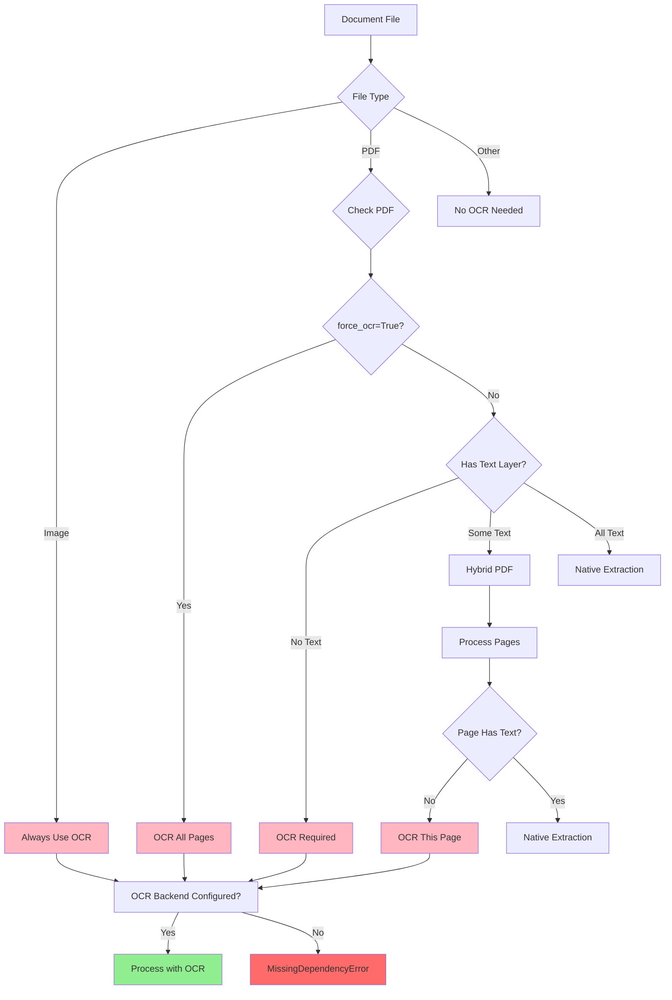
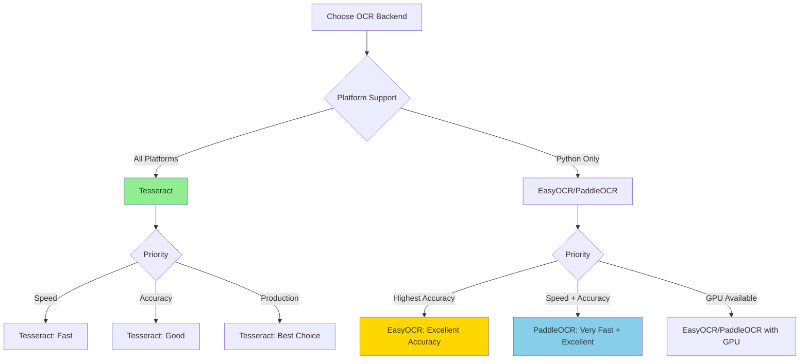

# OCR (Optical Character Recognition)

Extract text from images and scanned PDFs using OCR.

## When OCR is Needed



Kreuzberg automatically determines when OCR is required:

- **Images** (`.png`, `.jpg`, `.tiff`, `.bmp`, `.webp`) - Always requires OCR
- **PDFs with no text layer** - Scanned documents automatically trigger OCR
- **Hybrid PDFs** - Pages without text are processed with OCR, others use native extraction
- **Force OCR** - Use `force_ocr=True` to OCR all pages regardless of text layer

!!! note "Automatic Detection"
    You don't need to manually enable OCR for images. Kreuzberg detects the file type and applies OCR automatically when an OCR backend is configured.

## OCR Backend Comparison



Kreuzberg supports three OCR backends with different strengths:

| Feature | **Tesseract** | **EasyOCR** | **PaddleOCR** |
|---------|--------------|-------------|---------------|
| **Speed** | Fast | Moderate | Very Fast |
| **Accuracy** | Good | Excellent | Excellent |
| **Languages** | 100+ | 80+ | 80+ |
| **Installation** | System package | Python package | Python package |
| **Model Size** | Small (~10MB) | Large (~100MB) | Medium (~50MB) |
| **CPU/GPU** | CPU only | CPU + GPU | CPU + GPU |
| **Platform Support** | All | Python only | Python only |
| **Best For** | General use, production | High accuracy needs | Speed + accuracy |

### Recommendation

- **Production/CLI**: Use **Tesseract** for simplicity and broad platform support
- **Python + Accuracy**: Use **EasyOCR** for best accuracy with deep learning models
- **Python + Speed**: Use **PaddleOCR** for fast processing with good accuracy

## Installation

### Tesseract (Recommended)

Available on all platforms (Python, TypeScript, Rust, Ruby):

=== "macOS"

    ```bash
    brew install tesseract
    ```

=== "Ubuntu/Debian"

    ```bash
    sudo apt-get install tesseract-ocr
    ```

=== "RHEL/CentOS/Fedora"

    ```bash
    sudo dnf install tesseract
    ```

=== "Windows"

    Download from [GitHub releases](https://github.com/UB-Mannheim/tesseract/wiki)

### Additional Languages

```bash
# macOS
brew install tesseract-lang

# Ubuntu/Debian
sudo apt-get install tesseract-ocr-deu  # German
sudo apt-get install tesseract-ocr-fra  # French
sudo apt-get install tesseract-ocr-spa  # Spanish

# List all installed languages
tesseract --list-langs
```

### EasyOCR (Python Only)

Available only in Python with deep learning models:

```bash
pip install "kreuzberg[easyocr]"
```

!!! warning "Python 3.14 Compatibility"
    EasyOCR is not supported on Python 3.14 due to upstream PyTorch compatibility. Use Python 3.10-3.13 or use Tesseract on Python 3.14.

### PaddleOCR (Python Only)

Available only in Python with optimized deep learning:

```bash
pip install "kreuzberg[paddleocr]"
```

!!! warning "Python 3.14 Compatibility"
    PaddleOCR is not supported on Python 3.14 due to upstream compatibility issues. Use Python 3.10-3.13.

## Configuration

### Basic Configuration

=== "Python"

    ```python
    from kreuzberg import extract_file_sync, ExtractionConfig, OcrConfig

    config = ExtractionConfig(
        ocr=OcrConfig(
            backend="tesseract",
            language="eng"
        )
    )

    result = extract_file_sync("scanned.pdf", config=config)
    print(result.content)
    ```

=== "TypeScript"

    ```typescript
    import { extractFileSync, ExtractionConfig, OcrConfig } from 'kreuzberg';

    const config = new ExtractionConfig({
        ocr: new OcrConfig({
            backend: 'tesseract',
            language: 'eng'
        })
    });

    const result = extractFileSync('scanned.pdf', null, config);
    console.log(result.content);
    ```

=== "Rust"

    ```rust
    use kreuzberg::{extract_file_sync, ExtractionConfig, OcrConfig};

    fn main() -> kreuzberg::Result<()> {
        let config = ExtractionConfig {
            ocr: Some(OcrConfig {
                backend: "tesseract".to_string(),
                language: Some("eng".to_string()),
                ..Default::default()
            }),
            ..Default::default()
        };

        let result = extract_file_sync("scanned.pdf", None, &config)?;
        println!("{}", result.content);
        Ok(())
    }
    ```

=== "Ruby"

    ```ruby
    require 'kreuzberg'

    config = Kreuzberg::Config::Extraction.new(
        ocr: Kreuzberg::Config::OCR.new(
            backend: 'tesseract',
            language: 'eng'
        )
    )

    result = Kreuzberg.extract_file_sync('scanned.pdf', config: config)
    puts result.content
    ```

=== "Java"

    ```java
    import dev.kreuzberg.Kreuzberg;
    import dev.kreuzberg.ExtractionResult;
    import dev.kreuzberg.config.ExtractionConfig;
    import dev.kreuzberg.config.OcrConfig;

    ExtractionConfig config = ExtractionConfig.builder()
        .ocr(OcrConfig.builder()
            .backend("tesseract")
            .language("eng")
            .build())
        .build();

    ExtractionResult result = Kreuzberg.extractFileSync("scanned.pdf", null, config);
    System.out.println(result.content());
    ```

### Multiple Languages

=== "Python"

    ```python
    from kreuzberg import extract_file_sync, ExtractionConfig, OcrConfig

    config = ExtractionConfig(
        ocr=OcrConfig(
            backend="tesseract",
            language="eng+deu+fra"
        )
    )

    result = extract_file_sync("multilingual.pdf", config=config)
    print(result.content)
    ```

=== "TypeScript"

    ```typescript
    import { extractFileSync, ExtractionConfig, OcrConfig } from 'kreuzberg';

    const config = new ExtractionConfig({
        ocr: new OcrConfig({
            backend: 'tesseract',
            language: 'eng+deu+fra'
        })
    });

    const result = extractFileSync('multilingual.pdf', null, config);
    console.log(result.content);
    ```

=== "Rust"

    ```rust
    use kreuzberg::{extract_file_sync, ExtractionConfig, OcrConfig};

    fn main() -> kreuzberg::Result<()> {
        let config = ExtractionConfig {
            ocr: Some(OcrConfig {
                backend: "tesseract".to_string(),
                language: Some("eng+deu+fra".to_string()),
                ..Default::default()
            }),
            ..Default::default()
        };

        let result = extract_file_sync("multilingual.pdf", None, &config)?;
        println!("{}", result.content);
        Ok(())
    }
    ```

=== "Ruby"

    ```ruby
    require 'kreuzberg'

    config = Kreuzberg::Config::Extraction.new(
        ocr: Kreuzberg::Config::OCR.new(
            backend: 'tesseract',
            language: 'eng+deu+fra'
        )
    )

    result = Kreuzberg.extract_file_sync('multilingual.pdf', config: config)
    puts result.content
    ```

=== "Java"

    ```java
    import dev.kreuzberg.Kreuzberg;
    import dev.kreuzberg.ExtractionResult;
    import dev.kreuzberg.config.ExtractionConfig;
    import dev.kreuzberg.config.OcrConfig;

    ExtractionConfig config = ExtractionConfig.builder()
        .ocr(OcrConfig.builder()
            .backend("tesseract")
            .language("eng+deu+fra")
            .build())
        .build();

    ExtractionResult result = Kreuzberg.extractFileSync("multilingual.pdf", null, config);
    System.out.println(result.content());
    ```

### Force OCR on All Pages

Process PDFs with OCR even when they have a text layer:

=== "Python"

    ```python
    from kreuzberg import extract_file_sync, ExtractionConfig, OcrConfig

    config = ExtractionConfig(
        ocr=OcrConfig(backend="tesseract"),
        force_ocr=True
    )

    result = extract_file_sync("document.pdf", config=config)
    print(result.content)
    ```

=== "TypeScript"

    ```typescript
    import { extractFileSync, ExtractionConfig, OcrConfig } from 'kreuzberg';

    const config = new ExtractionConfig({
        ocr: new OcrConfig({ backend: 'tesseract' }),
        forceOcr: true
    });

    const result = extractFileSync('document.pdf', null, config);
    console.log(result.content);
    ```

=== "Rust"

    ```rust
    use kreuzberg::{extract_file_sync, ExtractionConfig, OcrConfig};

    fn main() -> kreuzberg::Result<()> {
        let config = ExtractionConfig {
            ocr: Some(OcrConfig {
                backend: "tesseract".to_string(),
                ..Default::default()
            }),
            force_ocr: true,
            ..Default::default()
        };

        let result = extract_file_sync("document.pdf", None, &config)?;
        println!("{}", result.content);
        Ok(())
    }
    ```

=== "Ruby"

    ```ruby
    require 'kreuzberg'

    config = Kreuzberg::Config::Extraction.new(
        ocr: Kreuzberg::Config::OCR.new(backend: 'tesseract'),
        force_ocr: true
    )

    result = Kreuzberg.extract_file_sync('document.pdf', config: config)
    puts result.content
    ```

=== "Java"

    ```java
    import dev.kreuzberg.Kreuzberg;
    import dev.kreuzberg.ExtractionResult;
    import dev.kreuzberg.config.ExtractionConfig;
    import dev.kreuzberg.config.OcrConfig;

    ExtractionConfig config = ExtractionConfig.builder()
        .ocr(OcrConfig.builder()
            .backend("tesseract")
            .build())
        .forceOcr(true)
        .build();

    ExtractionResult result = Kreuzberg.extractFileSync("document.pdf", null, config);
    System.out.println(result.content());
    ```

=== "Go"

    ```go
    package main

    import (
        "fmt"
        "log"

        "github.com/Goldziher/kreuzberg/packages/go/kreuzberg"
    )

    func main() {
        force := true
        result, err := kreuzberg.ExtractFileSync("document.pdf", &kreuzberg.ExtractionConfig{
            OCR: &kreuzberg.OCRConfig{
                Backend: "tesseract",
            },
            ForceOCR: &force,
        })
        if err != nil {
            log.Fatalf("extract failed: %v", err)
        }

        fmt.Println(result.Content)
    }
    ```

### Using EasyOCR (Python Only)

=== "Python"

    ```python
    from kreuzberg import extract_file_sync, ExtractionConfig, OcrConfig

    config = ExtractionConfig(
        ocr=OcrConfig(
            backend="easyocr",
            language="en",
            use_gpu=True
        )
    )

    result = extract_file_sync("scanned.pdf", config=config)
    print(result.content)
    ```

!!! tip "GPU Acceleration"
    EasyOCR and PaddleOCR support GPU acceleration via PyTorch/PaddlePaddle. Set `use_gpu=True` to enable.

### Using PaddleOCR (Python Only)

=== "Python"

    ```python
    from kreuzberg import extract_file_sync, ExtractionConfig, OcrConfig

    config = ExtractionConfig(
        ocr=OcrConfig(
            backend="paddleocr",
            language="en",
            use_gpu=True
        )
    )

    result = extract_file_sync("scanned.pdf", config=config)
    print(result.content)
    ```

## Advanced OCR Options

### DPI Configuration

Control image resolution for OCR processing:

=== "Python"

    ```python
    from kreuzberg import extract_file_sync, ExtractionConfig, OcrConfig, PdfConfig

    config = ExtractionConfig(
        ocr=OcrConfig(backend="tesseract"),
        pdf=PdfConfig(dpi=300)
    )

    result = extract_file_sync("scanned.pdf", config=config)
    ```

=== "TypeScript"

    ```typescript
    import { extractFileSync, ExtractionConfig, OcrConfig, PdfConfig } from 'kreuzberg';

    const config = new ExtractionConfig({
        ocr: new OcrConfig({ backend: 'tesseract' }),
        pdf: new PdfConfig({ dpi: 300 })
    });

    const result = extractFileSync('scanned.pdf', null, config);
    ```

=== "Rust"

    ```rust
    use kreuzberg::{extract_file_sync, ExtractionConfig, OcrConfig, PdfConfig};

    fn main() -> kreuzberg::Result<()> {
        let config = ExtractionConfig {
            ocr: Some(OcrConfig {
                backend: "tesseract".to_string(),
                ..Default::default()
            }),
            pdf_options: Some(PdfConfig {
                dpi: Some(300),
                ..Default::default()
            }),
            ..Default::default()
        };

        let result = extract_file_sync("scanned.pdf", None, &config)?;
        Ok(())
    }
    ```

=== "Ruby"

    ```ruby
    require 'kreuzberg'

    config = Kreuzberg::Config::Extraction.new(
        ocr: Kreuzberg::Config::OCR.new(backend: 'tesseract'),
        pdf: Kreuzberg::Config::PDF.new(dpi: 300)
    )

    result = Kreuzberg.extract_file_sync('scanned.pdf', config: config)
    ```

=== "Java"

    ```java
    import dev.kreuzberg.Kreuzberg;
    import dev.kreuzberg.ExtractionResult;
    import dev.kreuzberg.config.ExtractionConfig;
    import dev.kreuzberg.config.OcrConfig;
    import dev.kreuzberg.config.ImagePreprocessingConfig;

    ExtractionConfig config = ExtractionConfig.builder()
        .ocr(OcrConfig.builder()
            .backend("tesseract")
            .build())
        .imagePreprocessing(ImagePreprocessingConfig.builder()
            .targetDpi(300)
            .build())
        .build();

    ExtractionResult result = Kreuzberg.extractFileSync("scanned.pdf", null, config);
    ```

!!! tip "DPI Recommendations"
    - **150 DPI**: Fast processing, lower accuracy
    - **300 DPI** (default): Balanced speed and accuracy
    - **600 DPI**: High accuracy, slower processing

### Image Preprocessing

Kreuzberg automatically preprocesses images for better OCR results:

- **Grayscale conversion** - Reduces noise
- **Contrast enhancement** - Improves text visibility
- **Noise reduction** - Removes artifacts
- **Deskewing** - Corrects rotation

These are applied automatically and require no configuration.

## Troubleshooting

??? question "Tesseract not found"

    **Error**: `MissingDependencyError: tesseract`

    **Solution**: Install Tesseract OCR:

    ```bash
    # macOS
    brew install tesseract

    # Ubuntu/Debian
    sudo apt-get install tesseract-ocr

    # Verify installation
    tesseract --version
    ```

??? question "Language not found"

    **Error**: `Failed to initialize tesseract with language 'deu'`

    **Solution**: Install the language data:

    ```bash
    # macOS
    brew install tesseract-lang

    # Ubuntu/Debian
    sudo apt-get install tesseract-ocr-deu

    # List installed languages
    tesseract --list-langs
    ```

??? question "Poor OCR accuracy"

    **Problem**: Extracted text has many errors

    **Solutions**:

    1. **Increase DPI**: Try 600 DPI for better quality
        ```python
        config = ExtractionConfig(
            ocr=OcrConfig(backend="tesseract"),
            pdf=PdfConfig(dpi=600)
        )
        ```

    2. **Try different backend**: EasyOCR often has better accuracy
        ```python
        config = ExtractionConfig(
            ocr=OcrConfig(backend="easyocr", language="en")
        )
        ```

    3. **Specify correct language**: Use the document's language
        ```python
        config = ExtractionConfig(
            ocr=OcrConfig(backend="tesseract", language="deu")
        )
        ```

??? question "OCR is very slow"

    **Problem**: Processing takes too long

    **Solutions**:

    1. **Reduce DPI**: Use 150 DPI for faster processing
        ```python
        config = ExtractionConfig(
            ocr=OcrConfig(backend="tesseract"),
            pdf=PdfConfig(dpi=150)
        )
        ```

    2. **Use GPU acceleration** (EasyOCR/PaddleOCR):
        ```python
        config = ExtractionConfig(
            ocr=OcrConfig(backend="paddleocr", use_gpu=True)
        )
        ```

    3. **Use batch processing**: Process multiple files concurrently
        ```python
        results = batch_extract_files_sync(files, config=config)
        ```

??? question "Out of memory with large PDFs"

    **Problem**: Memory errors when processing large scanned PDFs

    **Solutions**:

    1. **Reduce DPI**: Lower resolution uses less memory
        ```python
        config = ExtractionConfig(
            ocr=OcrConfig(backend="tesseract"),
            pdf=PdfConfig(dpi=150)
        )
        ```

    2. **Process pages separately**: Extract specific page ranges

    3. **Increase system memory**: OCR is memory-intensive

??? question "EasyOCR/PaddleOCR not working on Python 3.14"

    **Error**: Installation fails on Python 3.14

    **Solution**: Use Python 3.10-3.13 or switch to Tesseract:

    ```bash
    # Use Tesseract (works on all Python versions)
    pip install kreuzberg
    brew install tesseract  # or apt-get install tesseract-ocr
    ```

## CLI Usage

Extract with OCR using the command-line interface:

```bash
# Basic OCR extraction
kreuzberg extract scanned.pdf --ocr

# Specify language
kreuzberg extract scanned.pdf --ocr --language deu

# Multiple languages
kreuzberg extract scanned.pdf --ocr --language "eng+deu"

# Force OCR on all pages
kreuzberg extract document.pdf --ocr --force-ocr

# Custom DPI
kreuzberg extract scanned.pdf --ocr --dpi 600
```

## Next Steps

- [Configuration](configuration.md) - All configuration options
- [Advanced Features](advanced.md) - Chunking, language detection
- [Advanced Features](advanced.md) - Advanced Kreuzberg features
- [Extraction Basics](extraction.md) - Core extraction API
